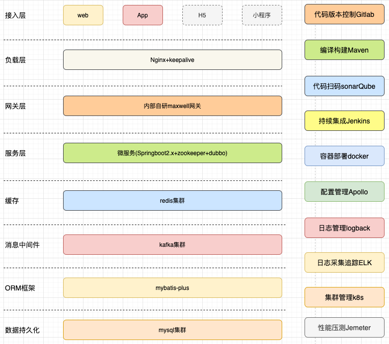

* [返回主页](../home.md)
# 常用书签
## Reference
### 面经常用网站
* [advanced](https://doocs.gitee.io/advanced-java/#/)
* [javaguide](https://javaguide.cn/)
* [凤凰架构](http://icyfenix.cn/)
* [JavaFamily](https://gitee.com/sharehappy/JavaFamily)
* [我们一起去大厂](https://aobing.blog.csdn.net/category_9424379.html)

### 我的腾讯云实例
* [控制台](https://console.cloud.tencent.com/lighthouse/instance/detail?rid=1&id=lhins-amwxl9pf)
### 我的阿里云域名解析
* [控制台](https://dns.console.aliyun.com/#/dns/setting/linzlb.fun)

### coding常用
* [java1234](http://blog.java1234.com/index.html)
* [maven](https://mvnrepository.com/)
* [docker使用](https://www.runoob.com/docker/docker-container-usage.html)
* [vuepress](https://v2.vuepress.vuejs.org/zh/)
* [json格式化](https://www.json.cn/)
* [leetcode](https://leetcode-cn.com/)

### 排查问题
* [Arthas](https://arthas.aliyun.com/zh-cn/)

### 画图图标获取
* [iconfont](https://www.iconfont.cn/)

### 语音业务资料
* [小度智能音箱开发参考](https://www.cnblogs.com/qinlongqiang/p/12498788.html)
* [dueros to c](https://dueros.baidu.com/didp/doc/dueros-bot-platform/dbp-smart-home/smart-home-skill/intro-smart-skill_markdown)
* [dueros to b](https://dueros.baidu.com/business/emp/view/doc?md=%2Fmd%2Fpan%2Fapk.md)
* [speech](https://www.duiopen.com/docs/smarthome_overview)
* [讯飞](https://aiui.xfyun.cn/doc/aiui/)
* [讯飞错误码描述](https://shimo.im/sheet/w3yUy39uNKs0J7DT)

### IoT资料
* [物模型](https://help.aliyun.com/document_detail/88239.html)
* [数字孪生](https://help.aliyun.com/document_detail/182342.html)
* [设备影子](https://help.aliyun.com/document_detail/53927.html)
* [emqx doc](https://docs.emqx.com/zh/enterprise/v4.2/development/protocol.html#mqtt%E5%8D%8F%E8%AE%AE)
* [WiFi，蓝牙，ZigBee，NB-IoT的区别](https://blog.csdn.net/wshh123456/article/details/88785761)
* [IoT技术](https://blog.csdn.net/klandor2008)
* [智能家居设备的配网方案与流程分析](http://www.woshipm.com/it/3525238.html)

### TSDB
* [aliyun HiTSDB](https://help.aliyun.com/document_detail/55652.html)

### OSS
* [aliyun OSS](https://help.aliyun.com/document_detail/177682.html?spm=a2c4g.11186623.6.620.414113c0XjO9xB)

### OAuth2.0
* [天猫精灵OAuth2.0认证授权流程参考](https://blog.csdn.net/willianfu/article/details/87464528?utm_medium=distribute.pc_relevant.none-task-blog-2~default~baidujs_utm_term~default-9.no_search_link&spm=1001.2101.3001.4242)

### k3s
* [k3s](https://www.rancher.cn/k3s/)
### 宝塔
* [宝塔Linux面板](https://www.sudu.cn/bt.html)

### 金山文档
* [金山文档](https://www.kdocs.cn/latest)

### 新技术
* [oschina](https://www.oschina.net/)

### 搭建一个SpringBoot项目常见的 Reference Documentation
* [homebrew](https://brew.sh/index_zh-cn)
  
* [Spring Boot 如何测试打包部署](http://www.ityouknow.com/springboot/2017/05/09/spring-boot-deploy.html)
* [Spring Boot 整合 Shiro-登录认证和权限管理](http://www.ityouknow.com/springboot/2017/06/26/spring-boot-shiro.html)
* [使用 Spring Boot 上传文件](http://www.ityouknow.com/springboot/2018/01/12/spring-boot-upload-file.html)
* [使用 Spring Boot 集成 FastDFS](http://www.ityouknow.com/springboot/2018/01/16/spring-boot-fastdfs.html)
* [使用 Spring Boot Actuator 监控应用](http://www.ityouknow.com/springboot/2018/02/06/spring-boot-actuator.html)
* [Spring Boot 如何解决项目启动时初始化资源](http://www.ityouknow.com/springboot/2018/05/03/spring-boot-commandLineRunner.html)
* [SpringBoot 常用部分](http://www.ityouknow.com/spring-boot.html)
* [SpringBoot Actuator监控中心+AdminUI界面管理](https://blog.csdn.net/u011976388/article/details/85395130)
* [SpringBoot Druid整合+监控](https://www.cnblogs.com/DFX339/p/12751584.html)
* [springboot参考资料](http://blog.battcn.com/categories/SpringBoot/)
* [SpringBoot整合Apollo](https://www.cnblogs.com/qdhxhz/p/13449285.html)
* [SpringBoot集成kafka全面实战](https://blog.csdn.net/yuanlong122716/article/details/105160545/)
* [springboot自动装配原理](https://www.cnblogs.com/javaguide/p/springboot-auto-config.html)
* [springboot常用注解](https://snailclimb.gitee.io/javaguide/#/./docs/system-design/framework/spring/SpringBoot+Spring%E5%B8%B8%E7%94%A8%E6%B3%A8%E8%A7%A3%E6%80%BB%E7%BB%93)
* [springboot整合mqtt发送与订阅](https://blog.csdn.net/qq_31275085/article/details/105788873)
  
* [使用 Jenkins 部署 Spring Boot](http://www.ityouknow.com/springboot/2017/11/11/spring-boot-jenkins.html)
* [jenkins](https://www.w3cschool.cn/jenkins/jenkins-6rwt28n7.html)

* [Redission使用](https://blog.csdn.net/liuxiao723846/article/details/88131065?utm_term=redission%E5%88%86%E5%B8%83%E5%BC%8F%E9%94%81&utm_medium=distribute.pc_aggpage_search_result.none-task-blog-2~all~sobaiduweb~default-2-88131065&spm=3001.4430)
* [Redission详解](https://blog.csdn.net/asd051377305/article/details/108384490?utm_medium=distribute.pc_relevant.none-task-blog-baidujs_utm_term-0&spm=1001.2101.3001.4242)

* [轻松搞定安全框架（Shiro）](http://blog.battcn.com/2018/07/03/springboot/v2-other-shiro/)
* [通用Mapper与分页插件的集成](http://blog.battcn.com/2018/05/10/springboot/v2-orm-mybatis-plugin/)
* [优雅解决分布式限流](http://blog.battcn.com/2018/08/08/springboot/v2-cache-redislimter/)
* [过滤器，监听器，拦截器](https://www.cnblogs.com/qdhxhz/p/9043568.html)
* [logback日志](https://www.cnblogs.com/qdhxhz/p/9069980.html)
* [整合elk，搭建实时日志平台](https://www.fangzhipeng.com/springboot/2017/05/22/sprinboot22-elk.html)
* [整合mybatis-plus](http://blog.java1234.com/index.html?typeId=43)
* [通过Lua脚本批量插入数据到Redis布隆过滤器](https://www.cnblogs.com/qdhxhz/p/11259078.html)
* [整合Druid实现多数据源和可视化监控](https://www.cnblogs.com/qdhxhz/p/10192041.html)
* [redis+lua实现分布式限流](http://blog.battcn.com/2018/08/08/springboot/v2-cache-redislimter/)
* [Maven中 jar包冲突原理与解决办法](https://blog.csdn.net/noaman_wgs/article/details/81137893)
* [微服务核心研究之--编排](https://www.jianshu.com/p/54e2e223dbac)
* [微服务架构的核心要点和实现原理](https://www.jianshu.com/p/97ced7ffe4f8)
* [apollo原理及集成](https://blog.csdn.net/wuzhiwei549/article/details/105139608/)
* [MQTT](https://docs.emqx.cn/enterprise/v4.2/design/design.html)
* [yuque note](https://www.yuque.com/sunxiaping/yg511q/pfa8a7)
* [canal](https://blog.csdn.net/yehongzhi1994/article/details/107880162)
  
* [kafka 安装 for mac](https://blog.csdn.net/oumuv/article/details/84860181)
* [kafka教程1](https://www.cnblogs.com/qingyunzong/category/1212387.html)
* [kafka教程2](https://www.cnblogs.com/riches/category/1536304.html)
* [kafka教程3](https://baijiahao.baidu.com/s?id=1651919282506404758&wfr=spider&for=pc)
  
* [docker](https://www.runoob.com/docker/docker-container-usage.html)
* [docker](https://www.docker.org.cn/book/docker/what-is-docker-16.html)
* [docker](https://www.runoob.com/docker/docker-container-usage.html)
* [docker logs](https://cloud.tencent.com/developer/article/1486571)
* [docker和k8s区别](https://www.cnblogs.com/misswangxing/p/10669444.html)

* [dubbo invoke](https://blog.csdn.net/weixin_28759537/article/details/113382975)
* [dubbo invoke](https://blog.csdn.net/u014082714/article/details/109094420?utm_medium=distribute.pc_aggpage_search_result.none-task-blog-2~aggregatepage~first_rank_v2~rank_aggregation-2-109094420.pc_agg_rank_aggregation&utm_term=dubbo%E7%9A%84invoke%E5%91%BD%E4%BB%A4&spm=1000.2123.3001.4430)
  
* [mybatis-plus](https://mp.baomidou.com/guide/crud-interface.html#alwaysupdatesomecolumnbyid)

### 常见技术选型

### 常见部署架构

---
* [返回主页](../home.md)