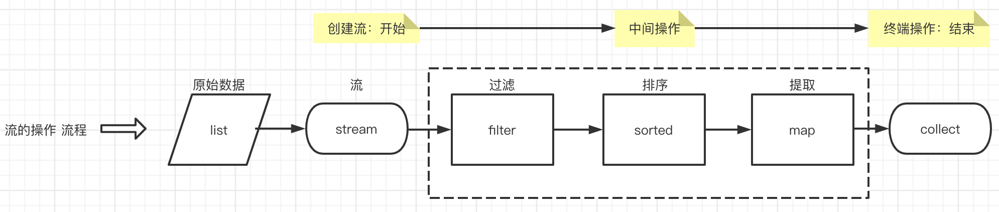
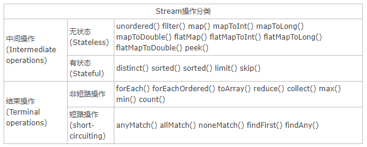

* [返回主页](../home.md)
# Java8流式编程
## 什么是流
+ 流是一种以声明性的方式来处理数据的API。
    + 通过将集合转换为这么一种叫做“流”的元素序列，通过声明性方式，能够对集合中的每个元素进行一系列的并行或者串行的流水线操作。

::: tip 特点
声明性：简洁，易读，代码行数大大减少<br>
可复合：更灵活，可循环合并，中间操作会自由组合（流根据系统自己来决定组合的顺序）<br>
可并行：性能更好
:::

## 创建stream的三种常见方式
+ 集合 Colletion.stream()
+ 静态方法 Stream.of()
+ 数组 Arrays.stream()

## 流的操作步骤
> 创建流 -> 中间操作 -> 终端操作
>> 中间操作只是声明，不真实处理数据，直到终端操作开始才会执行



### stream操作类型


## Intermediate&Terminal
::: tip Intermediate
一个流可以后面跟随零个或多个 intermediate(中间的) 操作。<br>
其目的主要是打开流，做出某种程度的数据映射/过滤，然后返回一个新的流，交给下一个操作使用。<br>
这类操作都是惰性化的（lazy），就是说，仅仅调用到这类方法，并没有真正开始流的遍历。 <br>
包含的操作有：map (mapToInt, flatMap 等)、 filter、 distinct、 sorted、 peek、 limit、 skip、 parallel、 sequential、 unordered
:::
::: tip Terminal
一个流只能有一个 terminal(终止的) 操作，当这个操作执行后，流就被使用“光”了，无法再被操作。 <br>
所以这必定是流的最后一个操作。Terminal 操作的执行，才会真正开始流的遍历，并且会生成一个结果，或者一个 side effect。  <br>
包含的操作有：forEach、 forEachOrdered、 toArray、 reduce、 collect、 min、 max、 count、 anyMatch、 allMatch、 noneMatch、 findFirst、 findAny、 iterator map/flatMap  <br>
操作它们的作用就是把 input Stream 的每一个元素，映射成 output Stream 的另外一个元素。
:::
### demo-POJO
```java
//Person 类包含年龄和姓名两个成员变量
private String name;
private int age;
```
```java
//创建一个 Person 泛型的 List
List<Person> list = new ArrayList<>();
list.add(new Person("jack", 20));
list.add(new Person("mike", 25));
list.add(new Person("tom", 30));
list.add(new Person("tom", 30));
```

### 1 stream() / parallelStream() 最常用到的方法，将集合转换为流
```java
//parallelStream() 是并行流方法，能够让数据集执行并行操作
list.stream();
```
### 2 filter(T -> boolean) 保留 boolean 为 true 的元素
```java
//保留年龄为 20 的 person 元素
list = list.stream()
            .filter(person -> person.getAge() == 20)
            .collect(Collectors.toList());//collect(toList()) 可以把流转换为 List 类型
//打印输出 [Person{name='jack', age=20}]
```

### 3 distinct() 去除重复元素
这个方法是通过类的 equals 方法来判断两个元素是否相等的,如例子中的 Person 类，<br>
需要先定义好 equals 方法，不然类似[Person{name=‘jack’, age=20}, Person{name=‘jack’, age=20}] 这样的情况是不会处理的。

### 4 sorted() / sorted((T, T) -> int)
如果流中的元素的类实现了 Comparable 接口，即有自己的排序规则，那么可以直接调用 sorted() 方法对元素进行排序，如 Stream<br>
反之, 需要调用 sorted((T, T) -> int) 实现 Comparator 接口

```java
//根据年龄大小来比较：
list = list.stream()
        .sorted((p1, p2) -> p1.getAge() - p2.getAge())
        .collect(Collectors.toList());
```
还可以简化
```java
list = list.stream()
           .sorted(Comparator.comparingInt(Person::getAge))
           .collect(Collectors.toList());
```

### 4.1 数字排序
```java
public static void testIntegerSort() {
     List<Integer> list = Arrays.asList(4, 2, 5, 3, 1);
     System.out.println(list);//执行结果：[4, 2, 5, 3, 1]
     //升序
     list.sort((a, b) -> a.compareTo(b.intValue()));
     System.out.println(list);//执行结果：[1, 2, 3, 4, 5]
     //降序
     list.sort((a, b) -> b.compareTo(a.intValue()));
     System.out.println(list);//执行结果：[5, 4, 3, 2, 1]
  }
```
### 4.2 字符串排序
```java
public static void testStringSort() {
  List<String> list = new ArrayList<>();
  list.add("aa");
  list.add("cc");
  list.add("bb");
  list.add("ee");
  list.add("dd");
  System.out.println(list);//执行结果：aa, cc, bb, ee, dd
  //升序
  list.sort((a, b) -> a.compareTo(b.toString()));
  System.out.println(list);//执行结果：[aa, bb, cc, dd, ee]
  //降序
  list.sort((a, b) -> b.compareTo(a.toString()));
  System.out.println(list);//执行结果：[ee, dd, cc, bb, aa]
 }
```
### 4.3 对象字段排序
```java
class Person {
    private String name;
    private int age;
    public Person() {
    }

    public Person(String name, Integer age) {
        this.name = name;
        this.age = age;
    }

    public String getName() {
        return name;
    }

    public void setName(String name) {
        this.name = name;
    }

    public int getAge() {
        return age;
    }

    public void setAge(int age) {
        this.age = age;
    }

    @Override
    public String toString() {
        return "Person{" +
                "name='" + name + '\'' +
                ", age=" + age +
                '}';
    }
}
```
```java
public void testObjectSort() {
    List<Person> list = new ArrayList<>();
    list.add(new Person("三炮", 48));
    list.add(new Person("老王", 35));
    list.add(new Person("小明", 8));
    list.add(new Person("叫兽", 70));
    System.out.println(list); //执行结果：[Person{name='三炮', age=48}, Person{name='老王', age=35}, Person{name='小明', age=8}, Person{name='叫兽', age=70}]
    //按年龄升序
    list.sort((a, b) -> Integer.compare(a.age, b.getAge()));
    System.out.println(list);//执行结果：[Person{name='小明', age=8}, Person{name='老王', age=35}, Person{name='三炮', age=48}, Person{name='叫兽', age=70}]
    //按年龄降序
    list.sort((a, b) -> Integer.compare(b.age, a.getAge()));
    System.out.println(list);//执行结果：[Person{name='叫兽', age=70}, Person{name='三炮', age=48}, Person{name='老王', age=35}, Person{name='小明', age=8}]
    //如果按姓名排序，其实就是按字符串排序一样
}
```

### 4.5 limit(long n) 返回前 n 个元素
```java
list = list.stream()
            .limit(2)
            .collect(Collectors.toList());
//打印输出 [Person{name='jack', age=20}, Person{name='mike', age=25}]
```

### 4.6 skip(long n) 去除前 n 个元素
```java
list = list.stream()
            .skip(2)
            .collect(Collectors.toList());
//打印输出 [Person{name='tom', age=30}]
```

::: tip
skip(m)用在 limit(n) 前面时，先去除前 m 个元素再返回剩余元素的前 n 个元素。<br>
limit(n) 用在 skip(m) 前面时，先返回前 n 个元素再在剩余的 n 个元素中去除 m 个元素。
:::

```java
list = list.stream()
            .limit(2)
            .skip(1)
            .collect(Collectors.toList());
//打印输出 [Person{name='mike', age=25}]
```

### 4.7 map(T -> R)
```java
//将流中的每一个元素 T 映射为 R（类似类型转换）
List newlist = list.stream().map(Person::getName).collect(Collectors.toList()); //1 newlist 里面的元素为 list 中每一个 Person 对象的 name 变量。
```

### 4.8 flatMap(T -> Stream)
```java
//将流中的每一个元素 T 映射为一个流，再把每一个流连接成为一个流。
//目的是把 List 中每个字符串元素以” “分割开，变成一个新的 List。 首先 map 方法分割每个字符串元素，但此时流的类型为 Stream。
List<String> list = new ArrayList<>();
        list.add("aaa bbb ccc");
        list.add("ddd eee fff");
        list.add("ggg hhh iii");
        list = list.stream().map(s -> s.split(" ")).flatMap(Arrays::stream).collect(toList());
```

### 4.9 anyMatch(T -> boolean)
```java
//流中是否有一个元素匹配给定的 T -> boolean 条件
//是否存在一个 person 对象的 age 等于 20
boolean b = list.stream().anyMatch(person -> person.getAge() == 20);
```

### 4.10 allMatch(T -> boolean)
```java
//流中是否所有元素都匹配给定的 T -> boolean 条件
boolean result = list.stream().allMatch(Person::isStudent);
```

### 4.11 noneMatch(T -> boolean)
```java
//流中是否没有元素匹配给定的 T -> boolean 条件
boolean result = list.stream().noneMatch(Person::isStudent);
```

### 4.12 findAny() 和 findFirst() findAny()
```text
找到其中一个元素 （使用 stream() 时找到的是第一个元素；使用 parallelStream()并行时找到的是其中一个元素） 
findFirst()：找到第一个元素 值得注意的是，这两个方法返回的是一个 Optional 对象，它是一个容器类，能代表一个值存在或不存在，这个后面会讲到
```

### 4.13 reduce((T, T) -> T) 和 reduce(T, (T, T) -> T)
```text
归约是将集合中的所有元素经过指定运算，折叠成一个元素输出，如：求最值、平均数等，这些操作都是将一个集合的元素折叠成一个元素输出。
在流中，reduce函数能实现归约。 reduce函数接收两个参数：
初始值 进行归约操作的Lambda表达式 用于组合流中的元素，如求和，求积，求最大值等
```
```java
int age = list.stream().reduce(0, (person1,person2)->person1.getAge()+person2.getAge());

//计算年龄总和：
int sum = list.stream().map(Person::getAge).reduce(0, (a, b) -> a + b);

//与之相同:
int sum = list.stream().map(Person::getAge).reduce(0, Integer::sum);
```
其中，reduce 第一个参数 0 代表起始值为 0，lambda (a, b) -> a + b 即将两值相加产生一个新值, 同样地：
```java
//计算年龄总乘积：
int sum = list.stream().map(Person::getAge).reduce(1, (a, b) -> a * b);

//或者用下面这个：
//不接受任何起始值，但因为没有初始值，需要考虑结果可能不存在的情况，因此返回的是 Optional 类型
Optional<Integer> sum = list.stream().map(Person::getAge).reduce(Integer::sum);
```

### 4.14、count() 
返回流中元素个数，结果为 long 类型。

### 4.15、collect() 
收集方法，我们很常用的是 collect(toList())，当然还有 collect(toSet()) 等，参数是一个收集器接口，这个后面会另外讲。

### 4.16、forEach() 
返回结果为 void，很明显我们可以通过它来干什么了
```java
//打印各个元素：
list.stream().forEach(System.out::println);
```
```java
//mybatis向数据库插值
list.stream().forEach(PersonMapper::insertPerson);
```

## 数值流
```java
int sum = list.stream().map(Person::getAge).reduce(0, Integer::sum); 
```
```text
计算元素总和的方法其中暗含了装箱成本，map(Person::getAge) 方法过后流变成了 Stream 类型，而每个 Integer 都要拆箱成一个原始类型再进行 sum 方法求和，这样大大影响了效率。
针对这个问题 Java 8 有良心地引入了数值流 IntStream, DoubleStream, LongStream，这种流中的元素都是原始数据类型，分别是 int，double，long
```

### 5.1 流与数值流的转换 流转换为数值流
```java
mapToInt(T -> int) : return IntStream
mapToDouble(T -> double) : return DoubleStream
mapToLong(T -> long) : return LongStream
IntStream intStream = list.stream().mapToInt(Person::getAge);
```

```java
//当然如果是下面这样便会出错
LongStream longStream = list.stream().mapToInt(Person::getAge);
//因为 getAge 方法返回的是 int 类型（返回的如果是 Integer，一样可以转换为 IntStream）
//数值流转换为流 很简单，就一个 boxed
Stream<Integer> stream = intStream.boxed();
```

### 5.2 数值流方法
这些方法作用不用多说，看名字就知道：sum(),max(),min(),average()

### 5.3 数值范围
```text
IntStream 与 LongStream 拥有 range 和 rangeClosed 方法用于数值范围处理。
IntStream ： rangeClosed(int, int) / range(int, int)
LongStream ： rangeClosed(long, long) / range(long, long) 这两个方法的区别在于一个是闭区间，一个是半开半闭区间：
rangeClosed(1, 100) ：[1, 100] range(1, 100) ：[1, 100) 我们可以利用 IntStream.rangeClosed(1, 100) 生成 1 到 100 的数值流。
```

```java
//求 1 到 10 的数值总和：
IntStream intStream = IntStream.rangeClosed(1, 10);
int sum = intStream.sum();
```


## Optional 类
```text
NullPointerException 可以说是每一个 Java 程序员都非常讨厌看到的一个词，针对这个问题， 
Java 8 引入了一个新的容器类 Optional，可以代表一个值存在或不存在，这样就不用返回容易出问题的 null。
之前文章的代码中就经常出现这个类，也是针对这个问题进行的改进。

Optional 类比较常用的几个方法有：
isPresent() ：值存在时返回 true，反之 flase 
get() ：返回当前值，若值不存在会抛出异常 
orElse(T) ：值存在时返回该值，否则返回 T 的值 Optional 类还有三个特化版本 OptionalInt，OptionalLong，OptionalDouble，刚刚讲到的数值流中的 max 方法返回的类型便是这个
Optional 类其中其实还有很多学问，讲解它说不定也要开一篇文章，这里先讲那么多，先知道基本怎么用就可以。
```

## 构建流
之前我们得到一个流是通过一个原始数据源转换而来，其实我们还可以直接构建得到流。
### 7.1 值创建流
```java
Stream.of(T…) ： Stream.of(“aa”, “bb”) 生成流
//生成一个字符串流
Stream<String> stream = Stream.of("aaa", "bbb", "ccc");
Stream.empty() : 生成空流
```

### 7.2数组创建流
```java
//还可以规定只取数组的某部分，用到的是Arrays.stream(T[], int, int)
int[] a = {1, 2, 3, 4};
Arrays.stream(a, 1, 3).forEach(System.out :: println);
//打印 2 ，3
```

### 7.3 文件生成流
```java
//每个元素是给定文件的其中一行
Stream<String> stream = Files.lines(Paths.get("data.txt"));
```

### 7.4 函数生成流 两个方法
```java
iterate ： 依次对每个新生成的值应用函数
generate ：接受一个函数，生成一个新的值
Stream.iterate(0, n -> n + 2)
//生成流，首元素为 0，之后依次加 2

Stream.generate(Math :: random)
//生成流，为 0 到 1 的随机双精度数

Stream.generate(() -> 1)
//生成流，元素全为 1
```

## collect !!!
+ 收集数据 coollect 方法作为终端操作，接受的是一个 Collector 接口参数，能对数据进行一些收集归总操作

### 8.1 收集 最常用的方法
```java
List newlist = list.stream.collect(toList());
```

### 8.2 汇总 
#### （1）counting 用于计算总和： （推荐第二种）
```java
long l = list.stream().collect(counting());
//下面这样也可以
long l = list.stream().count();
```

#### （2）summingInt ，summingLong ，summingDouble summing，没错，也是计算总和，不过这里需要一个函数参数
```java
//计算 Person 年龄总和： （推荐第二种）
int sum = list.stream().collect(summingInt(Person::getAge));

int sum = list.stream().mapToInt(Person::getAge).sum();
        
//除了上面两种，其实还可以：
int sum = list.stream().map(Person::getAge).reduce(Interger::sum).get();
```

#### （3）averagingInt，averagingLong，averagingDouble 看名字就知道，求平均数
```java
//要注意的是，这两种返回的值是不同类型的

Double average = list.stream().collect(averagingInt(Person::getAge));

OptionalDouble average = list.stream().mapToInt(Person::getAge).average();
```
#### (4）summarizingInt，summarizingLong，summarizingDouble 这三个方法比较特殊，比如 summarizingInt 会返回 IntSummaryStatistics 类型
```java
//IntSummaryStatistics 包含了计算出来的平均值，总数，总和，最值，可以通过下面这些方法获得相应的数据
IntSummaryStatistics l = list.stream().collect(summarizingInt(Person::getAge));
```

### 8.3 取最值 maxBy，minBy 两个方法，需要一个 Comparator 接口作为参数
```java
Optional optional = list.stream().collect(maxBy(comparing(Person::getAge))); //1 我们也可以直接使用 max 方法获得同样的结果

Optional<Person> optional = list.stream().max(comparing(Person::getAge));
```

### 8.4 joining 连接字符串 
也是一个比较常用的方法，对流里面的字符串元素进行连接，其底层实现用的是专门用于字符串连接的 StringBuilder
```java
String s = list.stream().map(Person::getName).collect(joining());
//结果：jackmiketom
```
```java
String s = list.stream().map(Person::getName).collect(joining(","));
//结果：jack,mike,tom
```

joining 还有一个比较特别的重载方法：
```java
//即 Today 放开头，play games. 放结尾，and 在中间连接各个字符串
String s = list.stream().map(Person::getName).collect(joining(" and ", "Today ", " play games."));
//结果：Today jack and mike and tom play games.
```

### 8.5 groupingBy 分组 groupingBy 用于将数据分组，最终返回一个 Map 类型
```java
Map<Integer, List<Person>> map = list.stream().collect(groupingBy(Person::getAge));
```
例子中我们按照年龄 age 分组，每一个 Person 对象中年龄相同的归为一组。
```java
Map<String,List<Person>> result = list.stream()
                                    .collect(Collectors.groupingby((person)->{
        if(person.getAge()>60)
            return "老年人";
        else if(person.getAge()>40)
            return "中年人";
        else
            return "青年人";
}));
```

另外可以看出，Person::getAge 决定 Map 的键（Integer 类型），list 类型决定 Map 的值（List 类型）<br>
多级分组 groupingBy 可以接受一个第二参数实现多级分组：
```java
Map<Integer, Map<T, List<Person>>> map = list.stream().collect(groupingBy(Person::getAge, groupBy(...)));
```
其中返回的 Map 键为 Integer 类型，值为 Map, 按组收集数据
```java
Map<Integer, Integer> map = list.stream().collect(groupingBy(Person::getAge, summingInt(Person::getAge)));
```

该例子中，我们通过年龄进行分组，然后 summingInt(Person::getAge)) 分别计算每一组的年龄总和（Integer），最终返回一个 Map
```java
groupingBy(Person::getAge)

groupingBy(Person::getAge, toList())
```

### 8.6 partitioningBy 分区
分区与分组的区别在于，分区是按照 true 和 false 来分的，因此partitioningBy 接受的参数的 lambda 也是 T -> boolean
```java
//根据年龄是否小于等于20来分区
Map<Boolean, List<Person>> map = list.stream()
                                     .collect(partitioningBy(p -> p.getAge() <= 20));

//打印输出
{
    false=[Person{name='mike', age=25}, Person{name='tom', age=30}], 
    true=[Person{name='jack', age=20}]
}
```

* [返回主页](../home.md)