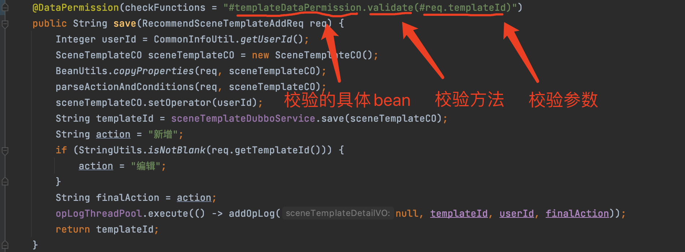
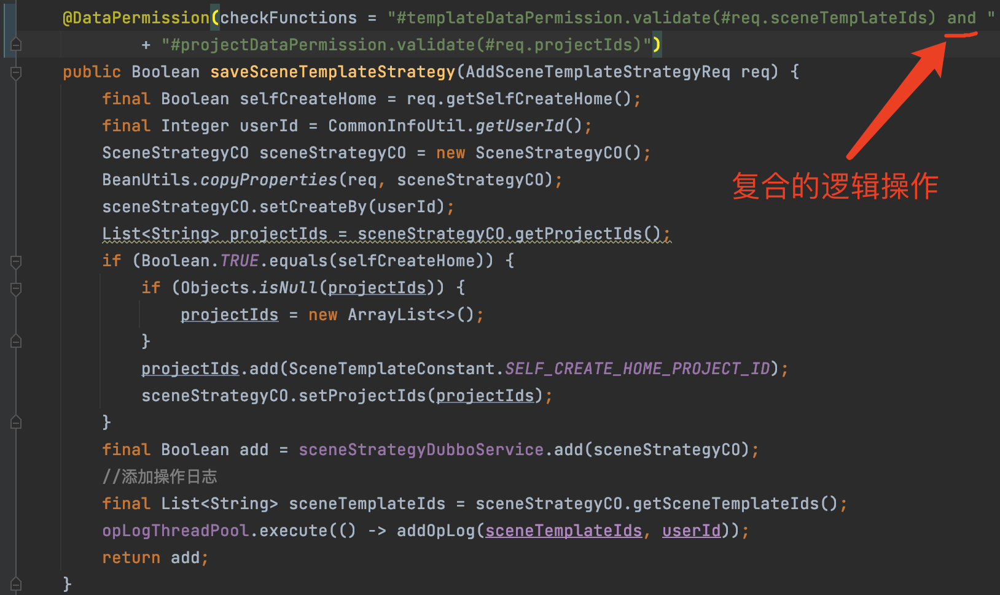

* [返回主页](../home.md)
# 数据权限优化
## 背景
面向后台管理系统中，都会涉及到接口的数据权限校验，以往的实现方式在具体业务方法块中做的数据权限判断，和业务代码耦合到一起，未做解耦。扩展性不好，遇到多维度的数据权限校验业务代码会更加膨胀，职责未分清，导致缺陷问题不断

## 数据权限校验技术要求
+ 1、数据权限校验和业务逻辑代码解耦，并支持注解AOP形式进行注解拦截校验
+ 2、数据权限注解支持通过el表达式获取参数，并支持list参数
+ 3、数据权限注解去掉com.xxx.xxx.biz.datascope.CheckDataScopeFun#checkDataScope 去掉range,datascope

## 技术实现
### 定义权限校验注解
```java
@Target({ElementType.PARAMETER, ElementType.METHOD})
@Retention(RetentionPolicy.RUNTIME)
@Documented
public @interface DataPermission {

    /**
     * 校验的目标函数 beanName代表校验类的bean的名称; method表示具体的校验函数;param代表具体的参数 and、or 表示逻辑
     * 例如:
     * #beanName1.method(#param) and #beanName2.method(#param)
     * #beanName1.method(#param) or #beanName2.method(#param)
     * (#beanName1.method(#param) and #beanName2.method(#param)) or #beanName3.method(#param)
     *
     * @return
     */
    String checkFunctions() default "";
}
```

### 定义权限校验顶层接口
```java
/**
 * 校验数据权限
 *
 * @param <T>资源的数据类型
 * @author 哈尔（李泽贤 haer.li@tuya.com)
 * @since 2021/2/19 5:54 下午/v1
 */
public interface DataPermissionFun<T> {

    /**
     * @param resourceIds 资源Ids
     * @return
     */
    Boolean validate(T resourceIds);
}
```

### 权限拦截AOP核心实现
```java
/**
 * 操作数据权限校验 aop
 */
@Slf4j
@Aspect
@Component
public class DataScopeAspect {

    @Autowired
    private Map<String, DataPermissionFun> funcNameBeanMap;

    private LocalVariableTableParameterNameDiscoverer discoverer = new LocalVariableTableParameterNameDiscoverer();
    private ExpressionParser parser = new SpelExpressionParser();

    @Pointcut("@annotation(com.coli688.ol.biz.permission.DataPermission)")
    public void checkDataScope() {

    }

    /**
     * 织入数据校验的前置逻辑
     *
     * @param joinPoint
     */
    @Before("checkDataScope()")
    public void check(JoinPoint joinPoint) {
        if (Objects.isNull(AppContext.getOrNull()) || Objects.isNull(DataAuthorizationUtils.getUserId())) {
            log.debug("管理员角色不进行任何校验");
            return;
        }

        MethodSignature signature = (MethodSignature) joinPoint.getSignature();
        final Method method = signature.getMethod();
        final DataPermission annotation = method.getAnnotation(DataPermission.class);
        //校验函数el表达式
        final String checkFunNames = annotation.checkFunctions();

        //绑定参数
        EvaluationContext evaluationContext = bindParam(method, joinPoint.getArgs());
        final Expression expression = parser.parseExpression(checkFunNames);
        boolean hasDataPermission = false;

        try {
            hasDataPermission = expression.getValue(evaluationContext, Boolean.class);
        } catch (Exception e) {
            log.error("方法:{} 参数:{} 校验数据权限失败", method.getDeclaringClass().getName() + "#" + method.getName(),
                    Arrays.toString(joinPoint.getArgs()), e);
        }

        log.debug("方法:{} 参数:{} 校验数据权限:{}", method.getDeclaringClass().getName() + "#" + method.getName(),
                Arrays.toString(joinPoint.getArgs()), hasDataPermission);

        if (!hasDataPermission) {
            throw MsgConst.COMMON_PERMISSION_DENY.toException();
        }
    }

    /**
     * 将方法的参数名和参数值绑定
     *
     * @param method 方法，根据方法获取参数名
     * @param args   方法的参数值
     * @return
     */
    private EvaluationContext bindParam(Method method, Object[] args) {
        //获取方法的参数名
        String[] params = discoverer.getParameterNames(method);

        //将参数名与参数值对应起来
        EvaluationContext context = new StandardEvaluationContext();

        //将数据权限校验的方法放入计算的上下文中
        funcNameBeanMap.forEach((k, v) -> {
            context.setVariable(k, v);
        });

        if (Objects.isNull(params) || params.length <= 0) {
            return context;
        }

        for (int len = 0; len < params.length; len++) {
            context.setVariable(params[len], args[len]);
        }

        return context;
    }
}
```

### 实现DataPermissionFun接口
```text
权限校验业务逻辑由业务实现人员具体来实现，只需要实现com.xxx.xxx.biz.permission.DataPermissionFun#validate抽象方法就可以
比如：校验当前请求的公司，在当前用户账号下是否有权限操作
```

```java
@Slf4j
@Component(PermissionConstant.COMPANY)
@RequiredArgsConstructor
public class CompanyPermission implements DataPermissionFun<String> {
    /**
     * 检查操作的公司数据是否在可操作性公司范围内
     */
    @Override
    public Boolean validate(String companyId) {
        if (StringUtils.isBlank(companyId)) {
            return Boolean.TRUE; //有些根查询操作无法传递companyId，直接放行该操作
        }

        List<String> companyIdList = CommonInfoUtil.get().getCompanyId();
        if (CollectionUtils.isEmpty(companyIdList)) {
            log.debug("当前用户 : {} 公司权限为空", CommonInfoUtil.getUserId());
            throw MsgConst.COMMON_PERMISSION_DENY.toException();
        }
        return companyIdList.contains(companyId);
    }
}
```

## 使用方式
### 单个数据数据权限以推荐场景个人级别的数据权限为


### 复合的数据数据权限以推荐场景策略的数据权限为例它是模板与项目权限的结合


### 更复杂的组合逻辑也是支持的
```java
"(#obj1.validate(#req.sceneTemplateIds) and #obj2.validate(#req.projectIds) or #obj3.validate(#req.projectIds)"
```

## 未来展望
::: tip 对于业务服务来说，大部分接口都要做数据权限校验
1、希望能抽象出来一个顶层接口与网关结合，形成一种统一的权限校验标准<br>
2、权限的拦截触发由网关作为入口，未做权限的统一处理
:::


## 技术实现参考的文档
* [Spring Expression](https://docs.spring.io/spring-framework/docs/3.0.x/reference/expressions.html)
* [aop](https://docs.spring.io/spring-framework/docs/5.0.0.M5/spring-framework-reference/html/aop.html)


* [返回主页](../home.md)