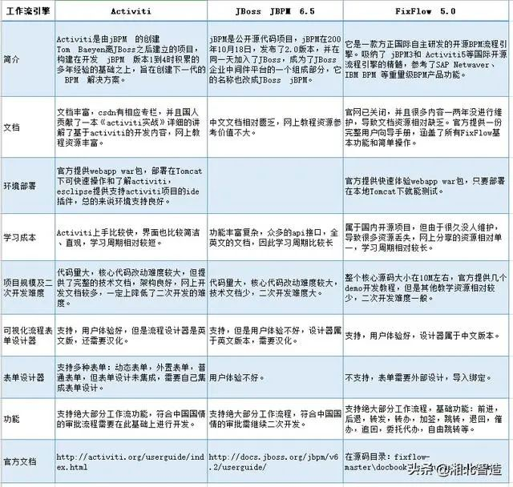

* [返回主页](../home.md)
# 工作流引擎
## 介绍
工作流引擎是任务分配软件（例如业务流程管理）的一项核心技术<br><br>

* [从迭代开发工作流引擎小故事认识工作流～](https://www.cnblogs.com/duck-and-duck/p/14436373.html)

## 功能
::: tip 三大功能
1 验证当前过程状态：在给定当前状态的情况下，检查是否有效执行任务。
<br>2 确定用户权限：检查是否允许当前用户执行任务。
<br>3 执行条件脚本：经过前两个步骤后，工作流引擎将执行任务，如果执行成功完成，则返回成功，否则返回错误并触发并回滚更改。
:::
## 术语
::: tip BMP
Business Process Management 业务流程管理
:::
## 选型


### flowable
```markdown
Flowable 是一个使用 Java 编写的轻量级业务流程引擎，使用 Apache V2 license 协议开源。

Flowable 项目中包括
    BPMN（Business Process Model and Notation）引擎、
    CMMN（Case Management Model and Notation）引擎、
    DMN（Decision Model and Notation）引擎、
    表单引擎（Form Engine）等模块。

flowable基于activiti6衍生出来的版本，开发团队是从activiti中分裂出来的，
2016 年 10 月，Activiti 工作流引擎的主要开发者离开 Alfresco 公司并在 Activiti 分支基础上开启了 Flowable 开源项目。
基于 Activiti v6 beta4 发布的第一个 Flowable release 版本为6.0。

flowable修复了一众activiti6的bug，并在其基础上研发了DMN支持，BPEL支持等等，相对开源版，其商业版的功能会更强大。
以flowable6.4.1版本为分水岭，大力发展其商业版产品，
```
::: warning 缺点
开源版本维护不及时，部分功能已经不再开源版发布，比如表单生成器（表单引擎）、历史数据同步至其他数据源、ES等。
:::

* [flowable官方网站](https://www.flowable.com/)

### Camunda
```markdown
Camunda基于activiti5，所以其保留了PVM，最新版本Camunda7.15，保持每年发布2个小版本的节奏，

开发团队也是从activiti中分裂出来的，发展轨迹与flowable相似，同时也提供了商业版，不过对于一般企业应用，开源版本也足够了
```

* [Camunda官方网站](https://docs.camunda.org/)

:::tip 优点
（1）性能和稳定性更好。压测数据详细见：https://blog.csdn.net/wxz258/article/details/109030329
<br>（2）功能比较完善，除了BPMN，Camunda还支持企业和社区版本中的CMMN（案例管理）和DMN（决策自动化）。
<br>    Camunda不仅带有引擎，还带有非常强大的工具，用于建模，任务管理，操作监控和用户管理，所有这些都是开源的。
:::

### Osworkflow
Osworkflow是java编写的，底层工作流实现，基于有限状态机<br>
Osworkflow是一个轻量化的流程引擎，基于状态机机制，数据库表很少，
Osworkflow提供的工作流构成元素有：步骤（step）、条件（conditions）、循环（loops）、分支（spilts）、合并（joins）等，
是比较灵活的轻量级的框架。如果流程比较简单，osworkflow是很好的选择

::: warning 缺点
不支持会签、跳转、退回、加签等这些操作，需要自己扩展开发，有一定难度<br>
在流程建模方面不太友好，需要手动编写xml文件去定义流程文件。
:::

### JBPM（Java Business Process Management）：JAVA业务流程管理
```markdown
JBPM是一个可扩展、灵活、开源的流程引擎， 它可以运行在独立的服务器上或者嵌入任何Java应用中。

1、jBPM3是一个完整的工作流系统实现，面向开发人员，目的在于简化对组织核心流程进行支撑的软件创建，不支持标准。
2、jBPM4引入PVM，使其拥有更强大的扩展性，同时增加BPMS特性，这些特性包括了对BPMN的支持、面向业务人员的Web建模器和简单统计分析功能的加入。
3、jBPM5基于原先的Drools Flow，支持BPMN，通过与Drools的合并支持BAM，通过内容仓库增加对流程可视化的支持。由于放弃了jBPM4的PVM，引擎的可扩展性受到损害，并且不再支持jPDL。


JBPM由JBoss公司开发，目前最高版本JPBM7，不过从JBPM5开始已经跟之前不是同一个产品了.
jBPM4诞生的比较早，后来JBPM4创建者Tom Baeyens离开JBoss后，加入Alfresco后很快推出了新的基于jBPM4的开源工作流系统Activiti,
JBPM5，JBPM6似乎缺少一个合格的系统架构师，其接口设计匪夷所思，基本上是按照drools的接口再提供了一套JBPM接口，同名的接口，实现类不断重复出现，代码体系十分混乱。
JBPM自从版本五后，便重启炉灶，完全抛弃了JBMP4的代码基础，重新基于Drools Flow进行了实现。
```
::: warning 现在时间节点选择流程引擎，JBPM不是最佳选择:
基于Drools Flow技术在国内市场上用的很少，所有不建议选择jBPM5以后版本<br>
另外JBPM以hibernate作为数据持久化ORM也已不是主流技术。
:::

* [JBPM官方网站](https://www.jbpm.org/)

### Activiti
```markdown
Activiti项目是一项新的基于Apache许可的开源BPM平台，从基础开始构建，旨在提供支持新的BPMN 2.0标准，
包括支持对象管理组（OMG），面对新技术的机遇，诸如互操作性和云架构，提供技术实现。

Activiti是一个独立运作和经营的开源项目品牌，并将独立于Alfresco开源ECM系统运行。
Activiti将是一种轻量级，可嵌入的BPM引擎，而且还设计适用于可扩展的云架构。 
Activiti将提供宽松的Apache许可2.0，以便这个项目可以广泛被使用，
同时促进Activiti BPM引擎和的BPMN 2.0的匹配，该项目现正由OMG通过标准审定。 
加入Alfresco Activiti项目的是VMware的SpringSource分支，Alfresco的计划把该项目提交给Apache基础架构，
希望吸引更多方面的BPM专家和促进BPM的创新。
```

::: tip 历史
创始人Tom Baeyens是JBoss jBPM的项目架构师，以及另一位架构师Joram Barrez，一起加入到创建Alfresco这项首次实现Apache开源许可的BPMN 2.0引擎开发中来。
<br>Activiti是由jBPM 的创建Tom Baeyen离JBoss之后建立的项目，构建在开发 jBPM 版本1到4时积累的多年经验的基础之上，旨在创建下一代的 BPM 解决方案。
<br>Activiti由Alfresco软件开发，目前最高版本activiti 7。activiti的版本比较复杂，有activiti5、activiti6、activiti7几个主流版本.
<br>Activiti5基于jBPM4的开源工作流系统，与Alfresco的集成增加了其流程可视化与管理能力，同时通过创新的Activiti Cycle协作组件支持流程相关人员之间的协调，最后，它加强了集成能力。
<br>activiti5和activiti6的核心leader是Tijs Rademakers，由于团队内部分歧，在2017年时Tijs Rademakers离开团队，创建了后来的*flowable*,
<br>activiti6以及activiti5代码已经交接给了 Salaboy团队,activiti6以及activiti5的代码官方已经暂停维护了,
<br>Salaboy团队目前在开发activiti7框架，activiti7内核使用的还是activiti6，并没有为引擎注入更多的新特性，只是在activiti之外的上层封装了一些应用。
:::

::: tip 优点
Activiti支持启动引擎后随时热部署,这是JBPM存在一个软肋<br>
<br>文档丰富，csdn有相应专栏，并且国人贡献了一本《activiti实战》详细的讲解了基于activiti的开发内容，网上教程资源丰富。
<br>Activiti上手比较快，界面也比较简洁、直观，学习周期相对较短
<br>与jBPM4相比，Activiti5最令人瞩目的特性就在于它的协作工具组件。
<br>Activiti拥有更简洁健壮的接口:Activiti中提供TaskQuery接口，可以设置各种查询过滤，排序方式，最终通过list方法执行查询，相比jbpm，它还提供了分页查询功能，双方高下立判。
<br>Activiti拥有更友好的用户体验: JBPM核心引擎完全没有关于表单的任何抽象，它的工作机制是通过全局常量，流程变量，任务变量，这些概念十分技术化。相比之下Activiti则更贴近实际的应用场景，它将为开始节点，以及人工任务提供了表单设置，用户可以设置字段名称，字段类型。通过Activiti的平台可以根据这些设置去生成表单，但如果不使用其平台只使用引擎的话，也支持通过它来表达与第三方表单的关系。这些表单设置的元数据信息也可以通过接口去获取。
:::

::: tip 协作工具组件
Activiti Modeler—建模器:基于开源Signavio Web流程编辑器的一个定制版本，提供了对BPMN2.0图形化规范的支持，建模后的流程以文件格式进行存储。
Activiti probe—管理及监控组件: 对流程引擎运行期实例提供管理及监控的Web控制台。包含部署的管理、流程定义的管理、数据库表的检视、日志查看、事务的平均执行时间、失败多次的工作等功能。
:::

* [Activiti官方网站](https://www.activiti.org/)

```markdown
其它资料：
表单设计器
支持多种表单：动态表单，外置表单，普通表单，但表单设计未集成，需要自己集成表单设计。

可视化流程表单设计器
支持，用户体验好，但是流程设计器是英文版，还需要汉化。

项目规模及二次开发难度
代码量大，核心代码改动难度较大，但提供了完整的技术文档，架构良好，网上开发文档较多，一定上降低了二次开发的难度
```

### SWF
```markdown
SWF与其说是工作流引擎，不如说是分布式计算调度框架，SWF中只包括Task和History两部分，
甚至是每个Task之间如果要传递一些数据的话，都只能通过第三方存储（比如Message Queue或者Redis），
不过这也给了编程更大的灵活性，问题是这种灵活性是不是非常需要。

一个SWF由Worker和Decider组成，Worker执行实际的任务，而Decider进行流程控制，两者严格上来讲没有区别，
只是所执行的任务不同罢了。每个Worker和Decider会定期的去SWF的一个Task List取下一个任务。
可以看出来这更像是一个“多线程”的结构，而SWF官方网站的Use Case是NASA的火星探索计划中需要处理图片的系统，
这其实也是一个更多侧重于计算的系统，流程反而非常简单。

另外，SWF（Simple Workflow）的一个Workflow不能太复杂，因为所有的流程控制都集中于Decider，
如果太复杂的话Decider将无比庞大，给维护和扩展带来一定的困扰。
```

::: warning 缺点
不能支持太复杂的流程
:::


* [返回主页](../home.md)