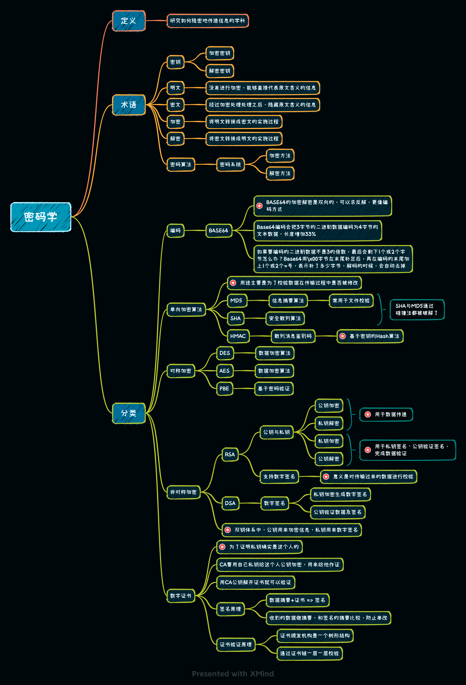
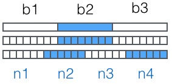

* [返回主页](../home.md)
## 密码学
### 大纲
+ 定义
+ 术语
+ 分类
### 详情

### Base64详解
+ Base64是一种用64个字符来表示任意二进制数据的方法,属于最常见的二进制编码方法
::: tip 作用
用记事本打开exe、jpg、pdf这些文件时，我们都会看到一大堆乱码，
因为二进制文件包含很多无法显示和打印的字符，
所以，如果要让记事本这样的文本处理软件能处理二进制数据，就需要一个二进制到字符串的转换方法。
:::

::: tip 原理
Base64的原理很简单，首先，准备一个包含64个字符的数组： 
['A', 'B', 'C', ... 'a', 'b', 'c', ... '0', '1', ... '+', '/']  
然后，对二进制数据进行处理，每3个字节一组，一共是3x8=24bit，划为4组，每组正好6个bit： 
这样我们得到4个数字作为索引，然后查表，获得相应的4个字符，就是编码后的字符串。
:::

::: tip 结论
所以，Base64编码会把3字节的二进制数据编码为4字节的文本数据，长度增加33%，好处是编码后的文本数据可以在邮件正文、网页等直接显示。 
如果要编码的二进制数据不是3的倍数，最后会剩下1个或2个字节怎么办？ 
Base64用\x00字节在末尾补足后，再在编码的末尾加上1个或2个=号，表示补了多少字节，解码的时候，会自动去掉。
:::
* [返回主页](../home.md)