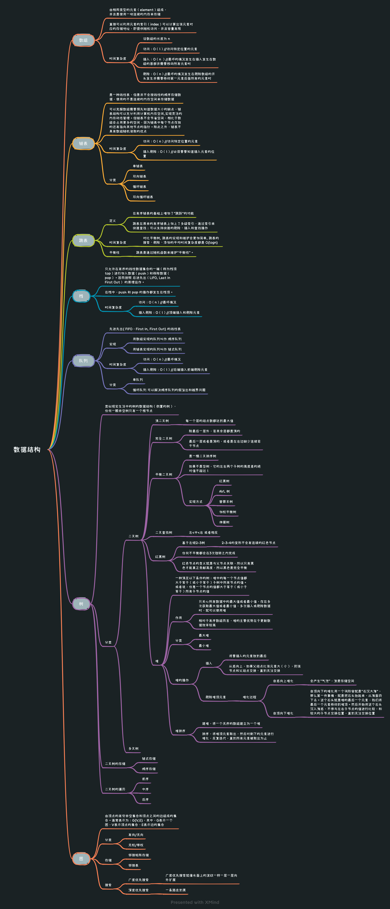

* [返回主页](../home.md)
# 数据结构
## 底层存储方式
::: tip 数组（顺序存储）
紧凑型，因此可以随机访问
:::

::: tip 链表（链式存储）
不连续，靠指针指向下一个位置
:::

> 本质上说，底层只有数组和链表这2种存储方式
```text
eg.
  图
      邻接表就是链表
      邻接矩阵就是数组
  哈希表
      通过函数映射到大数组
  树
      数组实现就是堆
      链表实现就是常见的树
```

## 基本操作
> 遍历+访问 , 换个方式说就是增删查改

## 遍历框架
### 数组遍历框架
```java{1}
//for/while为代表的迭代
for(int i=0; i<arr.length; i++){
    //迭代访问arr[i]
}
```

### 链表的遍历框架
```java{1}
//递归为代表
void traverse(ListNode head){
    traverse(head.next);
}
```
> 场景：如责任链模式，中间件的调用链...

### 二叉树遍历框架
```java{2,4,6}
void traverse(TreeNode root){
    //前序
    traverse(root.left);
    //中序
    traverse(root.right);
    //后序
}
```
### N叉树遍历框架
```java{3}
class TreeNode{
    int val;
    TreeNode[] children;
}
void traverse(TreeNode root){
    for(TreeNode child : root.children){
        //前序
        traverse(child);
        //后序
    }
}
```

### 二叉搜索树遍历框架
```java{3}
void BST(TreeNode root, int target){
    if(root.val == target) 
        //干点什么
    if(root.val < target)
        BST(root.right, target);
    if(root.val > target)
        BST(root.left, target);
}
```

## 常见数据结构



### bitmap结构
::: tip 结构
bit即比特，是计算机系统里边数据的最小单位，8个bit即为一个Byte。一个bit的值，要么是0，要么是1。bitmap可以理解为通过一个bit数组来存储特定数据的一种数据结构；
:::
::: tip 优缺点
bitmap在数据稠密的时候，非常节省空间，但是在数据稀疏的时候，会有极大的浪费
:::
::: tip 场景
+ 排序
+ 查询
+ 去重
+ bloom filter
    + 多个hash函数指定到bitmap的位置
:::

* [返回主页](../home.md)