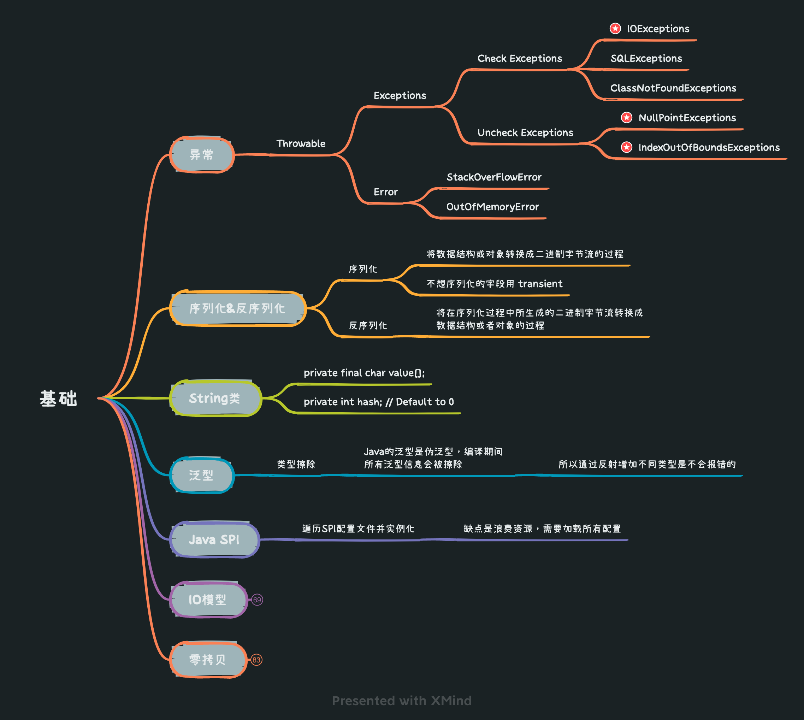
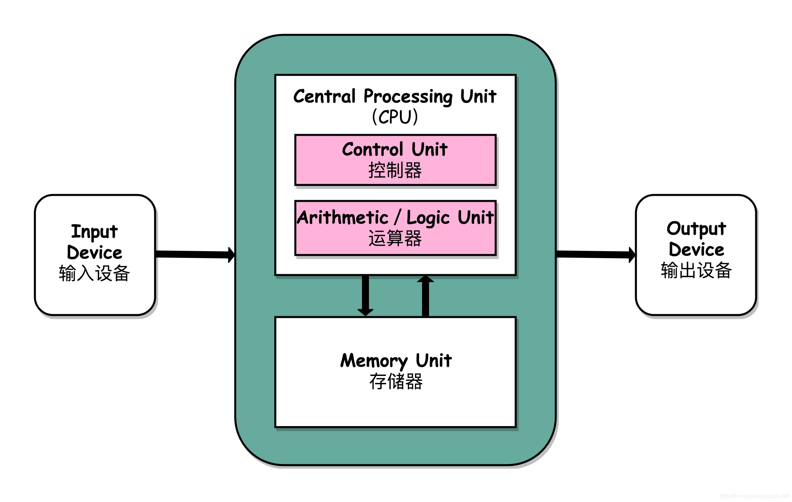

* [返回主页](../../README.md)


## Java
### fail-fast
> java.util包下面的所有的集合类都是 fail-fast 的<br> 
> java.util.concurrent包下面的所有的类都是 fail-safe 的
```markdown
实现：
transient int modCount
标识结构上被修改的次数，由迭代器使用, 例如新增元素，先modCount++, 再判断是否扩容
非迭代器操作或者并发下的迭代器操作会尽最大努力抛出异常，快速而干净地失败，
而不是在未来不确定的时间冒任意的、非确定性的行为的风险
```
```markdown
所有非线程安全的都可以存null，可以存储 null 的 key 和 value，但 null 作为键只能有一个，null 作为值可以有多个
所有线程安全的都不能存null，因为在多线程下，没法判断是本来就是null值，还是空指针导致
```

### 包装类型的常量池技术
+ 装箱：将基本类型用它们对应的引用类型包装起来；
+ 拆箱：将包装类型转换为基本数据类型；
```markdown
Java 基本类型的包装类的大部分都实现了常量池技术。

Byte,Short,Integer,Long 这 4 种包装类默认创建了数值 [-128，127] 的相应类型的缓存数据，
Character 创建了数值在 [0,127] 范围的缓存数据，Boolean 直接返回 True or False。
```
Integer 缓存源码
```java
public static Integer valueOf(int i) {
    if (i >= IntegerCache.low && i <= IntegerCache.high)
        return IntegerCache.cache[i + (-IntegerCache.low)];
    return new Integer(i);
}
private static class IntegerCache {
    static final int low = -128;
    static final int high;
    static {
        // high value may be configured by property
        int h = 127;
    }
}
```
Boolean 缓存源码
```java
public static Boolean valueOf(boolean b) {
    return (b ? TRUE : FALSE);
}
```

## I/O
```text
 I/O 描述了计算机系统与外部设备之间通信的过程
```
### 冯.诺依曼结构
+ 内部设备
  + 运算器
     + CPU核心能力，计算
  + 控制器
     + 需要记录上下文
  + 存储器
     + 内存
+ 外部设备
  + 输入设备
  + 输出设备

[comment]: <> (![]&#40;../../picture/1/0冯.诺依曼结构.png&#41;)
<div align="center">
    
</div>

### 进程的地址空间划分
    用户空间（User space） 
	内核空间（Kernel space ） 
### 内核态VS用户态
    由于需要限制不同的程序之间的访问能力, 防止他们获取别的程序的内存数据, 
    或者获取外围设备的数据, 并发送到网络, CPU划分出两个权限等级 -- 用户态和内核态
   + 内核态
     + cpu可以访问内存的所有数据，包括外围设备，例如硬盘，网卡，cpu也可以将自己从一个程序切换到另一个程序
     + 和磁盘交互的是PageCache
     + 和网卡交互的是socket缓冲区
   + 用户态
      + 只能受限的访问内存，且不允许访问外围设备，占用cpu的能力被剥夺，cpu资源可以被其他程序获取
      + 主要是进程的用户缓冲区
### I/O调用步骤
	1. 内核等待 I/O 设备准备好数据
	2. 内核将数据从内核空间拷贝到用户空间
### I/O模型
	BIO (Blocking I/O)
		同步阻塞
			应用程序发起 read 调用后，会一直阻塞，直到内核把数据拷贝到用户空间
			每一个客户端请求分配给一个线程来单独处理
	NIO (Non-blocking/New I/O)
		同步非阻塞
			面向缓冲，基于通道
			对应 java.nio 包，提供了 Channel , Selector , Buffer 等抽象
			内核准备数据和数据就绪阶段应用程序可以反复调用read，内核拷贝数据才阻塞
			缺点：不断进行 I/O 系统调用轮询数据是否已经准备好的过程是十分消耗 CPU 资源
		I/O 多路复用模型
			线程首先发起 select 调用，询问内核数据是否准备就绪，等内核把数据准备好了，用户线程再发起 read 调用。read 调用的过程（数据从内核空间 -> 用户空间）还是阻塞的
			支持 IO 多路复用的系统调用
				select
					线性扫描，遍历的方式，效率低
					有1024限制
				poll
					遍历
					无限制
				epoll
					事件驱动
					没有最大并发连接的限制
		BIO=>NIO
			NIO是基于事件驱动思想,解决的是BIO的大并发问题
			不是一个连接就对应一个处理线程了，而是有效的请求对应一个线程
				用通道管理器selector实现这个功能，监听accept事件
				客户端连接后，触发accept事件
				服务器构建对应的Channel，并在其上注册Selector，监听读写事件
	AIO (Asynchronous I/O)
		异步IO模型
			内核拷贝数据后回调
	在上面3个模型中，内核要做的动作有3个
		1准备数据
		2数据就绪
		3拷贝数据
		不同模型的差别
			BIO 123步骤应用都是阻塞
			NIO 12步骤应用不阻塞，3阻塞，12步骤有普通NIO和多路复用的区别

### 数据传输怎么获得高性能
	核心思想
		快速的接待消费线程
		让慢速的IO通过队列进行等待来避免消费线程的阻塞
	方式
		采用NIO或者IO多路复用，AIO等模式
		多线程+队列，实际上就是用线程池这种东西！
                dubbo在实现高性能这块也是用ThreadPool来处理序列化的数据

## zero copy 零拷贝
```
是一个思想，指的是指计算机执行操作时，CPU 不需要先将数据从某处内存复制到另一个特定区域
```
### 特点
    CPU 不全程负责内存中的数据写入其他组件，CPU 仅仅起到管理的作用。
    但注意，零拷贝不是不进行拷贝，而是 CPU 不再全程负责数据拷贝时的搬运工作。
    如果数据本身不在内存中，那么必须先通过某种方式拷贝到内存中（这个过程 CPU 可以不参与），
    因为数据只有在内存中，才能被转移，才能被 CPU 直接读取计算
### 实现方式
+ sendfile
  + 一次代替 read/write 系统调用，通过使用 DMA 技术以及传递文件描述符，实现了 zero copy
  + 两个技术
    + DMA 技术
      + 将四次 CPU 全程负责的拷贝与四次上下文切换减少到两次
      + DMA 负责磁盘到内核空间中的 Page cache（read buffer）的数据拷贝以及从内核空间中的 socket buffer 到网卡的数据拷贝
    + 传递文件描述符代替数据拷贝
  + 一次系统调用代替两次系统调用
    + 由于 sendfile 仅仅对应一次系统调用，而传统文件操作则需要使用 read 以及 write 两个系统调用。正因为如此，sendfile 能够将用户态与内核态之间的上下文切换从 4 次讲到 2 次。
+ mmap
  + 仅代替 read 系统调用，将内核空间地址映射为用户空间地址，write 操作直接作用于内核空间。通过 DMA 技术以及地址映射技术，用户空间与内核空间无须数据拷贝，实现了 zero copy
  + mmap() 系统调用函数会直接把内核缓冲区里的数据「映射」到用户空间，这样，操作系统内核与用户空间就不需要再进行任何的数据拷贝操作。
    + 内核态缓冲区映射到用户态进程的用户缓冲区
  + 缺点
    + 一、虚拟内存增大
    + 二、磁盘延迟
      + mmap 经过缺页中断向磁盘发起真正的磁盘 I/O，因此若是咱们当前的问题是在于磁盘 I/O 的高延迟，那么用mmap() 消除小小的系统调用开销是杯水车薪的
    + 三、不能不断的写内容进入文件导到文件增加这类的事
    + 四、只适用于更新、读写一块固定大小的文件区域
+ 直接 Direct I/O
  + 读写操作直接在磁盘上进行，不使用 page cache 机制，通常结合用户空间的用户缓存使用。通过 DMA 技术直接与磁盘/网卡进行数据交互，实现了 zero copy
  + 缓存文件 I/O
    + 用户空间要读写一个文件并不直接与磁盘交互，而是中间夹了一层缓存，即 page cache；
  + 直接文件 I/O
    + 用户空间读取的文件直接与磁盘交互，没有中间 page cache 层；
  + Direct I/O 的读写
    + Write 操作：由于其不使用 page cache，所以其进行写文件，如果返回成功，数据就真的落盘了（不考虑磁盘自带的缓存）；
    + Read 操作：由于其不使用 page cache，每次读操作是真的从磁盘中读取，不会从文件系统的缓存中读取。

### 场景
kafka推送消息用到了sendfile，落盘技术用到了mmap

### 总结
	mmap 适合小数据量读写，sendFile 适合大文件传输。

	mmap 须要 4 次上下文切换，3 次数据拷贝；
    sendFile 须要 3 次上下文切换，最少 2 次数据拷贝。

    sendFile 能够利用 DMA 方式，减小 CPU 拷贝，
    mmap 则不能（必须从内核拷贝到 Socket 缓冲区）

    mmap将磁盘文件映射到内存，支持读和写，对内存的操做会反映在磁盘文件上。

    sendfile 是将读到内核空间的数据，转到socket buffer，进行网络发送；

* [返回主页](../../README.md)