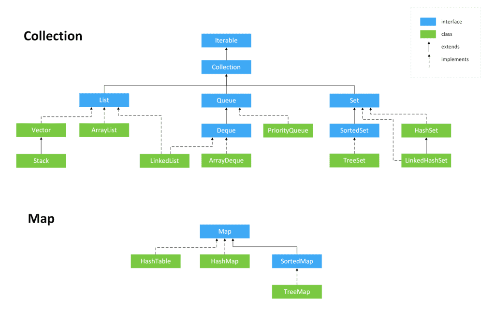
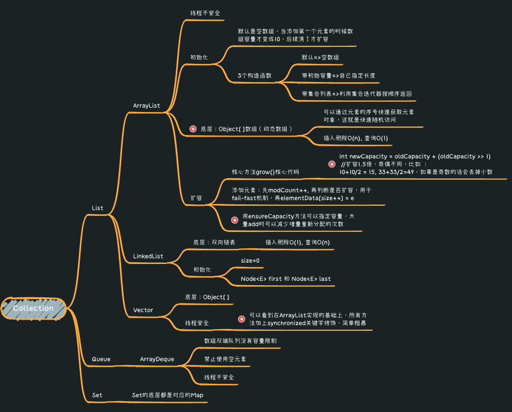
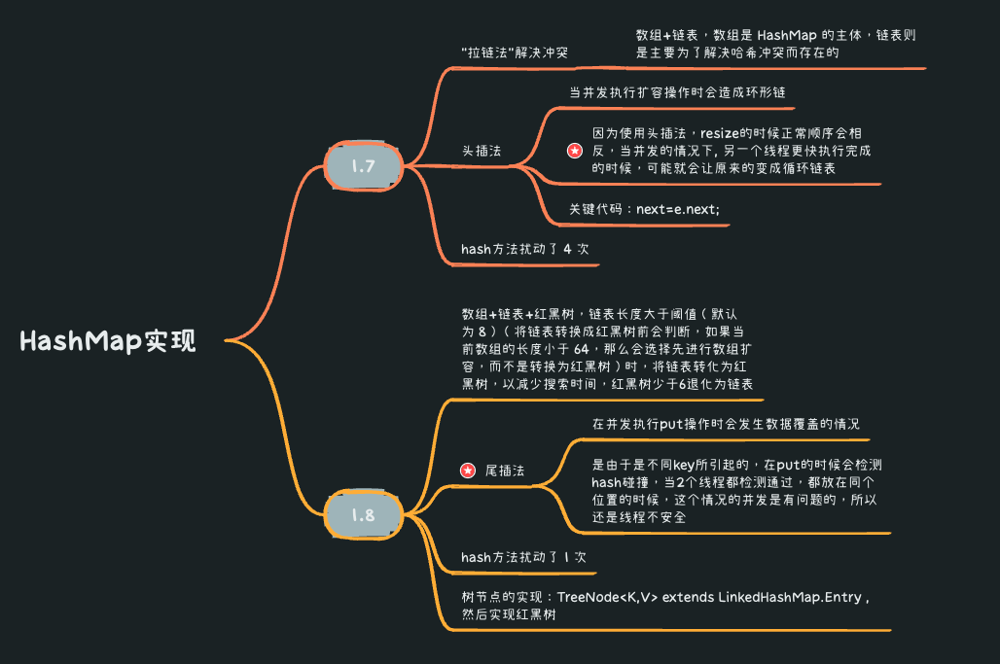
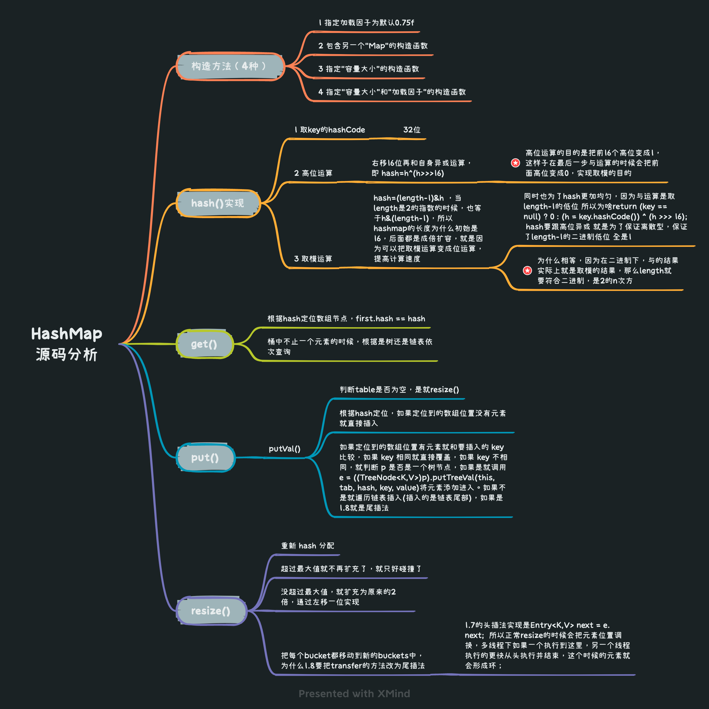

* [返回主页](../home.md)
# 1集合


## Collection



## Map 
### HashMap



### HashTable
```text
1 线程安全
    所以key和value都不能为null，原理和网络条件下使用包装类一样，多线程下不能确定是空指针还是没数据
2 初始化大小是11，扩展是 *2+1
3 jdk1.8的时候也没有使用红黑树
```
### SortedMap
#### TreeMap
```text
底层为红黑树
    红黑树为2-3-4树实现，可以用左倾2-3树来理解
    使用左倾2-3树模型，就很容易理解红黑树特性
    红色节点的含义是连接父节点，所以只有黑色节点才贡献高度
红黑树特性是有序平衡的基础上兼顾查找和插入删除效率，在插入删除的时候不超过3次旋转变色就可以完成，速度非常快
```
* [返回主页](../home.md)