* [返回主页](../home.md)
# 2并发
## Java内存区域
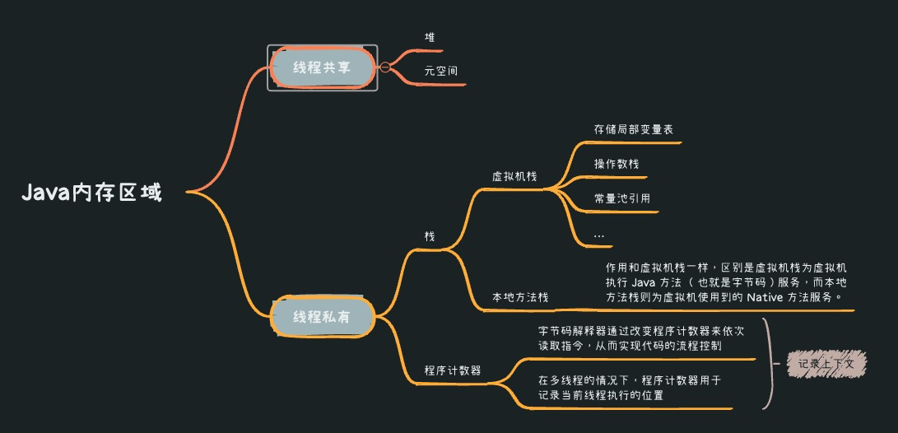

## 多线程
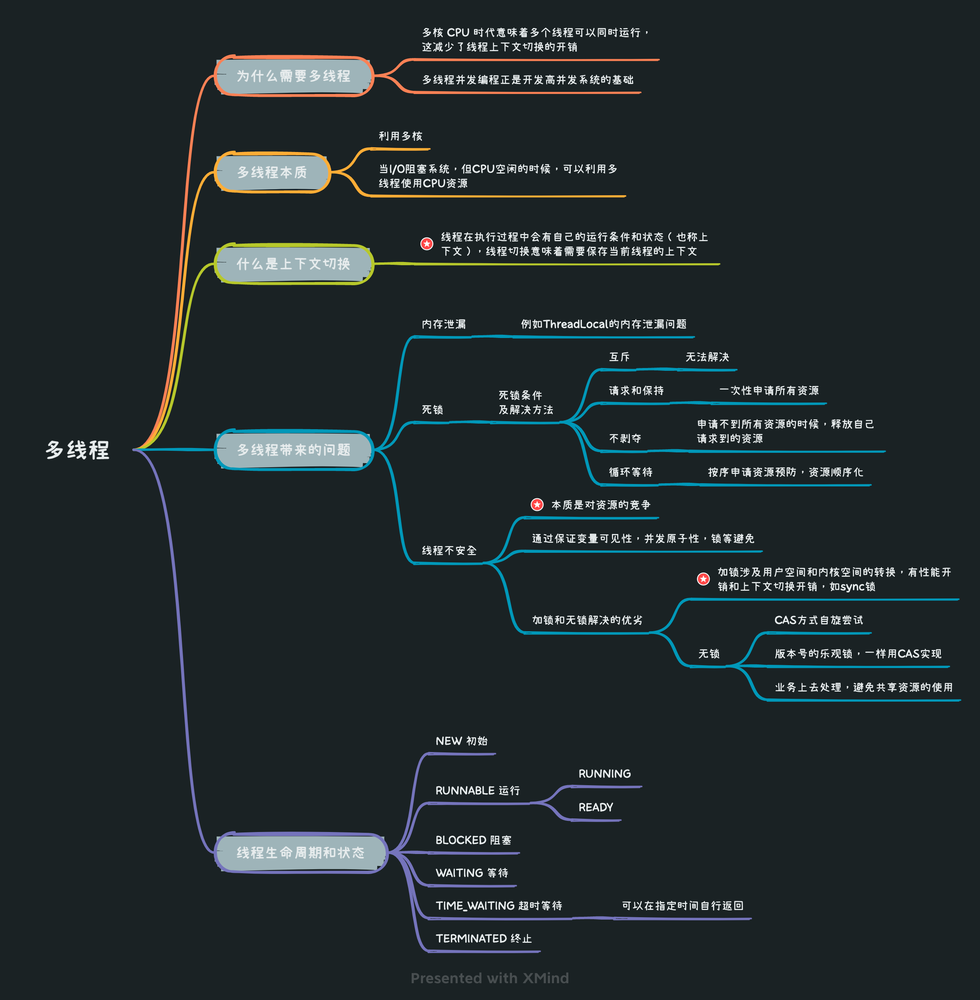

## 关键字&重要类
### sleep/wait 暂停线程比较
```text
sleep()
    没释放锁，占用CPU
    一般用于缓存
wait()
    释放了锁，不占用CPU，被唤醒后要做上下文切换
    一般用于线程间通信/交互
```
### synchronized
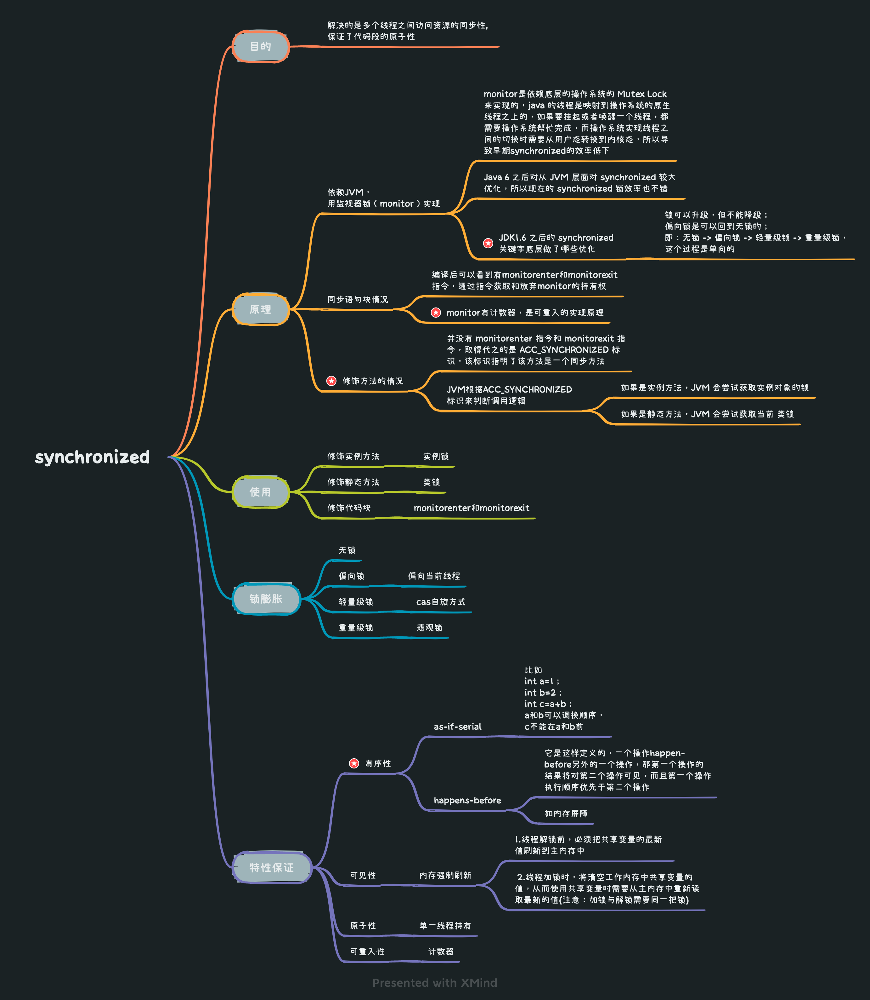

### volatile
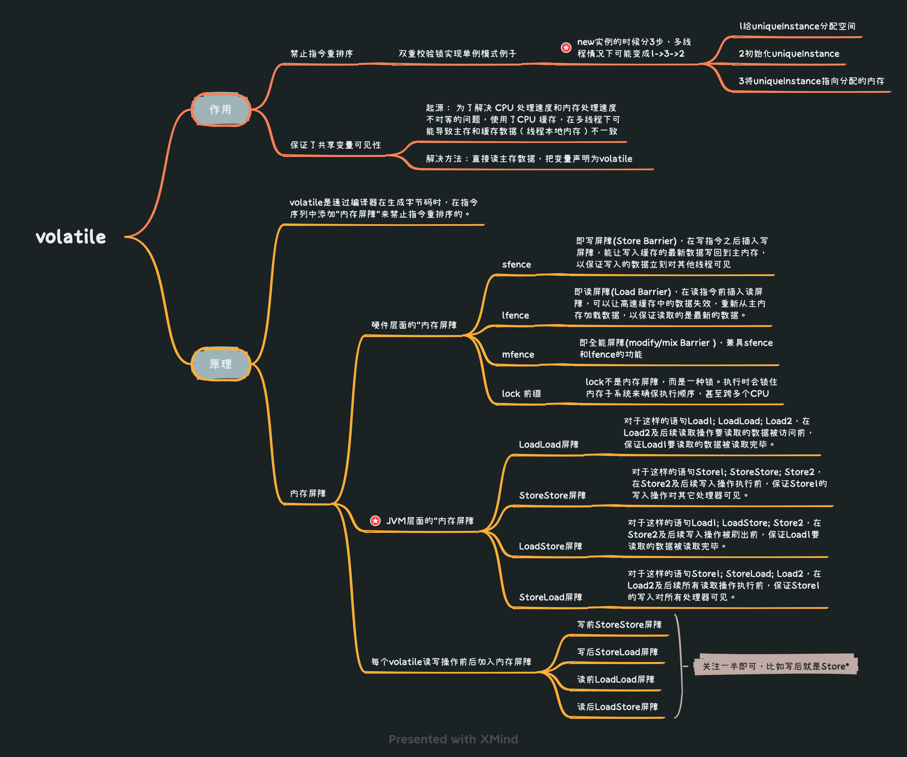

### ThreadLocal
#### 目的
```text
让每个线程绑定自己的值，可以将ThreadLocal类形象的比喻成存放数据的盒子，盒子中可以存储每个线程的私有数据
```
#### 源码实现
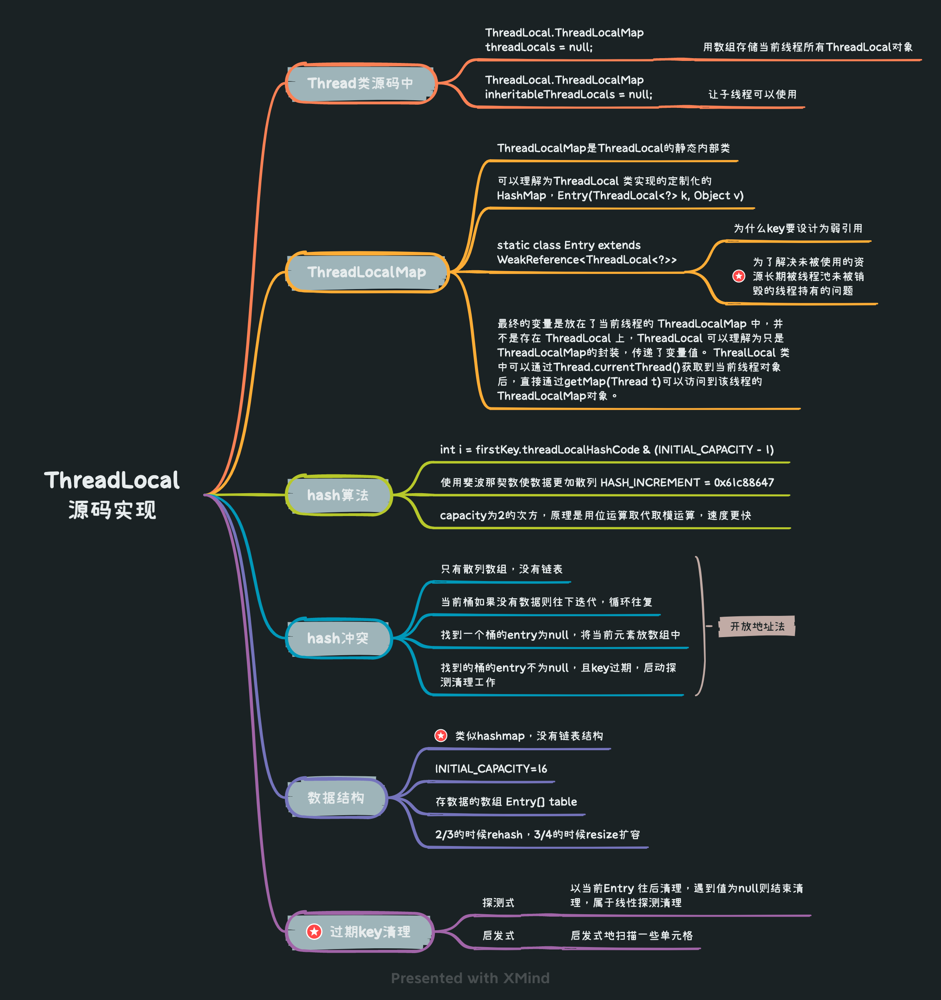

#### 内存泄漏问题
```text
由上面源码实现ThreadLocalMap可以看到key 为 ThreadLocal 的弱引用,而 value 是强引用
如果 ThreadLocal 没有被外部强引用的情况下，在垃圾回收的时候，key 会被清理掉，而 value 不会被清理掉。
这样一来，ThreadLocalMap 中就会出现 key 为 null 的 Entry。
假如我们不做任何措施的话，value 永远无法被 GC 回收，这个时候就可能会产生内存泄露。
最常用的解决方法就是一定要强引用ThreadLocal，这样key也会一直使用
```
```java{4}
//如果是需要回收的key和value的情况，使用完手动remove()
public class HolidayPeriodMapContext implements AutoCloseable {

    private static final ThreadLocal<HolidayPeriodMapBO> CTX = new ThreadLocal<>();
    
    public HolidayPeriodMapContext(HolidayPeriodMapBO holiday) {
        CTX.set(holiday);
    }
    public static HolidayPeriodMapBO currentHolidayPeriodMap() {
        return CTX.get();
    }

    @Override
    public void close() {
        CTX.remove();
    }
}

try (HolidayPeriodMapContext holidayCtx = new HolidayPeriodMapContext(holiday)) {
    ..............................
}
```

::: tip 场景
1.用户全局token<br>
原理：自定义拦截器，获取用户信息放ThreadLocal中<br><br>
2.获取reqId并处理
:::

#### InheritableThreadLocal
::: tip 目的
如果希望当前线程的ThreadLocal能够被子线程使用
:::
::: tip 实现
Thread类的init方法中，会判断是否将可继承的ThreadLocal变量传递到子线程
:::
```java{2}
if (inheritThreadLocals && parent.inheritableThreadLocals != null)
    this.inheritableThreadLocals = ThreadLocal.createInheritedMap(parent.inheritableThreadLocals);
```

## Unsafe类
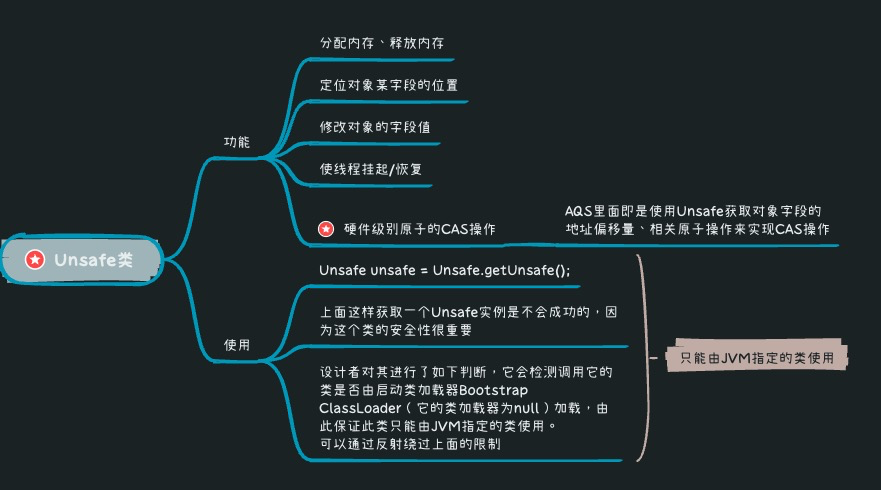

## JUC
### JUC包结构
+ 1.atomic包
+ 2.locks包
    + AQS抽象类（AbstractQueuedSynchronizer）
    + ReentrantLock
    + Lock接口
        + 读锁/写锁/可重入锁..
    + ReadWriteLock接口
        + ReentrantReadWriteLock  
    + Condition 接口 
        + Condition 将对象监视器方法（wait、notify 和 notifyAll）分解为不同的对象，通过将它们与任意 Lock 实现的使用结合起来，使每个对象具有多个等待集的效果。 Lock 代替了同步方法和语句的使用，Condition 代替了 Object 监视器方法的使用。
+ 3.当前concurrent包的类
    + 3.1并发容器
        + ConcurrentHashMap
        + BlockingQueue 阻塞队列
        + CopyOnWriteArrayList
        +ConcurrentSkipListMap 跳表实现
    + 3.2并发工具类
        + CountDownLatch
            + 允许 count 个线程阻塞在一个地方，直至所有线程的任务都执行完毕
        + CyclicBarrier
        + Semaphore
            + 信号量
        + 线程池
    + 3.3执行框架
        + Executor
        + Future
        + Callable
    
### atomic类
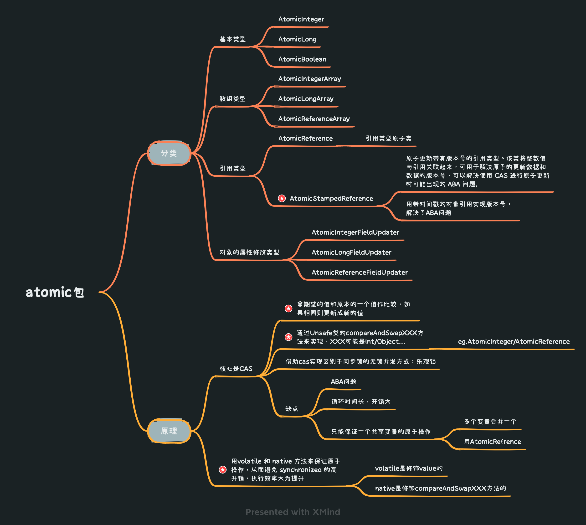

### AQS
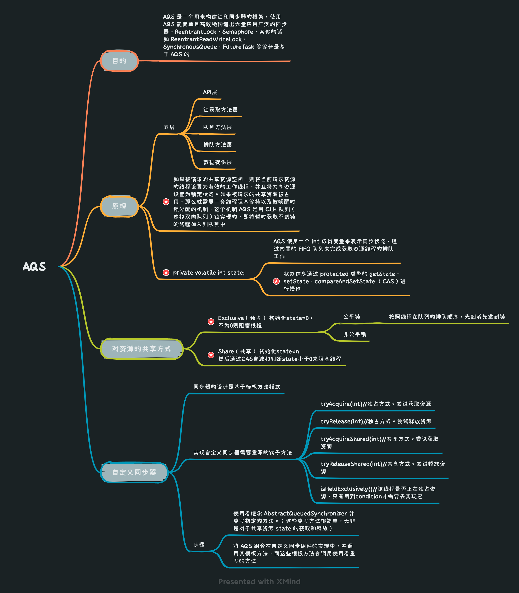
#### AQS加锁/获取锁基本流程
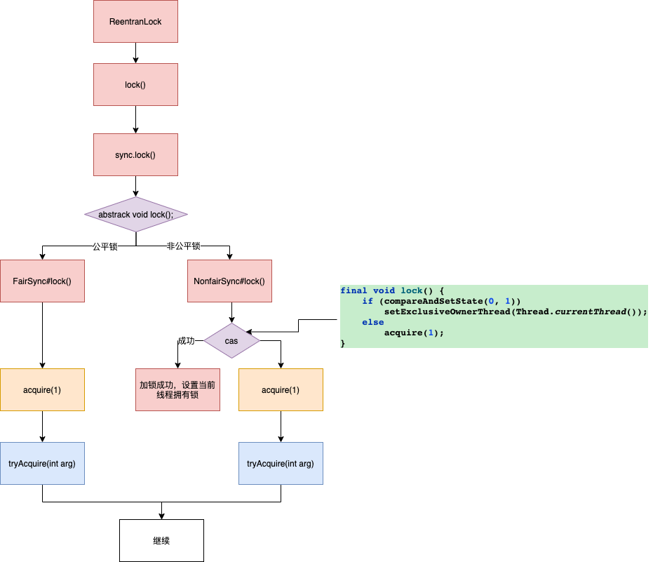
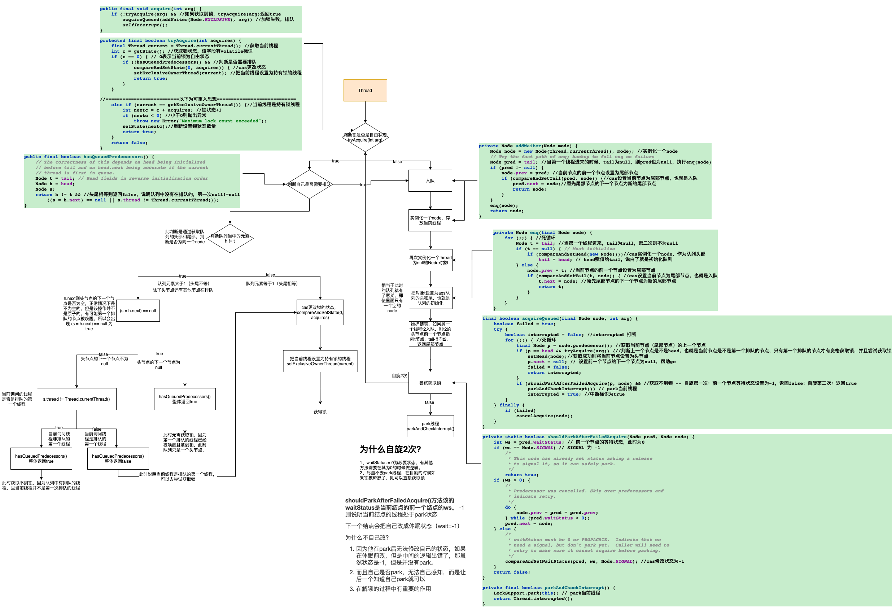
### ReentrantLock
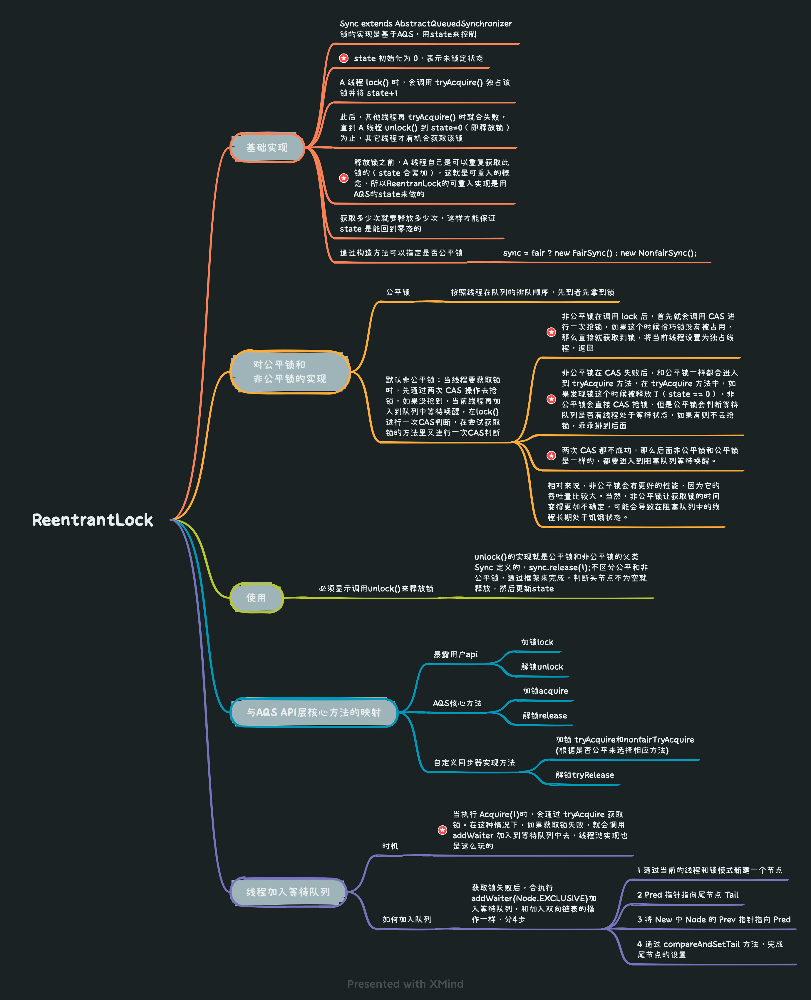

### 线程池
::: tip  目的
降低资源消耗<br>
提高响应速度<br>
可管理性增强<br>
:::
::: tip 场景
活动连接数不是特别高（小于单机1000）的情况
:::
::: warning 线程池模型主要问题
严重依赖于线程，所以场景如果是十万/百万的连接，BIO模型是有问题的

线程的创建和销毁成本很高，创建和销毁都是重量级的系统函数<br>
线程本身占用较大内存，像Java的线程栈，一般至少分配512K～1M的空间<br>
线程的切换成本是很高的，需要保留线程的上下文
:::

#### Executor
+ 好处
    + Executor 框架是 Java5 之后引进的，在 Java 5 之后，通过 Executor 来启动线程比使用 Thread 的 start 方法更好，除了更易管理，效率更好（用线程池实现，节约开销）外，还有关键的一点：有助于避免 this 逃逸问题
        + this 逃逸是指在构造函数返回之前其他线程就持有该对象的引用. 调用尚未构造完全的对象的方法可能引发令人疑惑的错误
+ 组成
    + 任务(Runnable /Callable)
        + Runnable 接口不会返回结果或抛出检查异常，但是 Callable 接口可以
    + 任务的执行(Executor)
    + 异步计算的结果(Future)

####  execute()方法和 submit()方法的区别
+ execute()方法用于提交不需要返回值的任务，所以无法判断任务是否被线程池执行成功与否
+ submit()方法用于提交需要返回值的任务。线程池会返回一个 Future 类型的对象，通过这个 Future 对象可以判断任务是否执行成功，并且可以通过 Future 的 get()方法来获取返回值，get()方法会阻塞当前线程直到任务完成

#### 线程池execute方法原理
```text
1.首先判断当前线程池中执行的任务数量是否小于 corePoolSize，
  如果小于的话，通过addWorker(command, true)新建一个线程，并将任务(command)添加到该线程中；
  然后，启动该线程从而执行任务
2.如果当前执行的任务数量大于等于 corePoolSize 的时候就会走到这里，通过 isRunning 方法判断线程池状态，
  线程池处于 RUNNING 状态并且队列可以加入任务，该任务才会被加入进去，不然尝试判断线程是否全部执行完毕。
  同时执行拒绝策略
3.通过addWorker(command, false)新建一个线程，并将任务(command)添加到该线程中；
  然后，启动该线程从而执行任务。如果addWorker(command, false)执行失败，则通过reject()执行相应的拒绝策略
  
上面step2和3里的true和false就是用来判断是取核心线程数还是最大线程数的，所以流程就是先检查核心线程数，然后检查队列是否满了，再检查最大线程数，最后按饱和策略处理
ps.
    1)如果任务为null，则抛出异常;
    2)用addWorker方法新建线程;
```

#### 线程池的实现
##### 通过构造方法
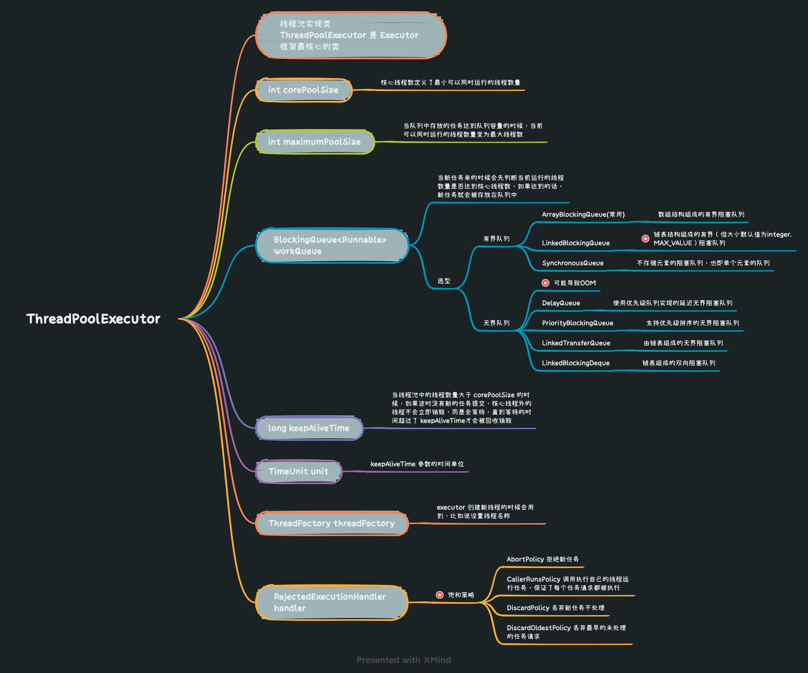

::: warning 注意点
别忘记给线程池命名 （利于定位问题）<br>
特别是@Async的使用，定义名称，不使用默认也是舱壁模式的体现，可以防止远程调用的问题影响到其他业务的线程池
:::
##### 通过 Executor 框架的工具类 Executors 来实现
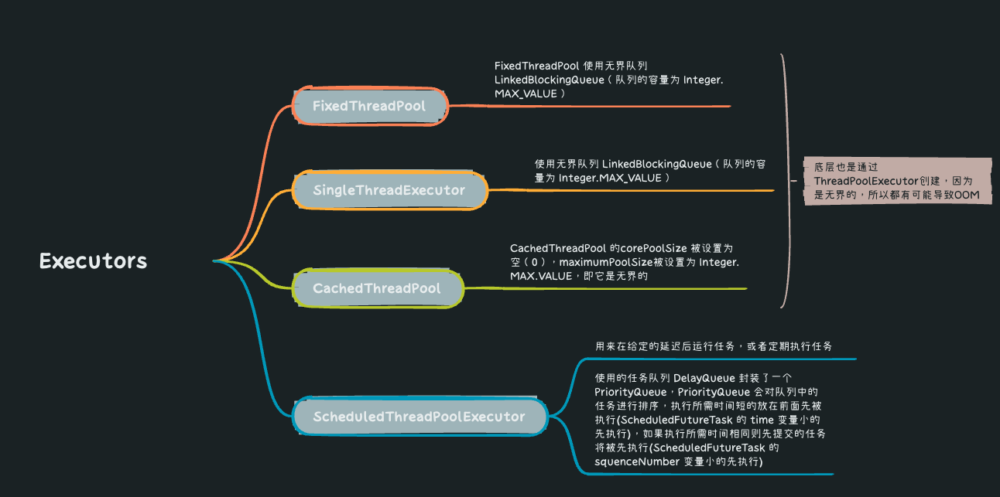

#### 线程池大小的确定
::: tip 普遍的公式
CPU 密集型任务(N+1)  <br>
N为CPU核数，加1是为了避免线程偶发的缺页中断，尽量让CPU使用，避免上下文切换

I/O 密集型任务(2N)<br>
考虑让出CPU给其他线程使用

具体还是要考虑业务情况
:::

* [返回主页](../home.md)