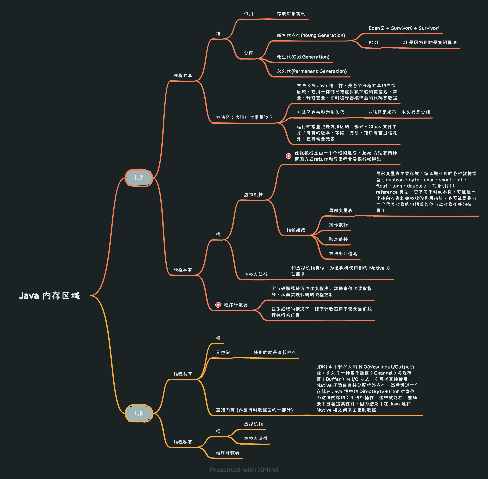
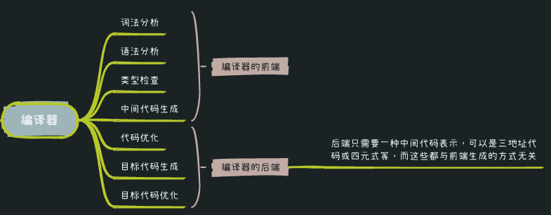

* [返回主页](../home.md)
# 3JVM
## Java内存区域

### 堆内存

## 对象内存布局


## 编译器


## 对象访问定位的方式


## 对象的创建过程


## GC
### 内存分配与回收
+ 对象优先在 eden 区分配
	+ 大对象直接进入老年代
		+ 避免为大对象分配内存时由于分配担保机制带来的复制而降低效率
	+ 长期存活的对象将进入老年代
	+ 空间分配担保
		+ 只要老年代的连续空间大于新生代对象总大小或者历次晋升的平均大小， 就会进行 Minor GC，否则将进行 Full GC
### GC流程

```text
所有自动执行的 GC 操作都只会在对象创建的情况下进行调用，调用的 GC 分为两种 GC：
> 新生代 GC：MinorGC
> 老生代 GC：MajorGC（Full GC）
 
1. 所有新创建的对象都存储在新生代的伊甸园区。
2. 如果伊甸园区内存空间充足可用，新对象直接在伊甸园区进行堆内存空间堆开辟。
3. 如果伊甸园区内存空间不足，意味着当前内存区已满，满了会触发第一次 GC 即 MinorGC(清理普通的无用对象)，
   如果在 MinorGC 之后发现内存空间充足，则在伊甸园区开辟新的内存空间保存新对象的数据。
4. 经过持续的 MinorGC 还被保存下来的对象（伊甸园空间不足执行 MinorGC，MinorGC 之后空间仍然不足才会进行晋升处理），
   就认为该对象可能是一个有用的对象，所以就会对这个有用对象进行晋升处理，把有用对象保存在存活区中（存活区依然属于新生代），
   此时由于存在有用对象的内存区域的改变，必然释放伊甸园区部分内存空间，来实现新对象的创建。
5. 如果伊甸园区和存活区都满了，就去看老生代有没有充足的内存空间，如果老生代内存空间充足，将存活去的数据晋升到老生代存储，然后释放新生代内存空间。保证新生代能继续开辟新的内存。
6. 如果老生代内存空间也不足，就会触发 MajorGC(Full GC)进行老生代内存空间的释放，如果 Full GC 失败，就表示整个内存彻底被占满，这时不会再执行 GC 处理，直接抛出 OOM。
7. 如果新建对象非常庞大，那么不经过伊甸园区存储，直接再老生代存储对象，意味着很大可能会直接抛出 OOM 异常。
```
### 判断对象是否死亡

### 判断常量是废弃常量
> 当前没有任何对象引用该常量，说明是废弃的，可回收

### 判断类无用
```text
该类所有的实例都已经被回收
加载该类的 ClassLoader 已经被回收
该类对应的 java.lang.Class 对象没有在任何地方被引用
```

### 引用的分类
::: tip 强引用
必不可少，当内存空间不足，Java 虚拟机宁愿抛出 OutOfMemoryError 错误
:::
::: tip 软引用
如果内存空间足够，垃圾回收器就不会回收它，如果内存空间不足了，就会回收这些对象的内存
:::
::: tip 弱引用
在垃圾回收器线程扫描它所管辖的内存区域的过程中，一旦发现了只具有弱引用的对象，不管当前内存空间足够与否，都会回收它的内存
:::
::: tip 虚引用
任何时候都可能回收，虚引用主要用来跟踪对象被垃圾回收的活动
:::

### full gc
::: tip 发生时间
1. 老年代写满<br>
2. system.gc<br>
3. 持久代空间不足
:::

### 收集算法&收集器


## 问题排查


## 性能调优


* [返回主页](../home.md)