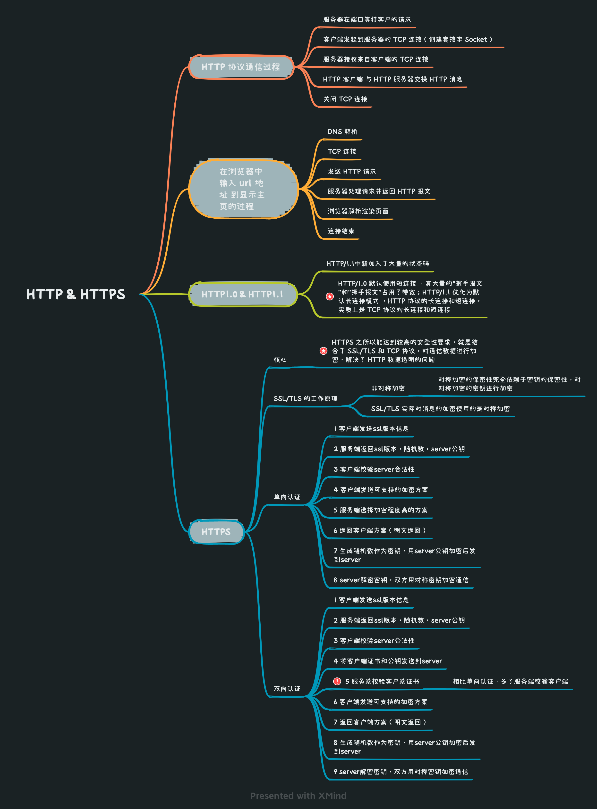
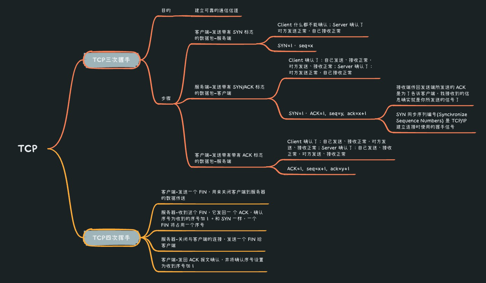
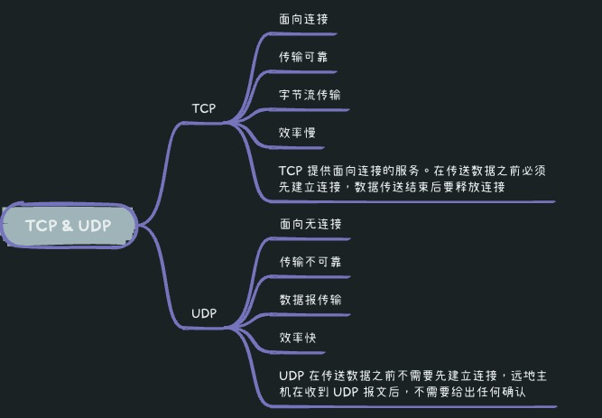
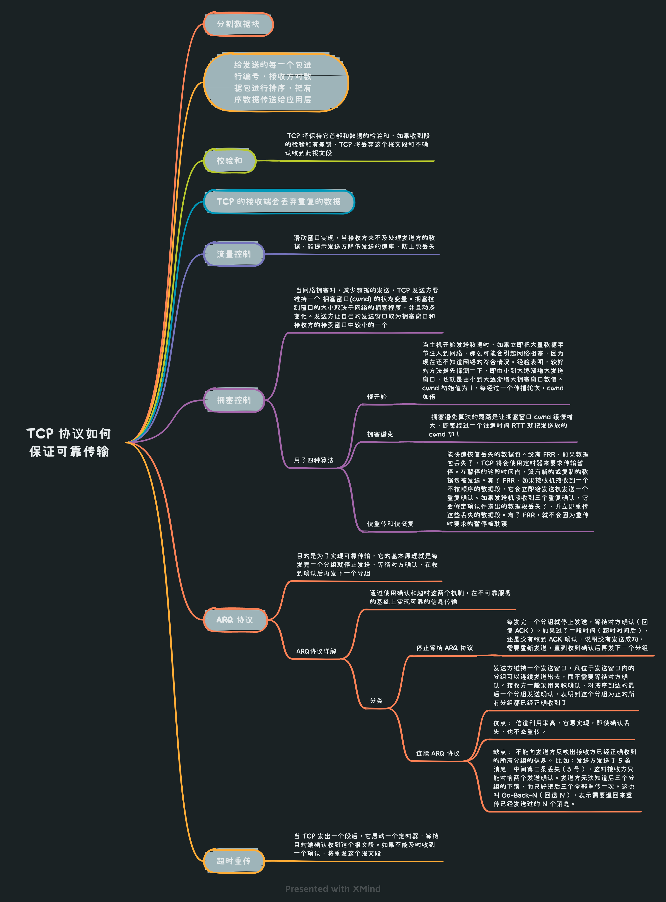
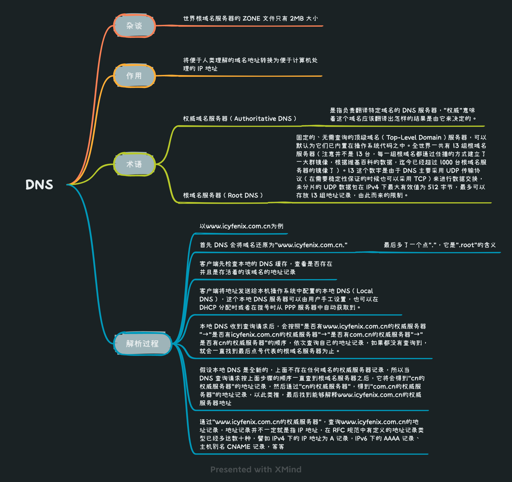
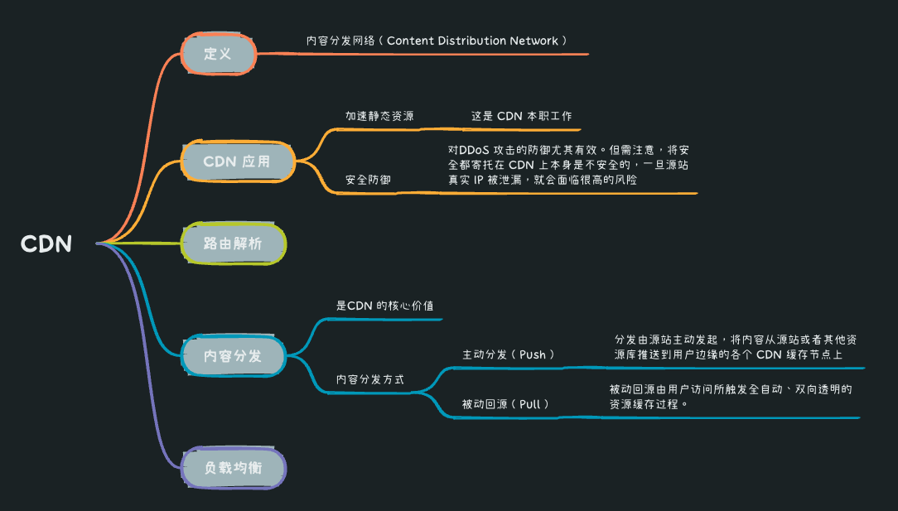

* [返回主页](../home.md)
# 4网络
## OSI七层模型 VS TCP/IP 四层模型
::: tip OSI七层模型
应用层 
表示层 
会话层 
传输层 
网络层 
数据链路层 
物理层
:::
::: tip TCP/IP 四层模型
应用层(对应OSI上三层) 
传输层 
网络层 
数据链路层 
物理层(对应OSI下2层)
:::

## HTTP & HTTPS
### 介绍
::: tip HTTP
HTTP 协是基于 TCP协议，发送 HTTP 请求之前首先要建立 TCP 连接也就是要经历 3 次握手。目前使用的 HTTP 协议大部分都是 1.1。在 1.1 的协议里面，默认是开启了 Keep-Alive 的，这样的话建立的连接就可以在多次请求中被复用了
:::

::: tip HTTPS
HTTPS 之所以能达到较高的安全性要求，就是结合了 SSL/TLS 和 TCP 协议，对通信数据进行加密，解决了 HTTP 数据透明的问题
:::

### 详情

## TCP
### 三次握手 & 四次挥手

### TCP & UDP

### TCP可靠保证

## DNS

## CDN

## 负载均衡

* [返回主页](../home.md)