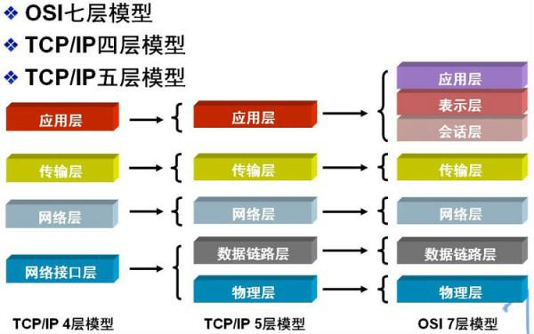
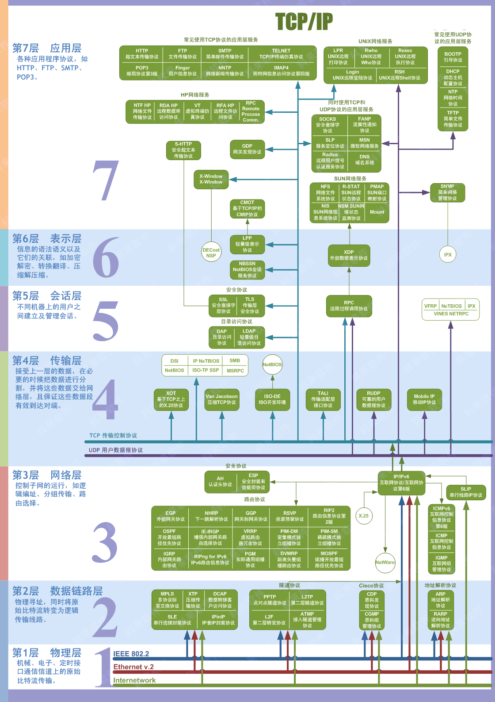
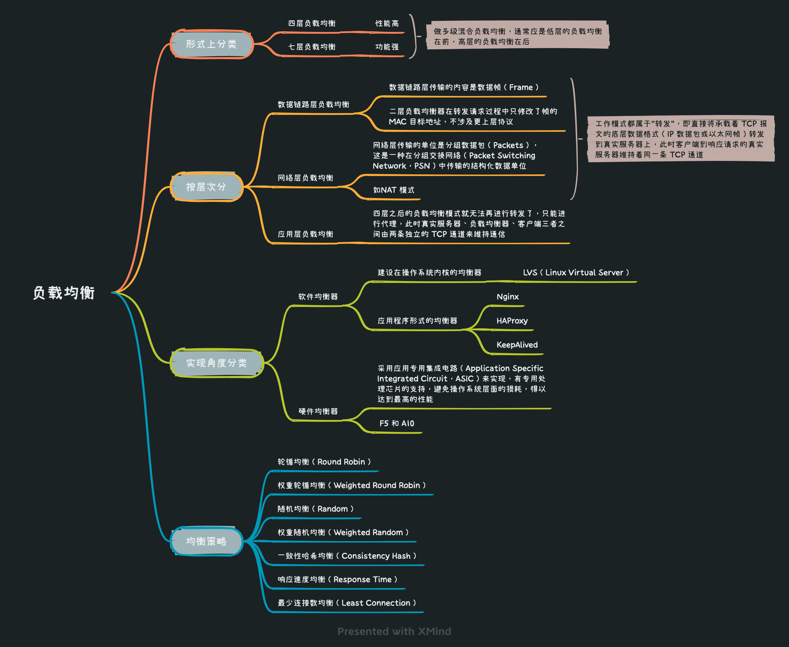

* [返回主页](../home.md)
# 4网络
## OSI七层模型 VS TCP/IP 四层模型

[comment]: <> (::: tip OSI七层模型)

[comment]: <> (应用层 )

[comment]: <> (表示层 )

[comment]: <> (会话层 )

[comment]: <> (传输层 )

[comment]: <> (网络层 )

[comment]: <> (数据链路层 )

[comment]: <> (物理层)

[comment]: <> (:::)

[comment]: <> (::: tip TCP/IP 四层模型)

[comment]: <> (应用层&#40;对应OSI上三层&#41; )

[comment]: <> (传输层 )

[comment]: <> (网络层 )

[comment]: <> (物理层&#40;对应OSI下2层&#41;)

[comment]: <> (:::)

### TCP/IP7层详情

## HTTP & HTTPS
### 介绍
::: tip HTTP
HTTP 协是基于 TCP协议，发送 HTTP 请求之前首先要建立 TCP 连接也就是要经历 3 次握手。 
目前使用的 HTTP 协议大部分都是 1.1。在 1.1 的协议里面，默认是开启了 Keep-Alive 的，这样的话建立的连接就可以在多次请求中被复用了
:::

::: tip HTTPS
HTTPS 之所以能达到较高的安全性要求，就是结合了 SSL/TLS 和 TCP 协议，对通信数据进行加密，解决了 HTTP 数据透明的问题
:::

### 详情

## TCP
### 三次握手 & 四次挥手

### TCP & UDP

### TCP可靠保证

## DNS

## CDN

## 负载均衡

* [返回主页](../home.md)