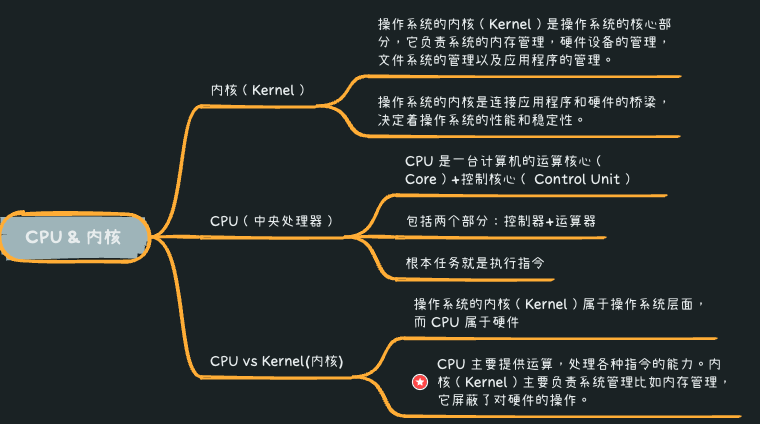
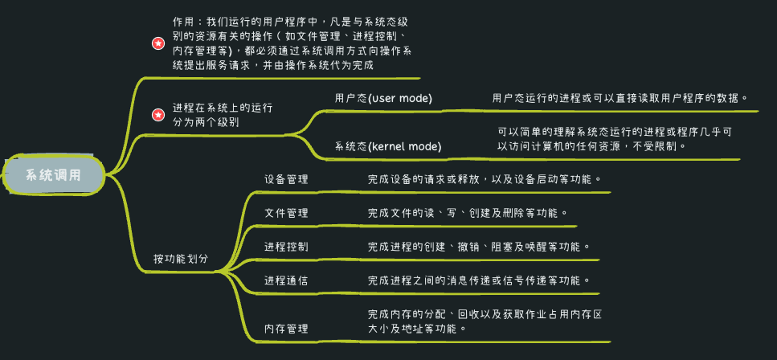
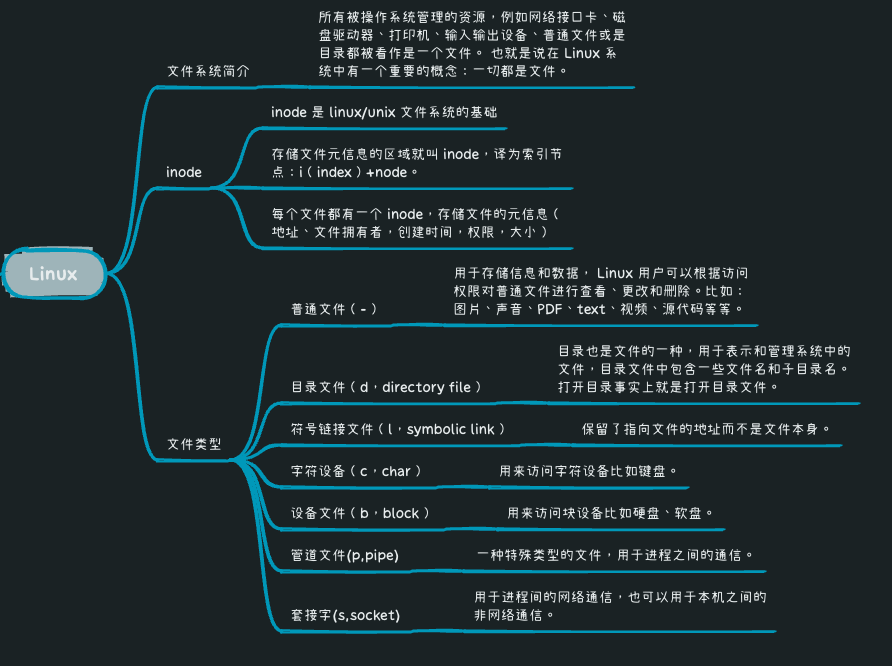
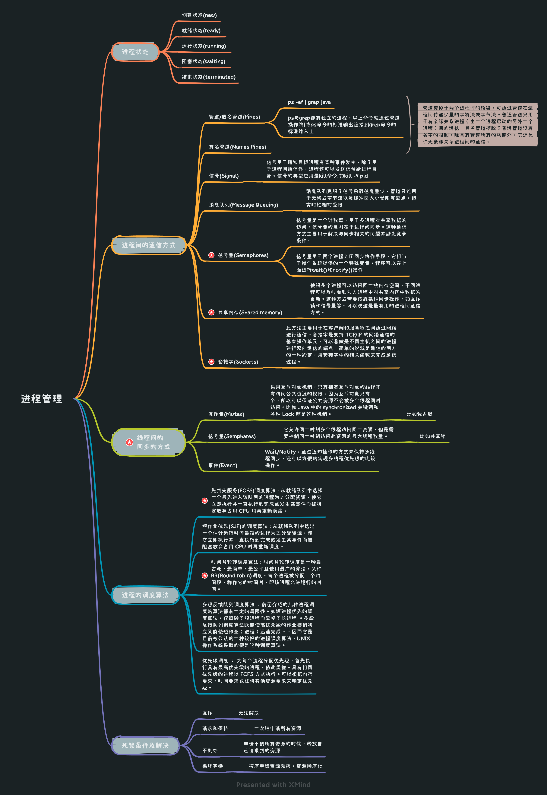
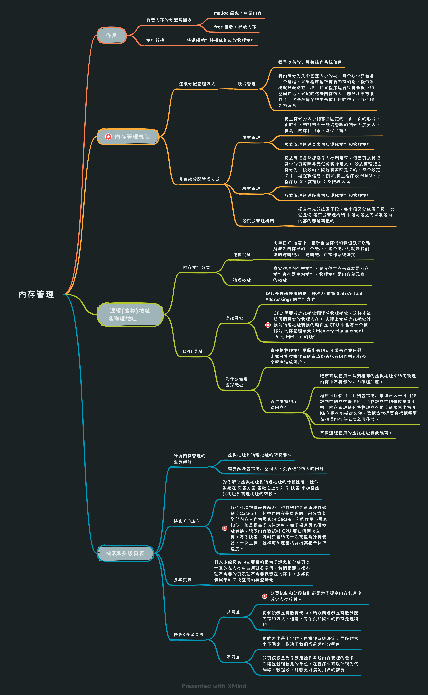
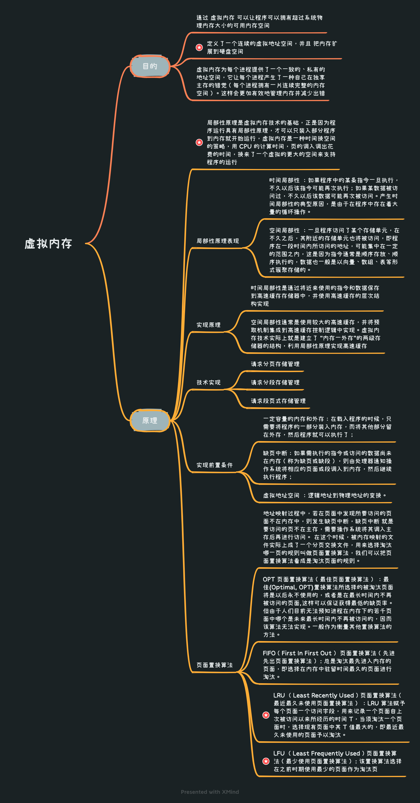

* [返回主页](../home.md)
# 5操作系统
## 操作系统本质
> 操作系统本质上是一个运行在计算机上的软件程序 ，用于管理计算机硬件和软件资源

## CPU & 内核

[comment]: <> (::: tip 内核（Kernel）)

[comment]: <> (操作系统的内核（Kernel）是操作系统的核心部分，它负责系统的内存管理，硬件设备的管理，文件系统的管理以及应用程序的管理。 )

[comment]: <> (操作系统的内核是连接应用程序和硬件的桥梁，决定着操作系统的性能和稳定性。)

[comment]: <> (:::)

[comment]: <> (::: tip CPU（中央处理器）)

[comment]: <> (CPU 是一台计算机的运算核心（Core）+控制核心（ Control Unit）, 包括两个部分：控制器+运算器 )

[comment]: <> (根本任务就是执行指令)

[comment]: <> (:::)

[comment]: <> (::: tip CPU vs Kernel&#40;内核&#41;)

[comment]: <> (操作系统的内核（Kernel）属于操作系统层面，而 CPU 属于硬件. )

[comment]: <> (CPU 主要提供运算，处理各种指令的能力。内核（Kernel）主要负责系统管理比如内存管理，它屏蔽了对硬件的操作。)

[comment]: <> (:::)

## 系统调用

## 了解Linux

## 进程管理

## 内存管理

## 虚拟内存（虚拟存储器）

* [返回主页](../home.md)