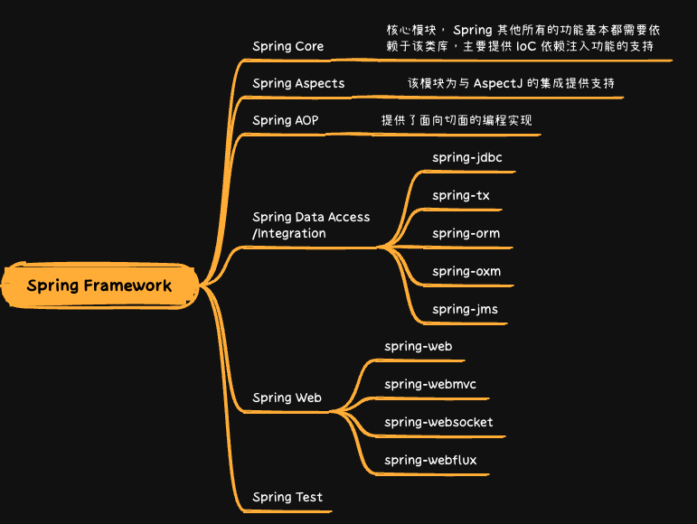
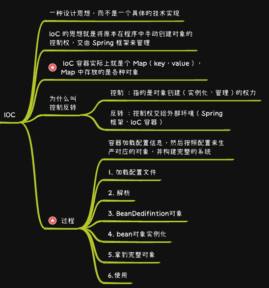
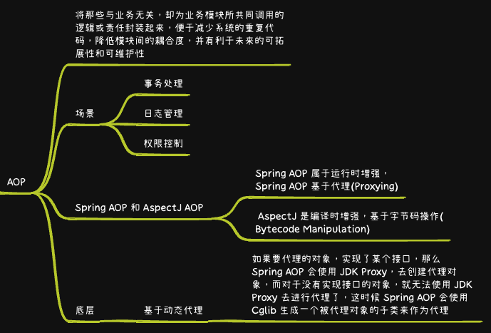
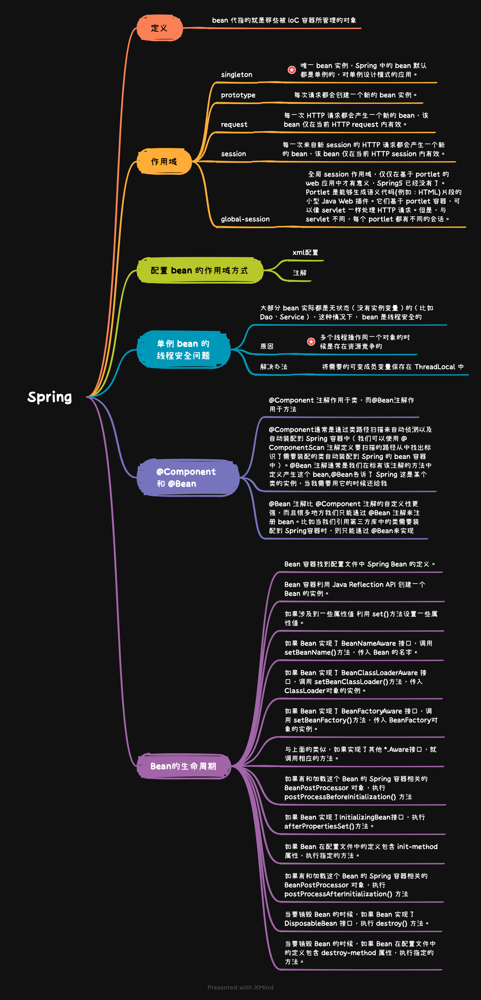
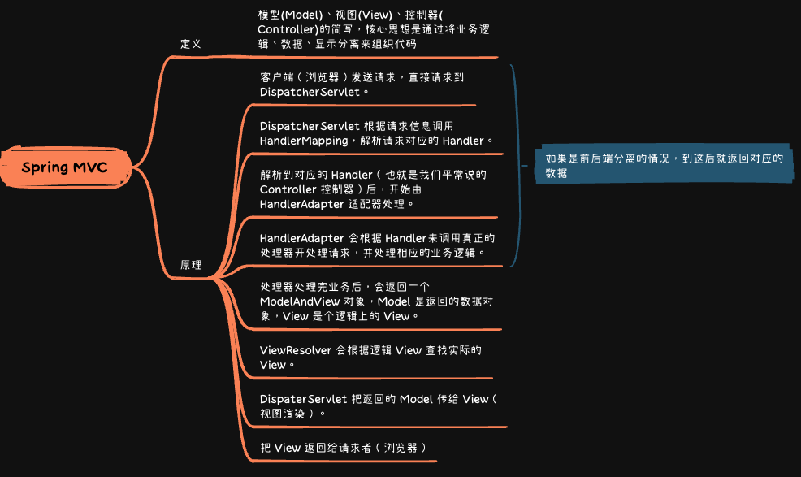
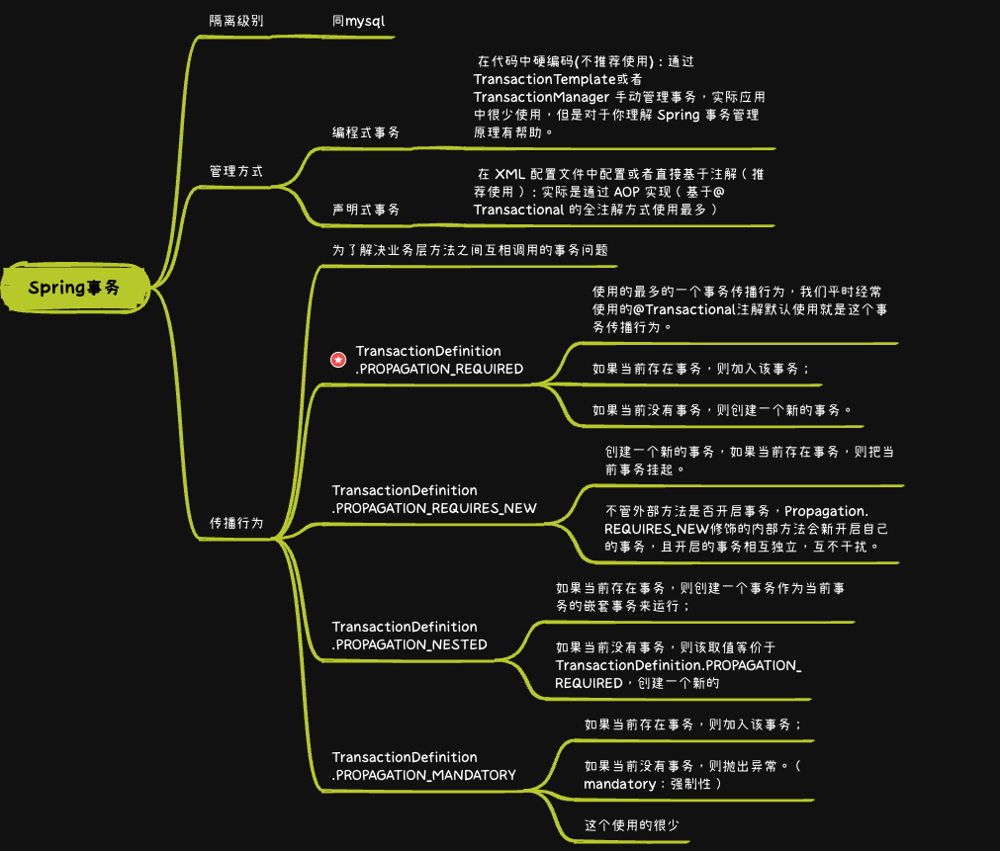
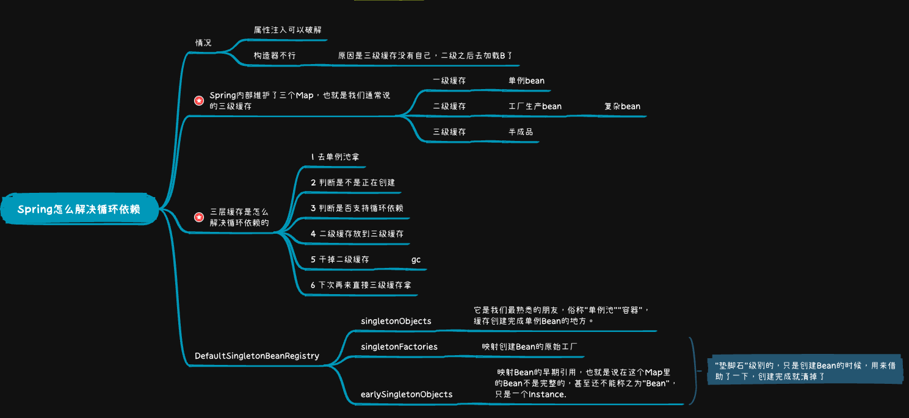

* [返回主页](../home.md)
# 6Spring
## 定义
> 开源的轻量级 Java 开发框架，旨在提高开发人员的开发效率以及系统的可维护性
> 
> 最核心的思想就是不重新造轮子，开箱即用

## Spring Framework


## Spring IOC & AOP
### IOC


### AOP


## Bean


## BeanFactory VS ApplicationContext
::: tip BeanFactory
Spring基础设施，面向Spring生产和管理Bean的
:::
::: tip ApplicationContext
面向开发者，再BeanFactory的基础上，扩展了面向应用的功能，如监听器
:::

## Filter VS  Interceptor
```text
共同点——都是AOP的体现
Filter是Servlet规定的，只能用于Web程序，Interceptor可以用于其他
Filter依赖web容器，拦截器是spring框架支持的，是spring组件
过滤器只能在servlet前后起作用，拦截器能深入到方法/异常前后
```

## SpringMVC


## Spring用到的设计模式


## Spring事务


## Spring解决循环依赖


* [返回主页](../home.md)