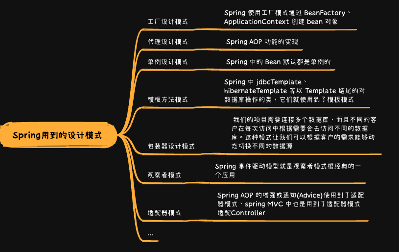

* [返回主页](../home.md)
# 6Spring
## 定义
> 开源的轻量级 Java 开发框架，旨在提高开发人员的开发效率以及系统的可维护性
> 
> 最核心的思想就是不重新造轮子，开箱即用

## Spring Framework


## Spring IOC & AOP
### IOC


### AOP

#### AOP原理


## Bean


## BeanFactory VS ApplicationContext
::: tip BeanFactory
Spring基础设施，面向Spring生产和管理Bean的
:::
::: tip ApplicationContext
面向开发者，再BeanFactory的基础上，扩展了面向应用的功能，如监听器
:::

## Filter VS  Interceptor
```text
共同点——都是AOP的体现
Filter是Servlet规定的，只能用于Web程序，Interceptor可以用于其他
Filter依赖web容器，拦截器是spring框架支持的，是spring组件
过滤器只能在servlet前后起作用，拦截器能深入到方法/异常前后
```

## SpringMVC


## Spring用到的设计模式


## Spring事务


## Spring解决循环依赖


### 循环依赖与加载类型、作用域的关系
```text
在开始介绍各种情况之前，首先要了解以下三个知识点：
Spring中依赖注入的方式有两种，属性注入与构造器注入。上面的代码中，类A就是通过属性注入的方式注入了B，类B是通过构造器注入的方式注入了A。
Spring中的bean根据作用域的不同，可以大体分为两类，singleton和prototype。singleton在一个容器中，只会有一个实例；而prototype在每次调用时，都会产生一个新的实例。
Spring中，单例bean有延迟加载和立即加载两种加载方式，其中立即加载模式会在容器启动的时候就创建bean，而延迟加载会在容器启动后，使用到bean的时候再加载它。本篇分析一律使用延迟加载，因为有时候单例bean的加载顺序，会影响到创建bean的成功或失败。
```

```text
如果循环依赖的bean都是通过构造器注入依赖，那么不管它们是singleton还是prototype，都会失败。
如果循环依赖的bean都是prototype，那么不管它们是通过构造器注入依赖还是通过属性注入依赖，都会失败。
如果循环依赖的bean既有构造器注入也有属性注入，既有singleton也有prototype，在容器启动后，只有当获取的第一个bean是通过属性注入依赖的singleton时，才会成功，别的情况都会失败。
```
::: tip 结论
如果多个bean存在循环依赖，在Spring容器启动后，只有当获取的第一个bean是通过属性注入依赖的singleton时，才会成功，别的情况都会失败。
:::

### setting注入避免循环依赖的问题
::: tip Spring容器启动后，如果我们去获取singletonA，那么容器的操作步骤大致如下：
1、尝试创建bean singletonA，发现singletonA是singleton，且不是通过构造器注入依赖，那么先使用默认构造器创建一个A的实例，并保存对它的引用，并且将singletonA标记为“正在创建中的singleton”。然后发现singletonA依赖了singletonB，所以尝试创建singletonB。
<br><br>2、尝试创建bean singletonB，发现singletonB是singleton，且不是通过构造器注入依赖，那么先使用默认构造器创建一个B的实例，并保存对它的引用，并且将singletonB标记为“正在创建中的singleton”。然后发现singletonB依赖了singletonA，所以尝试创建singletonA。
<br><br>3、尝试创建singletonA，注意，这时Spring容器发现singletonA“正在创建中”，那么就不会再去创建singletonA，而是返回容器之前保存了的对singletonA的引用（首先会读取singletonObjects缓存中的实例,如果存在则直接返回。因为当我们实例化完成的时候,会通过addSingleton加入到缓存,所以Address注入User的时候不会重新加载一遍,只是从缓存中直接读取,所以不会有循环引用的问题）。
<br><br>4、容器将singletonA通过setter方法注入到singletonB，从而singletonB完成创建。
<br><br>5、容器将singletonB通过setter方法注入到singletonA，从而singletonA完成创建。
:::

## 其他
### Spring中 @Autowired注解与@Resource注解的区别
::: tip 相同点：
@Resource的作用相当于@Autowired，均可标注在字段或属性的setter方法上。
:::
::: warning 不同点：
（1）提供方：<br>
@Autowired是由org.springframework.beans.factory.annotation.Autowired提供，换句话说就是由Spring提供；<br>
@Resource是由javax.annotation.Resource提供，即J2EE提供，需要JDK1.6及以上。

（2）注入方式：<br>
@Autowired只按照byType 注入；<br>
@Resource默认按byName自动注入，也提供按照byType 注入；

（3）属性：<br>
@Autowired按类型装配依赖对象，默认情况下它要求依赖对象必须存在，如果允许null值，可以设置它required属性为false。如果我们想使用按名称装配，可以结合@Qualifier注解一起使用。<br>
@Resource有两个中重要的属性：name和type。name属性指定byName，如果没有指定name属性，当注解标注在字段上，即默认取字段的名称作为bean名称寻找依赖对象，当注解标注在属性的setter方法上，即默认取属性名作为bean名称寻找依赖对象。需要注意的是，@Resource如果没有指定name属性，并且按照默认的名称仍然找不到依赖对象时， @Resource注解会回退到按类型装配。但一旦指定了name属性，就只能按名称装配了。
:::
```text
@Resource装配顺序

　　1. 如果同时指定了name和type，则从Spring上下文中找到唯一匹配的bean进行装配，找不到则抛出异常

　　2. 如果指定了name，则从上下文中查找名称（id）匹配的bean进行装配，找不到则抛出异常

　　3. 如果指定了type，则从上下文中找到类型匹配的唯一bean进行装配，找不到或者找到多个，都会抛出异常

　　4. 如果既没有指定name，又没有指定type，则自动按照byName方式进行装配；如果没有匹配，则回退为一个原始类型进行匹配，如果匹配则自动装配；
```
::: tip @Autowired注解与@Resource注解的选择
推荐使用@Resource注解在字段上，这样就不用写setter方法了.并且这个注解是属于J2EE的，减少了与Spring的耦合,这样代码看起就比较优雅
:::


* [返回主页](../home.md)