* [返回主页](../home.md)
# 7MySql
## 数据库范式
::: tip 1NF 无重复列
属性不可再分（就是字段只能是一个值）
:::

::: tip 2NF 有唯一键
在1NF的基础上增加了一个列，这个列称为主键，非主属性都依赖于主键 
:::

::: tip 3NF 数据不冗余
在2NF基础上，非主键要依赖主键，不能依赖其他 
:::

## 存储引擎
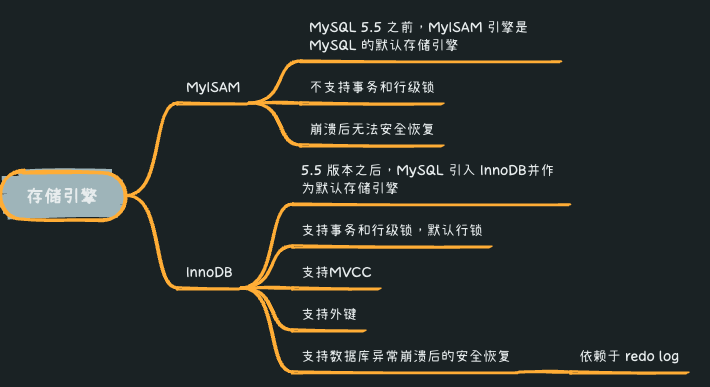

## 基础架构
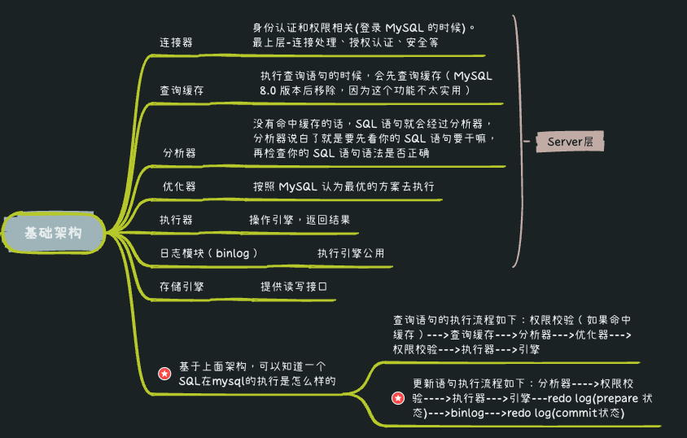

## InnoDB 存储引擎的锁
+ 表锁
+ 行锁
    + Record lock
        + 记录锁，单个行记录上的锁
    + Gap lock
        + 间隙锁，锁定一个范围，不包括记录本身
    + Next-key lock
        + record+gap 临键锁，锁定一个范围，包含记录本身

## InnoDB行格式
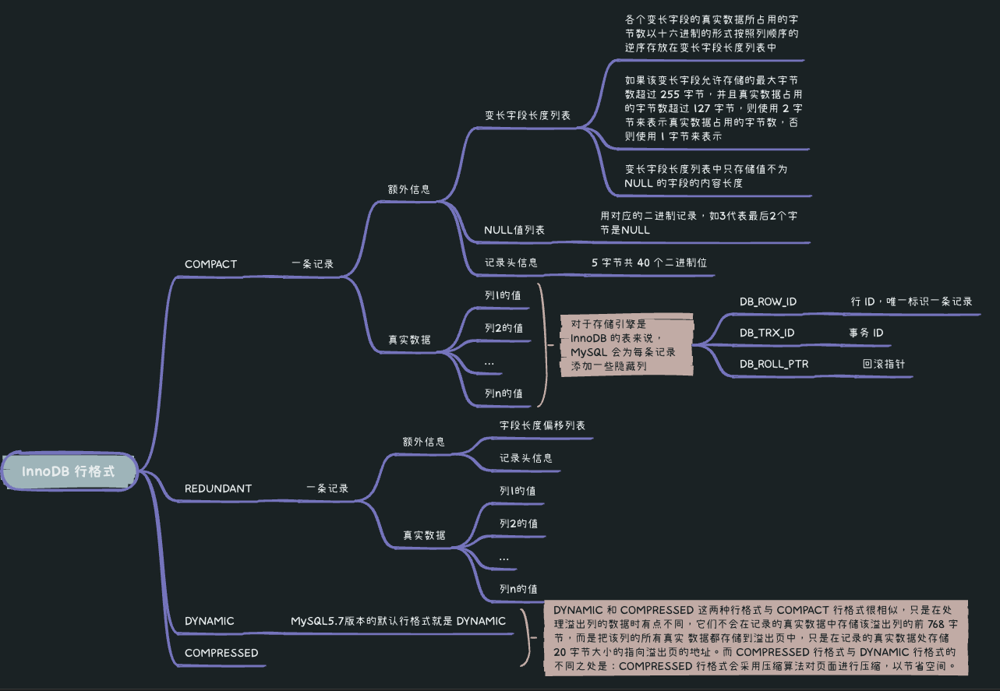

## InnoDB的数据页结构
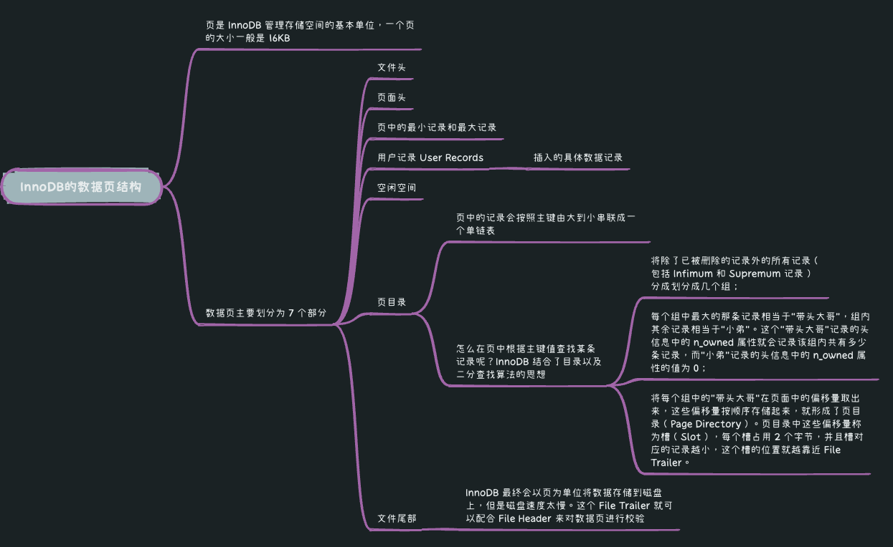

## InnoDB的表空间
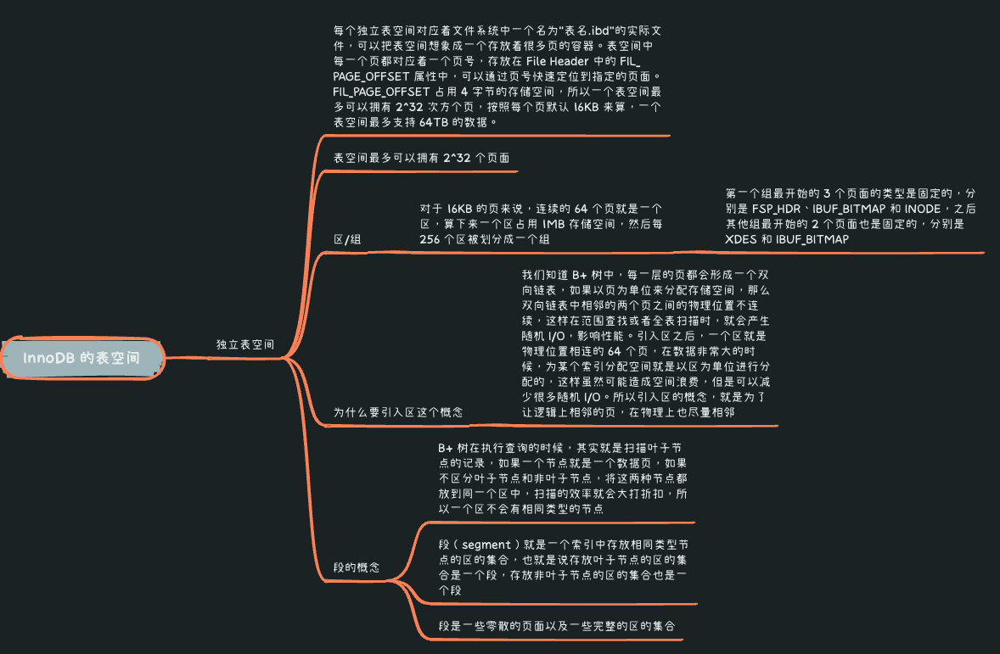

## 索引
### 定义
>用于快速查询和检索数据的数据结构

### 优点
+ 使用索引可以大大加快 数据的检索速度（大大减少检索的数据量）
+ 通过创建唯一性索引，可以保证数据库表中每一行数据的唯一性

### 缺点
+ 创建索引和维护索引需要耗费许多时间。当对表中的数据进行增删改的时候，如果数据有索引，那么索引也需要动态的修改，会降低 SQL 执行效率。
+ 索引需要使用物理文件存储，也会耗费一定空间

### 数据结构
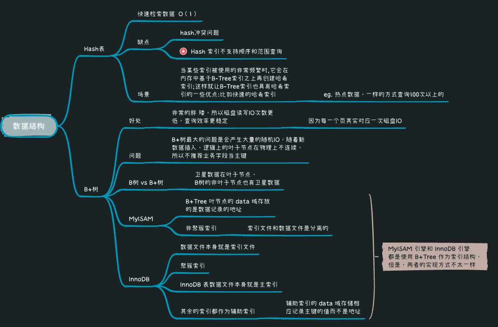

### 存储结构
::: tip 页
各数据页组成双向链表 , 每页数据是单向链表
:::

### 索引分类
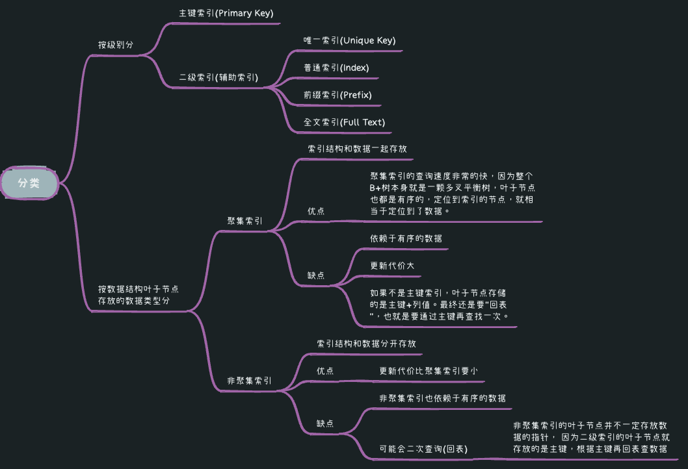

### 覆盖索引
> 覆盖索引即需要查询的字段正好是索引的字段，那么直接根据该索引，就可以查到数据了， 而无需回表查询。

### 索引下沉
索引下推是数据库检索数据过程中为减少回表次数而做的优化。eg.
```sql
select * from usertest where name like 'a%' and age = 10;
```
::: tip Mysql5.6之前的执行流程
根据最左前缀原则，执行name like 'a%'可以快速检索出id的值为1，5。
然后根据id的值进行回表操作，再次进行过滤age=10的数据
:::
::: tip Mysql5.6以后
在索引里面直接过滤age=10的数据，因为复合索引里面也存了age的数据，这样明明可以减少回表1次
这就是索引下沉
:::

### MYSQL索引底层结构为什么使用B+树?
> 因为B+树可以让索引结构最胖最矮，对于树的每一层节点，实际上对应着一次磁盘IO

### 索引失效情况
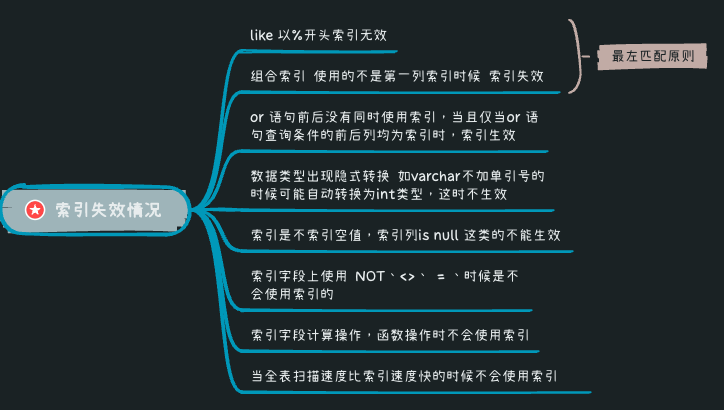

## 日志
### 二进制日志
::: tip  binlog日志
逻辑日志，记录内容是语句的原始逻辑，类似于“给 ID=2 这一行的 c 字段加 1”，属于MySQL Server 层<br>
会记录所有涉及更新数据的逻辑操作，并且是顺序写。<br>
不管用什么存储引擎，只要发生了表数据更新，都会产生 binlog 日志。
:::

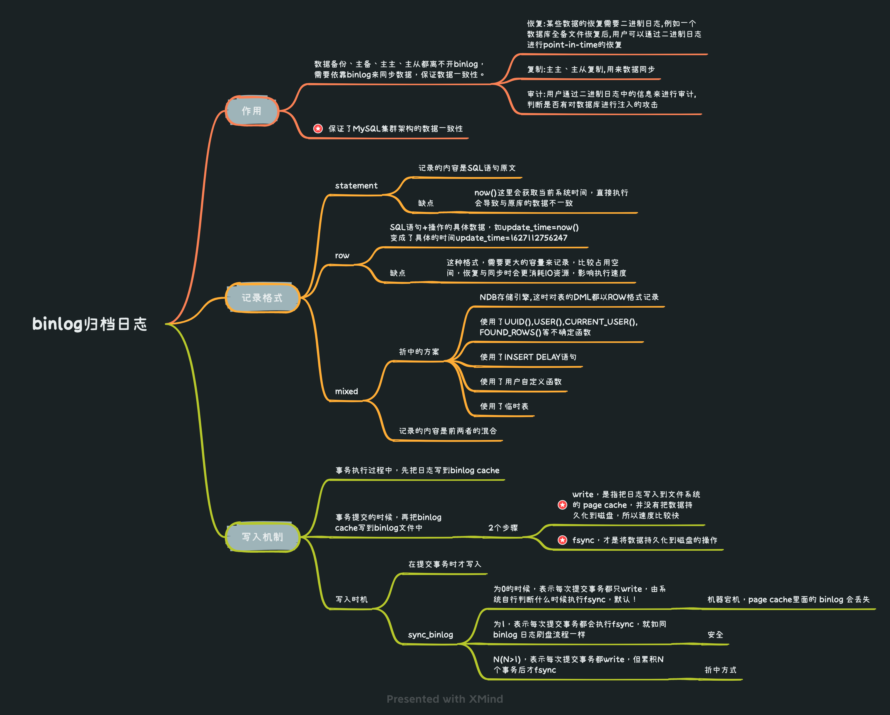


### 事务日志
#### redo log重做日志
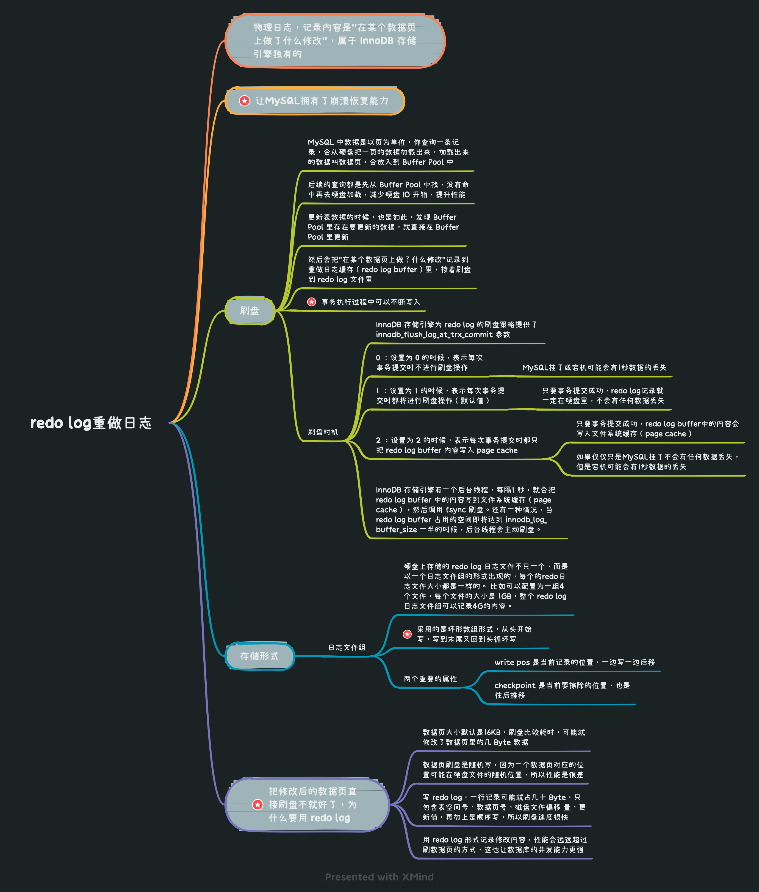

#### undo log回滚日志
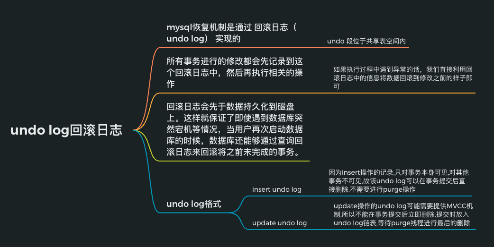

#### MVCC
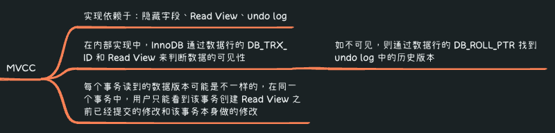

#### 二阶段提交
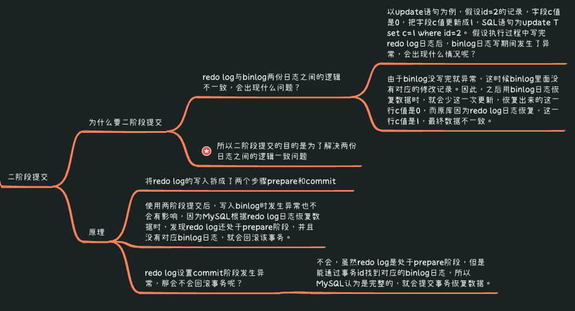


## 事务

## 优化

## 读写分离&分库分表
* [返回主页](../home.md)