* [返回主页](../home.md)
# Redis
## 场景
+ 缓存
+ 分布式锁
+ 消息队列

## 作用
* 高性能
* 高并发

## 数据结构
### C语言字符串
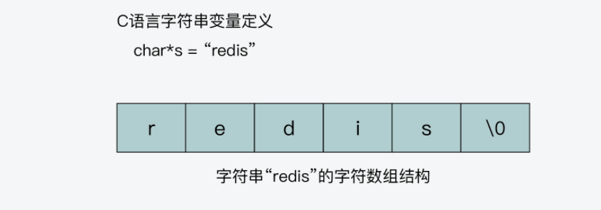
### SDS结构
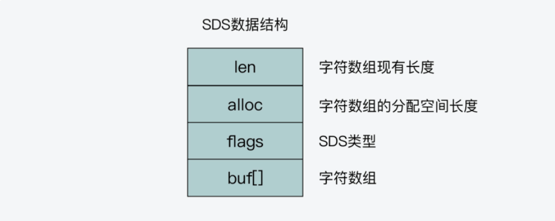
### redis常见数据结构
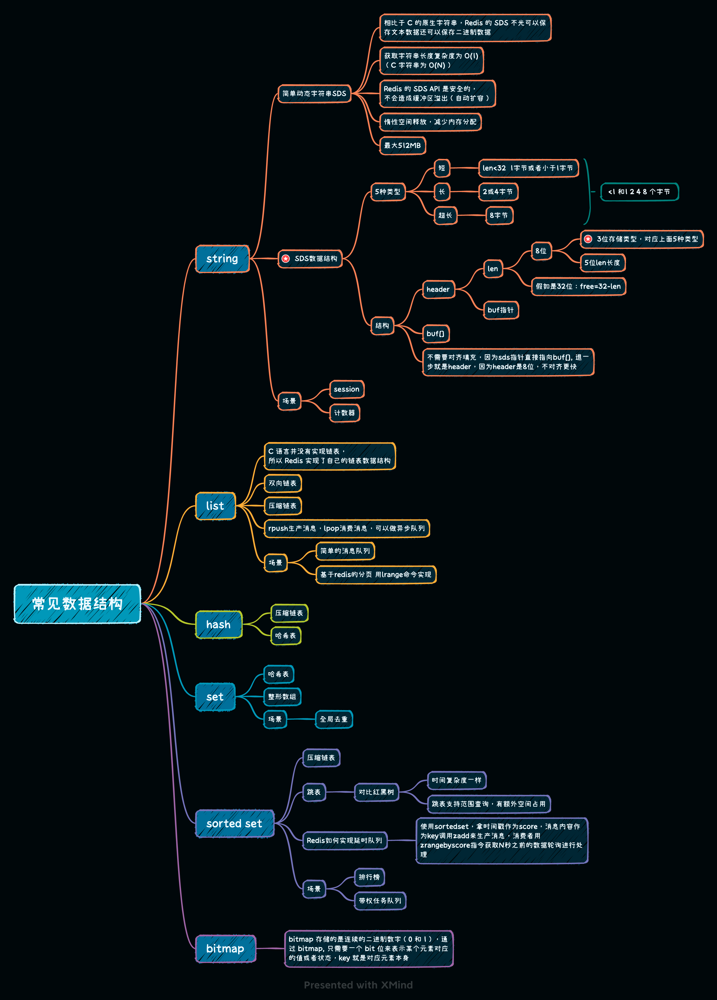

[comment]: <> (+ string  )

[comment]: <> (    + 场景)

[comment]: <> (        + session)

[comment]: <> (        + 计数器)

[comment]: <> (    + 底层为SDS简单动态字符串)

[comment]: <> (        + ps )

[comment]: <> (          相比于 C 的原生字符串，Redis 的 SDS 不光可以保存文本数据还可以保存二进制数据 )

[comment]: <> (          获取字符串长度复杂度为 O&#40;1&#41;（C 字符串为 O&#40;N&#41;） )

[comment]: <> (          Redis 的 SDS API 是安全的，不会造成缓冲区溢出（自动扩容） )

[comment]: <> (          惰性空间释放，减少内存分配 )

[comment]: <> (          最大512MB)

[comment]: <> (    + SDS结构)

[comment]: <> (        + 5种类型)

[comment]: <> (            + 小于1 和1 2 4 8 个字节)

[comment]: <> (        + 结构)

[comment]: <> (            + header)

[comment]: <> (                + 8位len&#40;3位存储类型，对应上面5种类型,5位len长度,假如是32位：free=32-len&#41;)

[comment]: <> (                + buf指针)

[comment]: <> (                + 不需要对齐填充，因为sds指针直接指向buf[], 退一步就是header，因为header是8位，不对齐更快)

[comment]: <> (+ list)

[comment]: <> (    + 场景)

[comment]: <> (        + 简单的消息队列)

[comment]: <> (        + 基于redis的分页 用lrange命令实现)

[comment]: <> (        + rpush生产消息，lpop消费消息，可以做异步队列)

[comment]: <> (    + C 语言并没有实现链表，所以 Redis 实现了自己的链表数据结构)

[comment]: <> (    + 底层为双向链表/压缩链表)

[comment]: <> (+ hash)

[comment]: <> (    + 底层为压缩链表/hash表)

[comment]: <> (+ set)

[comment]: <> (    + 底层为hash表/整形数组)

[comment]: <> (    + 场景)

[comment]: <> (        + 全局去重)

[comment]: <> (+ sorted set)

[comment]: <> (    + 场景)

[comment]: <> (        + 排行榜)

[comment]: <> (        + 带权任务队列)

[comment]: <> (        + Redis如何实现延时队列)

[comment]: <> (            + 使用sortedset，拿时间戳作为score，消息内容作为key调用zadd来生产消息，消费者用zrangebyscore指令获取N秒之前的数据轮询进行处理)

[comment]: <> (    + 底层为压缩链表/跳表)

[comment]: <> (+ bitmap)

[comment]: <> (    + bitmap 存储的是连续的二进制数字（0 和 1），通过 bitmap, 只需要一个 bit 位来表示某个元素对应的值或者状态，key 就是对应元素本身)

##  Redis 单线程模型
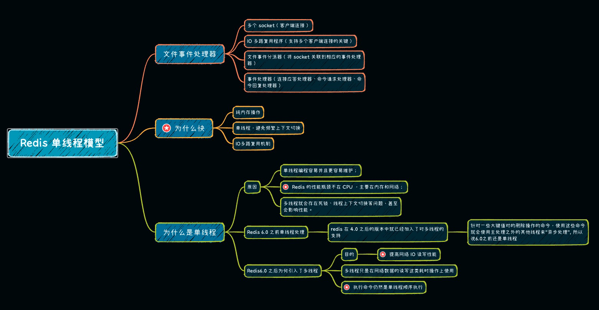

[comment]: <> (### 文件事件处理器)

[comment]: <> (+ 多个 socket（客户端连接）)

[comment]: <> (+ IO 多路复用程序（支持多个客户端连接的关键）)

[comment]: <> (+ 文件事件分派器（将 socket 关联到相应的事件处理器）)

[comment]: <> (+ 事件处理器（连接应答处理器、命令请求处理器、命令回复处理器）)

[comment]: <> (### 为什么快)

[comment]: <> (+ 纯内存操作)

[comment]: <> (+ 单线程，避免频繁上下文切换)

[comment]: <> (+ IO多路复用机制)

[comment]: <> (### 为什么是单线程)

[comment]: <> (+ 原因)

[comment]: <> (    + 单线程编程容易并且更容易维护；)

[comment]: <> (    + Redis 的性能瓶颈不在 CPU ，主要在内存和网络；)

[comment]: <> (    + 多线程就会存在死锁、线程上下文切换等问题，甚至会影响性能。)

[comment]: <> (+ ps)

[comment]: <> (    + Redis 6.0 之前单线程处理)

[comment]: <> (        + redis 在 4.0 之后的版本中就已经加入了对多线程的支持)

[comment]: <> (            + 针对一些大键值对的删除操作的命令，使用这些命令就会使用主处理之外的其他线程来“异步处理”, 所以说6.0之前还是单线程)

[comment]: <> (    + Redis6.0 之后为何引入了多线程)

[comment]: <> (        + 目的)

[comment]: <> (            + 提高网络 IO 读写性能)

[comment]: <> (        + 多线程只是在网络数据的读写这类耗时操作上使用)

[comment]: <> (        + 执行命令仍然是单线程顺序执行)

## Redis事件模型
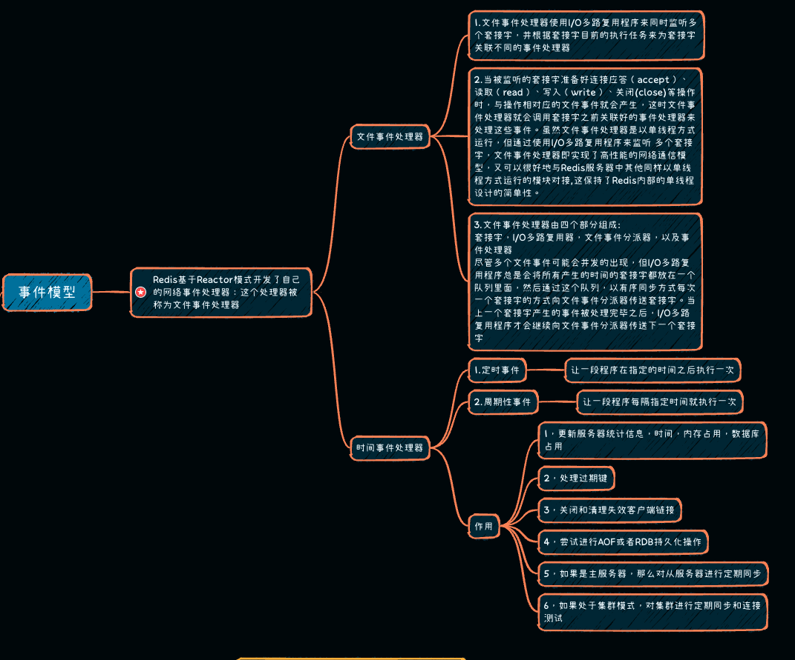

## 数据过期的判断和处理
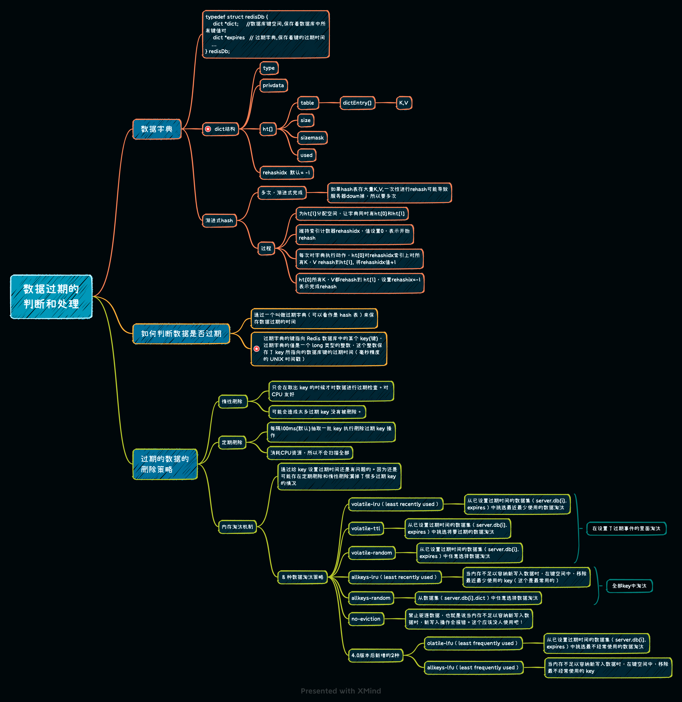

## 持久化机制
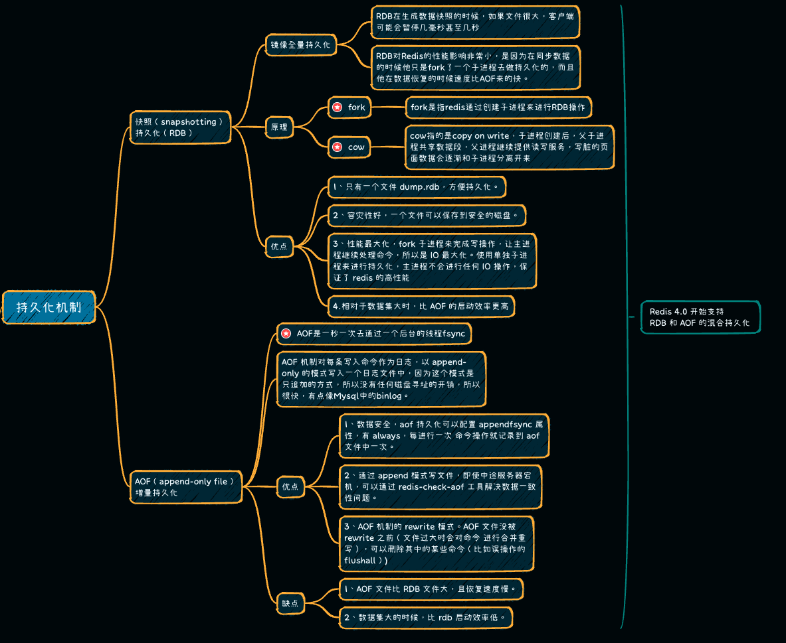

## Redis集群

## 三种常用的缓存读写策略
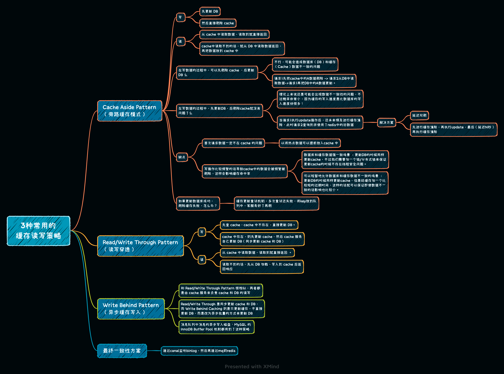

## 常见场景问题
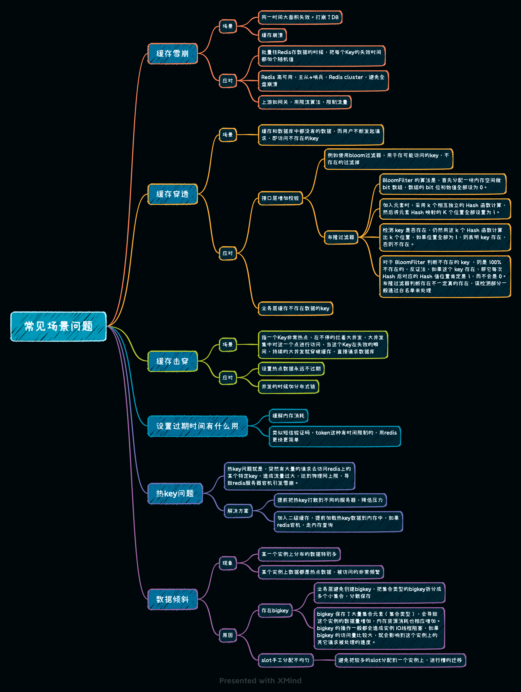

## redis事务
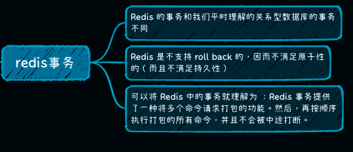

## redis分布式锁
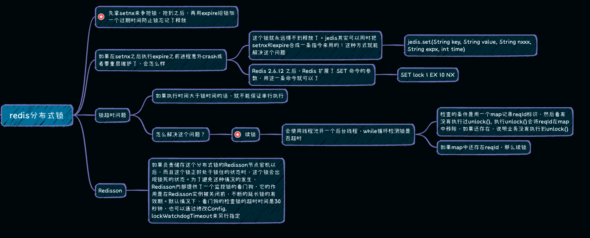

* [返回主页](../home.md)