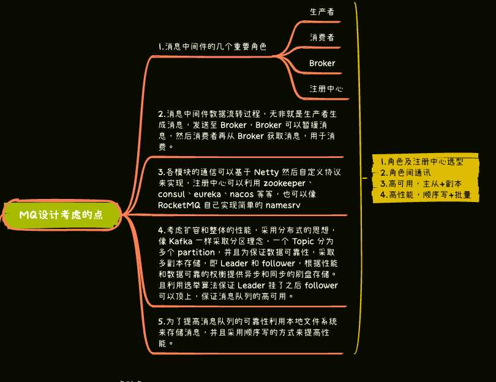
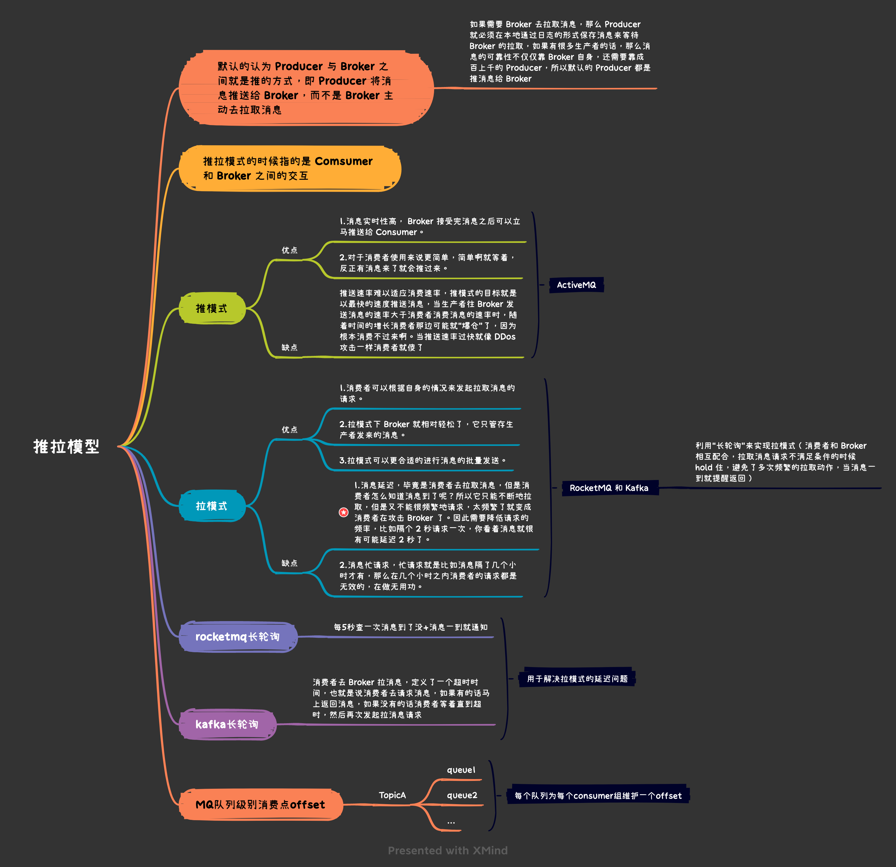
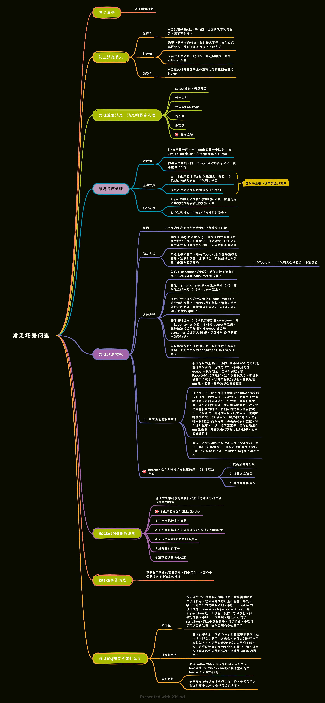
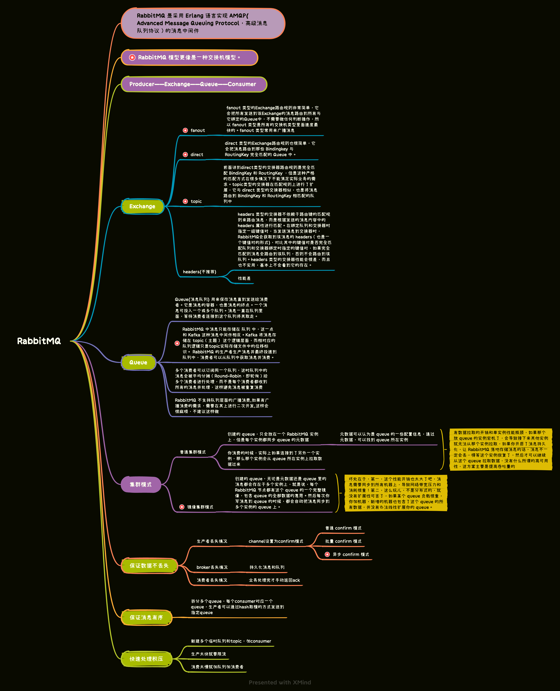
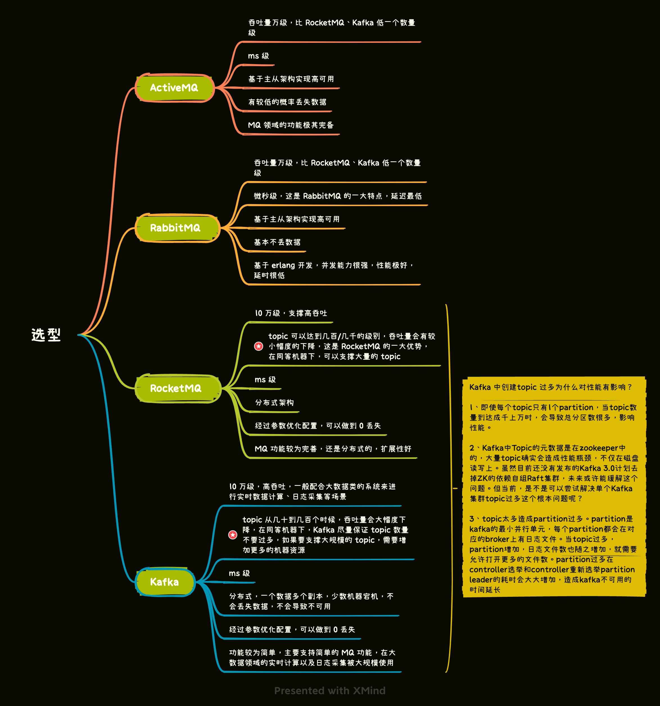

* [返回主页](../home.md)
# MQ
## 使用场景/目的
+ 异步处理
+ 应用解耦
+ 流量削峰
+ 消息通讯
::: warning 使用MQ导致的问题
系统可用性降低 
系统复杂度提高 
一致性问题
:::
  
## 设计一个MQ需要考虑什么

## 消息模型
+ 点对点
+ 发布-订阅
::: tip 不同MQ实现发布-订阅的方式
RabbitMQ 用 Exchange实现 
RocketMQ 用队列实现 
kafka用分区实现
:::

## 推拉模型

## 常见场景问题

## RabbitMQ

## 选型

* [返回主页](../home.md)