* [返回主页](../home.md)
# kafka
## 定义
Kafka是最初由Linkedin公司开发，是一个分布式、分区的、多副本的、多订阅者，基于zookeeper协调的分布式日志系统（也可以当做MQ系统），
常见可以用于web/nginx日志、访问日志，消息服务等等，Linkedin于2010年贡献给了Apache基金会并成为顶级开源项目。

## 场景
主要应用场景是：日志收集系统和消息系统。

## Kafka配置文件
### 配置文件server.properties
#### 1. broker.id=0
```text
kafka集群是由多个节点组成的，每个节点称为一个broker，中文翻译是代理。
每个broker都有一个不同brokerId，由broker.id指定，是一个不小于0的整数，各brokerId必须不同，但不必连续。
如果我们想扩展kafka集群，只需引入新节点，分配一个不同的broker.id即可。
启动kafka集群时，每一个broker都会实例化并启动一个kafkaController，并将该broker的brokerId注册到zooKeeper的相应节点中。
集群各broker会根据选举机制选出其中一个broker作为leader，即leader kafkaController。
leader kafkaController负责主题的创建与删除、分区和副本的管理等。
当leader kafkaController宕机后，其他broker会再次选举出新的leader kafkaController。
```
#### 2. log.dir = /export/data/kafka/
+ broker持久化消息到哪里，数据目录
#### 3. log.retention.hours = 168
```text
log文件最小存活时间，默认是168h，即7天。相同作用的还有log.retention.minutes、log.retention.ms。
retention是保存的意思。数据存储的最大时间超过这个时间会根据log.cleanup.policy设置的策略处理数据，也就是消费端能够多久去消费数据。
log.retention.bytes和log.retention.hours任意一个达到要求，都会执行删除，会被topic创建时的指定参数覆盖。
```
#### 4. log.retention.check.interval.ms
多长时间检查一次是否有log文件要删除。默认是300000ms，即5分钟。
#### 5. log.retention.bytes
限制单个分区的log文件的最大值，超过这个值，将删除旧的log，以满足log文件不超过这个值。默认是-1，即不限制。
#### 6. log.roll.hours
多少时间会生成一个新的log segment，默认是168h，即7天。相同作用的还有log.roll.ms、segment.ms。
#### 7. log.segment.bytes
log segment多大之后会生成一个新的log segment，默认是1073741824，即1G。
#### 8. log.flush.interval.messages
```text
指定broker每收到几个消息就把消息从内存刷到硬盘（刷盘）。默认是9223372036854775807 好大。
kafka官方不建议使用这个配置，建议使用副本机制和操作系统的后台刷新功能，因为这更高效。这个配置可以根据不同的topic设置不同的值，即在创建topic的时候设置值。
补充说明：
1、在Linux操作系统中，当我们把数据写入到文件系统之后，数据其实在操作系统的page cache里面，并没有刷到磁盘上去。如果此时操作系统 挂了，其实数据就丢了。 
2、kafka是多副本的，当你配置了同步复制之后。多个副本的数据都在page cache里面，出现多个副本同时挂掉的概率比1个副本挂掉，概率就小很多了 。
3、操作系统有后台线程，定期刷盘。如果应用程序每写入1次数据，都调用一次fsync（同步内存中所有已修改的文件数据到储存设备），那性能损耗就很大，
所以一般都会在性能和可靠性之间进行权衡。因为对应一个应用来说，虽然应用挂了，只要操作系统不挂，数据就不会丢。 
```
#### 9. log.flush.interval.ms
指定broker每隔多少毫秒就把消息从内存刷到硬盘。默认值同log.flflush.interval.messages一样，9223372036854775807。 同log.flush.interval.messages一样，kafka官方不建议使用这个配置。
#### 10. delete.topic.enable=true
是否允许从物理上删除topic。

## Kafka架构原理
### 1.核心概念
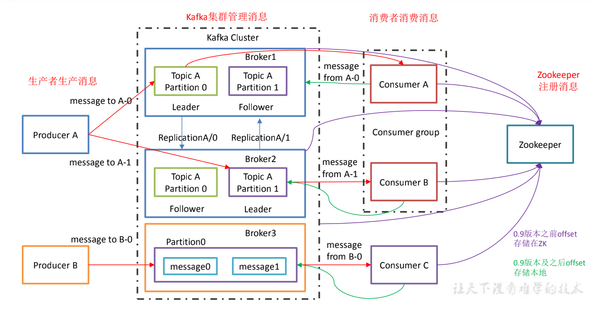
```text
1）Producer ：消息生产者，就是向 kafka broker 发消息的客户端；
2）Consumer ：消息消费者，向 kafka broker 取消息的客户端；
3）Consumer Group （CG）：消费者组，可以提高并发，由多个 consumer 组成。消费者组内每个消费者负责消费不同分区的数据，一个分区只能由一个组内消费者消费；消费者组之间互不影响。所有的消费者都属于某个消费者组，即消费者组是逻辑上的一个订阅者。 
4）zookeeper：存储Kafka集群信息，存储消费者的消费位置信息（0.9版本之前）。0.9版本之后为什么修改，是因为一致维护与zookeeper链接耗费性能
5）Broker ：一台 kafka 服务器就是一个 broker。一个集群由多个 broker 组成。一个 broker可以容纳多个topic。 
6）Topic ：每条发布到Kafka集群的消息都有一个类别，可以理解为一个队列，生产者和消费者面向的都是一个 topic； 
7）Partition：为了实现扩展性，一个非常大的 topic 可以分布到多个 broker（即服务器）上，一个 topic 可以分为多个 partition，每个 partition 是一个有序的队列；
8）Offset：
    生产者Offset：消息写入的时候，每一个分区都有一个offset，这个offset就是生产者的offset，同时也是这个分区的最新最大的offset。
    消费者Offset：消费者把每个分区最后读取的消息偏移量保存在Zookeeper 或Kafka上，如果消费者关闭或重启，它的读取状态不会丢失。
9）Replica：副本，为保证集群中的某个节点发生故障时，该节点上的 partition 数据不丢失，且 kafka 仍然能够继续工作，kafka 提供了副本机制，一个 topic 的每个分区都有若干个副本，一个 leader 和若干个 follower。 
10）leader：每个分区多个副本的“主”，生产者发送数据的对象，以及消费者消费数据的对象都是 leader。 
11）follower：每个分区多个副本中的“从”，实时从 leader 中同步数据，保持和 leader 数据的同步。leader 发生故障时，某个 follower 会成为新的 follower。 
12）AR：分区中的所有副本统称为AR（Assigned Repllicas）。AR=ISR+OSR。
13）ISR：所有与leader副本保持一定程度同步的副本（包括Leader）组成ISR（In-Sync Replicas），ISR集合是AR集合中的一个子集。消息会先发送到leader副本，然后follower副本才能从leader副本中拉取消息进行同步，同步期间内follower副本相对于leader副本而言会有一定程度的滞后。前面所说的“一定程度”是指可以忍受的滞后围，这个范围可以通过参数进行配置。
14）OSR：与leader副本同步滞后过多的副本（不包括leader）副本，组成OSR(Out-Sync Relipcas)。在正常情况下，所有的follower副本都应该与leader副本保持一定程度的同步，即AR=ISR,OSR集合为空。
15）HW：HW是High Watermak的缩写， 俗称高水位，它表示了一个特定消息的偏移量（offset），消费之只能拉取到这个offset之前的消息。
16）LEO：LEO是Log End Offset的缩写，它表示了当前日志文件中下一条待写入消息的offset。
```
### 2.生产者消息分发策略
::: tip 分区的原因
方便在集群中扩展，每个 Partition 可以通过调整以适应它所在的机器，而一个 topic又可以有多个 Partition 组成，因此整个集群就可以适应任意大小的数据了；
<br>可以提高并发，因为可以以 Partition 为单位读写了。
:::
#### 分发策略
我们需要将 producer 发送的数据封装成一个 ProducerRecord 对象。<br>

+ 指明 partition 的情况下，直接将指明的值直接作为 partiton 值；
+ 没有指明 partition 值但有 key 的情况下，将 key 的 hash 值与 topic 的 partition 数进行取余得到 partition 值；
+ 既没有 partition 值又没有 key 值的情况下，第一次调用时随机生成一个整数（后面每次调用在这个整数上自增），将这个值与 topic 可用的 partition 总数取余得到 partition 值，也就是常说的 round-robin 算法。

### 3.Kafka文件存储机制
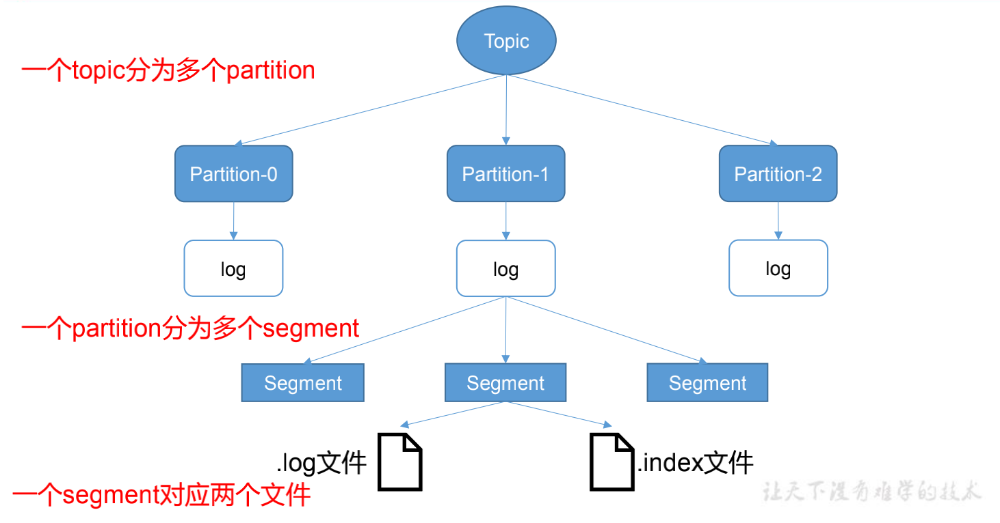
```text
由于生产者生产的消息会不断追加到 log 文件末尾，Kafka作为消息中间件，只负责消息的临时存储（默认保存168h，7天），并不是永久存储，
为防止 log 文件过大导致数据定位效率低下，Kafka 采取了分片和索引机制，将每个 partition 分为多个 segment。
每个 segment对应两个文件——“.index”文件和“.log”文件。
“.index”文件存储大量的索引信息，“.log”文件存储大量的数据，索引文件中的元数据指向对应数据文件中 message 的物理偏移地址。
这些文件位于一个文件夹下，该文件夹的命名规则为：topic 名称+分区序号。
例如，first 这个 topic 有三个分区，则其对应的文件夹为 first-0,first-1,first-2。
```

```text
每个LogSegment 的大小可以在server.properties 中log.segment.bytes=107370 （设置分段大小,默认是1gb）选项进行设置。
当log文件等于1G时，新的会写入到下一个segment中。
index 和 log 文件以上一个 segment 的最后一条消息的 offset 命名。
如何通过offset查找message呢？
根据offffset 二分查找文件列表，就可以快速定位到具体文件，进而获取到message的物理地址，通过物理地址再去相应的log文件获取message。
```
下图为 index 文件和 log文件的结构示意图。<br>
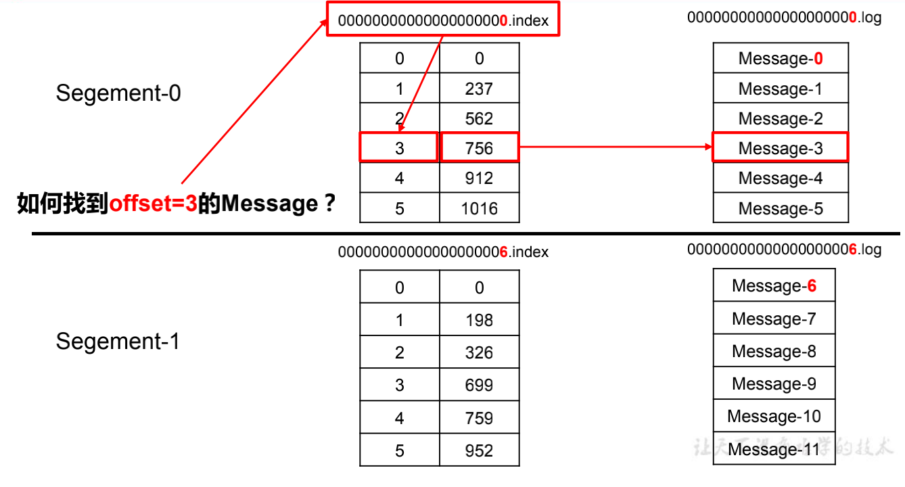

### 4.消费者负载均衡策略
在Kafka中，每个Topic会包含多个分区，默认情况下一个分区只能被一个消费组下面的一个消费者消费，这里就产生了分区分配的问题。Kafka中提供了多重分区分配算法（PartitionAssignor）的实现：RangeAssignor、RoundRobinAssignor、StickyAssignor。
#### RangeAssignor
```text
Kafka默认采用RangeAssignor的分配算法。
RangeAssignor对每个Topic进行独立的分区分配。
对于每一个Topic，首先对分区按照分区ID进行数值排序，然后订阅这个Topic的消费组的消费者再进行字典排序，之后尽量均衡的将分区分配给消费者。
这里只能是尽量均衡，因为分区数可能无法被消费者数量整除，那么有一些消费者就会多分配到一些分区。
字典序靠前的消费者会被多分配一个分区。这种分配方式明显的一个问题是随着消费者订阅的Topic的数量的增加，不均衡的问题会越来越严重，
比如上图中4个分区3个消费者的场景，C0会多分配一个分区。
如果此时再订阅一个分区数为4的Topic，那么C0又会比C1、C2多分配一个分区，这样C0总共就比C1、C2多分配两个分区了，而且随着Topic的增加，这个情况会越来越严重。
```
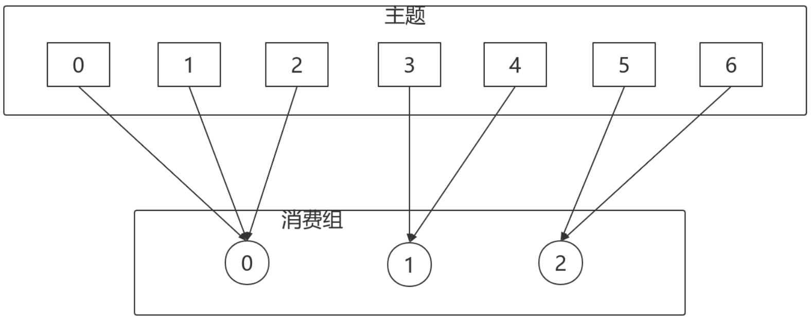

#### RoundRobinAssignor
```text
RoundRobinAssignor的分配策略是将消费组内订阅的所有Topic的分区及所有消费者进行排序后尽量均衡的分配（RangeAssignor是针对单个Topic的分区进行排序分配的）。
如果消费组内，消费者订阅的Topic列表是相同的（每个消费者都订阅了相同的Topic），那么分配结果是尽量均衡的（消费者之间分配到的分区数的差值不会超过1）。
如果订阅的Topic列表是不同的，那么分配结果是不保证“尽量均衡”的，因为某些消费者不参与一些Topic的分配。
```
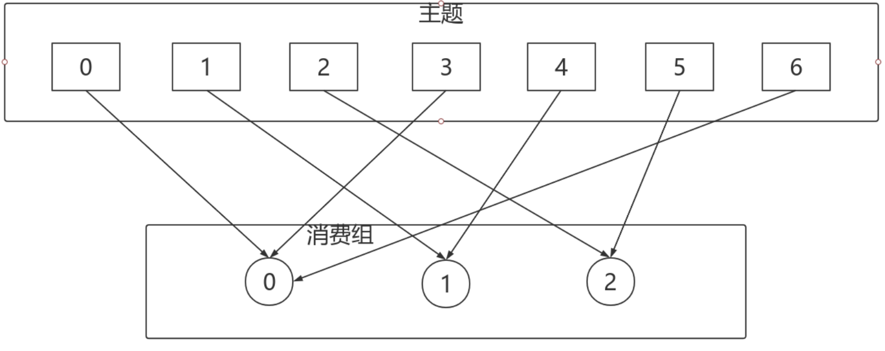
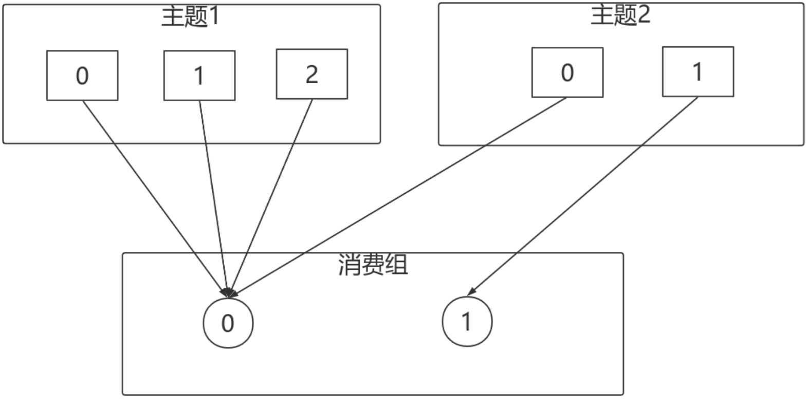
<br>
看上去分配已经尽量的保证均衡了，不过可以发现C0承担了4个分区的消费而C1订阅了T2一个分区，是不是把T2P0交给C1消费能更加的均衡呢？

#### StickyAssignor
```text
从字面意义上看，Sticky是“粘性的”，可以理解为分配结果是带“粘性的”：
1. 分区的分配尽量的均衡
2. 每一次重分配的结果尽量与上一次分配结果保持一致
   当这两个目标发生冲突时，优先保证第一个目标。第一个目标是每个分配算法都尽量尝试去完成的，而第二个目标才真正体现出StickyAssignor特性的。以下以轮询做比较：
```
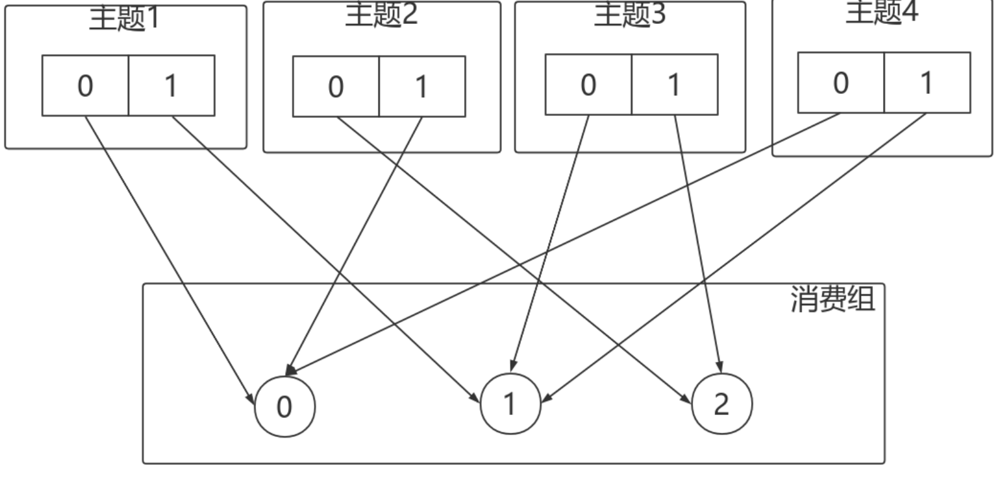
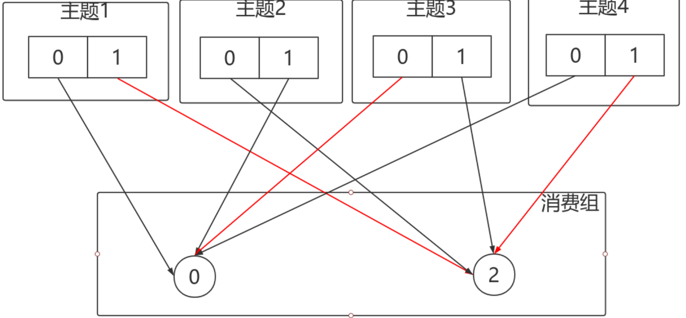


### 5.Kafka保证数据不丢失机制
#### 1.消息生产者保证数据不丢失：
```text
ack 应答机制：为保证 producer 发送的数据，能可靠的发送到指定的 topic，topic 的每个 partition 收到
producer 发送的数据后，都需要向 producer 发送 ack（acknowledgement 确认收到），如果producer 收到 ack，就会进行下一轮的发送，否则重新发送数据。
Kafka 为用户提供了三种可靠性级别，用户根据对可靠性和延迟的要求进行权衡，选择以下的配置。
```
acks 参数配置：<br>
0：producer 不等待 broker 的 ack，这一操作提供了一个最低的延迟，broker 一接收到还没有写入磁盘就已经返回，当 broker 故障时有可能丢失数据；<br>
1：producer 等待 broker 的 ack，partition 的 leader 落盘成功后返回 ack，如果在 follower同步成功之前 leader 故障，那么将会丢失数据； 如下图<br>
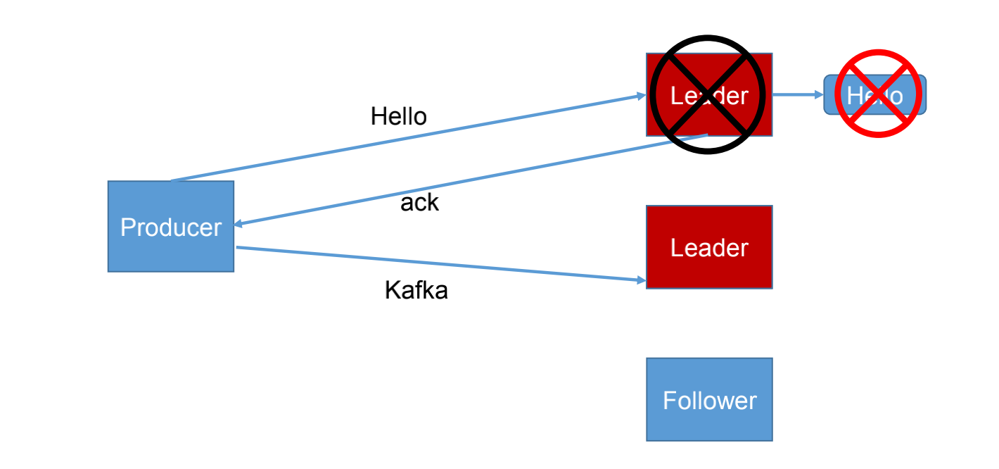
<br>-1（all）：producer 等待 broker 的 ack，partition 的 leader 和 follower （ISR）全部落盘成功后才返回 ack。但是如果在 follower 同步完成后，broker 发送 ack 之前，leader 发生故障，那么会造成数据重复。如下图<br>
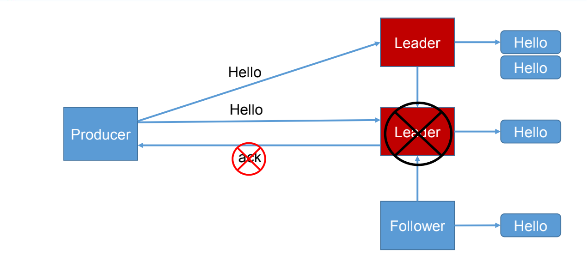

#### 2.消息消费者
::: warning 什么时候消费者丢失数据呢？
由于Kafka consumer默认是自动提交位移的（先更新位移，再消费消息），如果消费程序出现故障，没消费完毕，则丢失了消息，此时，broker并不知道。
:::
::: tip 解决方案：
enable.auto.commit=false 关闭自动提交位移
在消息被完整处理之后再手动提交位移。
:::

### 6.Kafka保证副本数据一致性
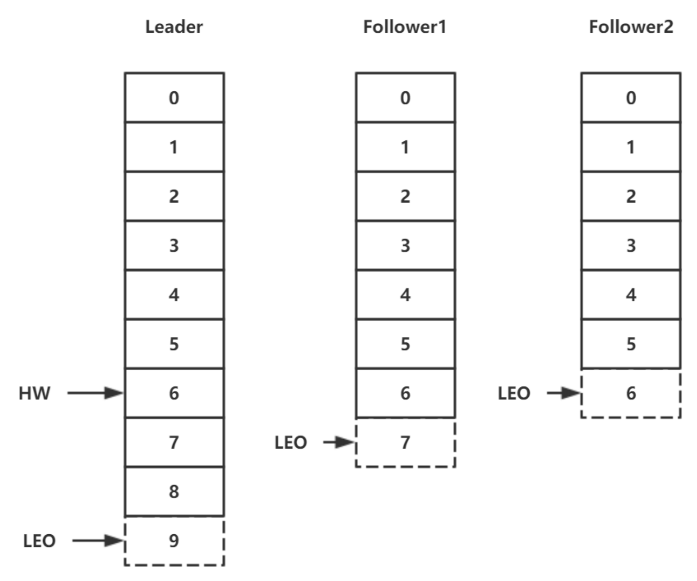
```text
LEO：它表示了当前日志文件中下一条待写入消息的offset；
HW：它表示了一个特定消息的偏移量（offset），消费者只能拉取到这个offset之前的消息。

1、follower 故障
follower 发生故障后会被临时踢出 ISR，待该 follower 恢复后，follower 会读取本地磁盘记录的上次的 HW，并将 log 文件高于 HW 的部分截取掉，从 HW 开始向 leader 进行同步。等该 follower 的 LEO 大于等于该 Partition 的 HW，即 follower 追上 leader 之后，就可以重新加入 ISR 了。
2、leader 故障
leader 发生故障之后，会从 ISR 中选出一个新的 leader，之后，为保证多个副本之间的数据一致性，其余的follower 会先将各自的 log 文件高于 HW 的部分截掉，然后从新的 leader同步数据。

注意：这只能保证副本之间的数据一致性，并不能保证数据不丢失或者不重复。
```

### 7.Kafka保证数据不重复机制
```text
将服务器的 ACK 级别设置为-1，可以保证 Producer 到 Server 之间不会丢失数据，即 At Least Once 语义。相对的，将服务器 ACK 级别设置为 0，可以保证生产者每条消息只会被发送一次，即 At Most Once 语义。At Least Once 可以保证数据不丢失，但是不能保证数据不重复；相对的，At Least Once可以保证数据不重复，但是不能保证数据不丢失。但是，对于一些非常重要的信息，比如说交易数据，下游数据消费者要求数据既不重复也不丢失，即 Exactly Once 语义。在 0.11 版本以前的 Kafka，对此是无能为力的，只能保证数据不丢失，再在下游消费者对数据做全局去重。对于多个下游应用的情况，每个都需要单独做全局去重，这就对性能造成了很大影响。0.11 版本的 Kafka，引入了一项重大特性：幂等性。所谓的幂等性就是指 Producer 不论向 Server 发送多少次重复数据，Server 端都只会持久化一条。幂等性结合 At Least Once 语义，就构成了 Kafka 的 Exactly Once 语义。即：
At Least Once + 幂等性 = Exactly Once
要启用幂等性，只需要将 Producer 的参数中 enable.idompotence 设置为 true 即可。Kafka的幂等性实现其实就是将原来下游需要做的去重放在了数据上游。开启幂等性的 Producer 在初始化的时候会被分配一个 PID，发往同一 Partition 的消息会附带 SequenceNumber（序列化号）。而Broker 端会对<PID, Partition, SequenceNumber>做缓存，当具有相同主键的消息提交时，Broker 只会持久化一条。但是 PID 重启就会变化，同时不同的 Partition 也具有不同主键，所以幂等性无法保证跨分区跨会话的 Exactly Once。

ProducerID：在每个新的Producer初始化时，会被分配一个唯一的ProducerID，这个ProducerID对客户端使用者是不可见的。
SequenceNumber：对于每个ProducerID，Producer发送数据的每个Topic和Partition都对应一个从0开始单调递增的SequenceNumber值。
```


### 8.offset维护
```text
由于 consumer 在消费过程中可能会出现断电宕机等故障，consumer 恢复后，需要从故障前的位置的继续消费，所以 consumer 需要实时记录自己消费到了哪个 offset，以便故障恢复后继续消费。
Kafka 0.9 版本之前，consumer 默认将 offset 保存在 Zookeeper 中，从 0.9 版本开始，
consumer 默认将 offset 保存在 Kafka 一个内置的 topic 中，该 topic 为__consumer_offsets。 
zookeeper：老版本的位移offset是提交到zookeeper中的，目录结构是 ：/consumers/<group.id>/offsets/ / ，但是由于 ZOOKEEPER 的写入能力并不会随着 ZOOKEEPER 节点数量的增加而扩大，因而，当存在频繁的 Offset 更新时，ZOOKEEPER 集群本身可能成为瓶颈。因而，不推荐采用这种方式。
KAFKA 自身的一个特殊 Topic（__consumer_offsets）中：这种方式支持大吞吐量的Offset 更新，又不需要手动编写 Offset 管理程序或者维护一套额外的集群，因而是迄今为止最为理想的一种实现方式。
他们是通过消费者组名，主题和分区决定他们的offset。
```
### 9.Kafka高效读写数据
#### 顺序写磁盘
Kafka 的 producer 生产数据，要写入到 log 文件中，写的过程是一直追加到文件末端，为顺序写。官网有数据表明，同样的磁盘，顺序写能到 600M/s，而随机写只有 100K/s。这与磁盘的机械机构有关，顺序写之所以快，是因为其省去了大量磁头寻址的时间。
#### 零复制技术
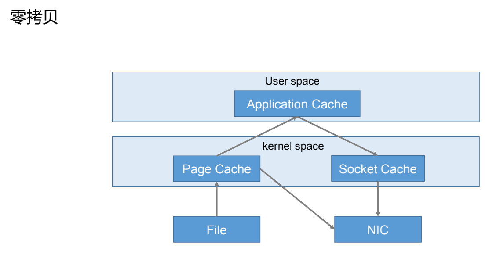

### 10.zookeeper在Kafka中的作用
```text
Kafka利用ZK保存相应的元数据信息，包括：broker信息，Kafka集群信息，旧版消费者信息以及消费偏移量信息，主题信息，分区状态信息，分区副本分片方案信息，动态配置信息，等等。
Kafka 集群中有一个 broker 会被选举为 Controller，负责管理集群 broker 的上下线，所有 topic 的分区副本分配和 leader 选举等工作。
在Kafka集群中会有一个或者多个broker，其中有一个broker会被选举为控制器（Kafka Controller），它负责管理整个集群中所有分区和副本的状态。当某个分区的leader副本出现故障时，由控制器负责为该分区选举新的leader副本。当检测到某个分区的ISR集合发生变化时，由控制器负责通知所有broker更新其元数据信息。当使用kafka-topics.sh脚本为某个topic增加分区数量时，同样还是由控制器负责分区的重新分配。
```
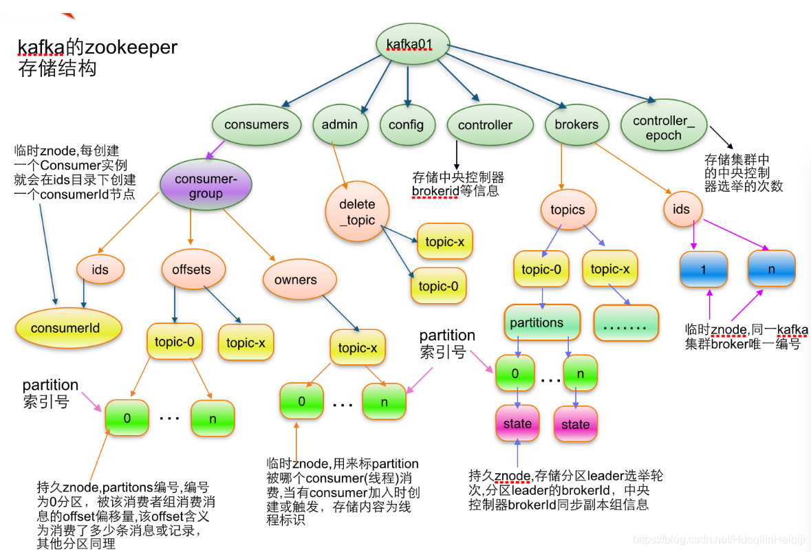
<br>
Controller 的管理工作都是依赖于 Zookeeper 的。
以下为 partition 的 leader 选举过程：
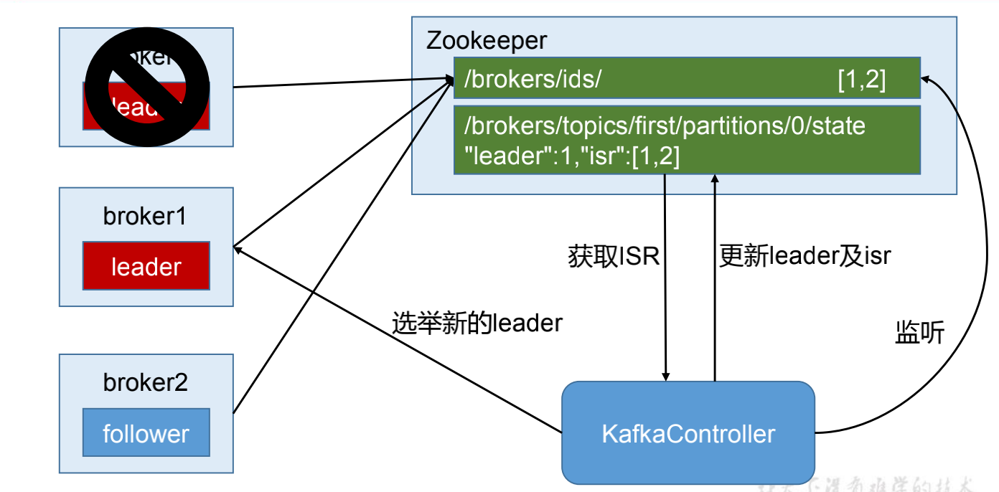

### 11.Kafka事务
```text
Kafka 从 0.11 版本开始引入了事务支持。事务可以保证 Kafka 在 Exactly Once 语义的基础上，生产和消费可以跨分区和会话，要么全部成功，要么全部失败。
为了实现跨分区跨会话的事务，需要引入一个全局唯一的 Transaction ID，并将 Producer获得的PID Transaction ID 绑定。这样当Producer 重启后就可以通过正在进行的 Transaction ID 获得原来的 PID。为了管理Transaction，Kafka 引入了一个新的组件 Transaction Coordinator。Producer 就是通过和 Transaction Coordinator 交互获得 Transaction ID 对应的任务状态。Transaction Coordinator 还负责将事务所有写入Kafka 的一个内部 Topic，这样即使整个服务重启，由于事务状态得到保存，进行中的事务状态可以得到恢复，从而继续进行。
```

## Kafka&Java API
### Producer API
#### 消息发送流程
Kafka 的 Producer 发送消息采用的是异步发送的方式。在消息发送的过程中，涉及到了两个线程——main 线程和 Sender 线程，以及一个线程共享变量——RecordAccumulator。main 线程将消息发送给 RecordAccumulator，Sender 线程不断从 RecordAccumulator 中拉取消息发送到 Kafka broker。<br>
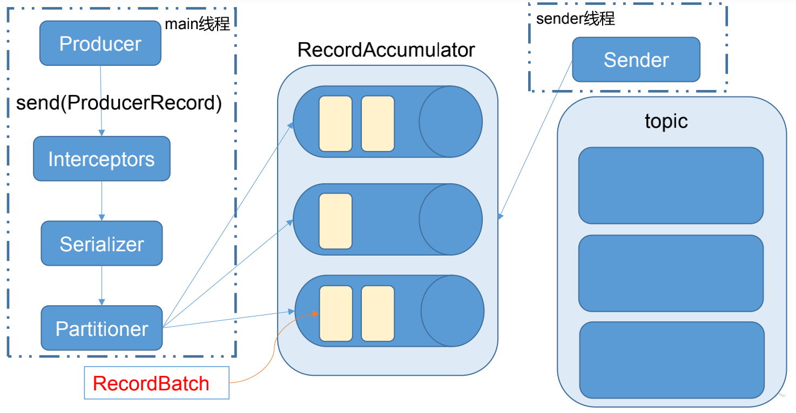
::: tip 相关参数：
batch.size：只有数据积累到 batch.size 之后，sender 才会发送数据。<br>
linger.ms：如果数据迟迟未达到 batch.size，sender 等待 linger.time 之后就会发送数据。
::: 
#### 异步发送API
##### 1.不带回调函数的API
```java
import org.apache.kafka.clients.producer.*;
import java.util.Properties;
import java.util.concurrent.ExecutionException;
public class CustomProducer {
	public static void main(String[] args) throws ExecutionException, 
		InterruptedException {
          Properties props = new Properties();
          //kafka 集群，broker-list
          props.put("bootstrap.servers", "hadoop102:9092");
          props.put("acks", "all");
          //重试次数
          props.put("retries", 1);
          //批次大小
          props.put("batch.size", 16384);
          //等待时间
          props.put("linger.ms", 1);
          //RecordAccumulator 缓冲区大小
          props.put("buffer.memory", 33554432);
          props.put("key.serializer", 
          		"org.apache.kafka.common.serialization.StringSerializer");
          props.put("value.serializer", 
          		"org.apache.kafka.common.serialization.StringSerializer");
          Producer<String, String> producer = new KafkaProducer<>(props);
          for (int i = 0; i < 100; i++) {
          		producer.send(new ProducerRecord<String, String>("first", 
          				Integer.toString(i), Integer.toString(i)));
          }
          producer.close();
     } 
}
```
##### 2.带回调函数的API
```text
回调函数会在 producer 收到 ack？？？？？ 时调用，为异步调用，该方法有两个参数，分别是RecordMetadata 和 Exception，如果 Exception 为 null，说明消息发送成功，如果Exception 不为 null，说明消息发送失败。
注意：消息发送失败会自动重试，不需要我们在回调函数中手动重试。
```
```java
import org.apache.kafka.clients.producer.*;
import java.util.Properties;
import java.util.concurrent.ExecutionException;
public class CustomProducer {
	public static void main(String[] args) throws ExecutionException, 
		InterruptedException {
		Properties props = new Properties();
        props.put("bootstrap.servers", "hadoop102:9092");//kafka 集群，broker-list
        props.put("acks", "all");
        props.put("retries", 1);//重试次数
        props.put("batch.size", 16384);//批次大小
        props.put("linger.ms", 1);//等待时间
        props.put("buffer.memory", 33554432);//RecordAccumulator 缓冲区大小
        props.put("key.serializer", 
        	"org.apache.kafka.common.serialization.StringSerializer");
        props.put("value.serializer", 
        	"org.apache.kafka.common.serialization.StringSerializer");
        Producer<String, String> producer = new KafkaProducer<>(props);
        for (int i = 0; i < 100; i++) {
            producer.send(new ProducerRecord<String, String>("first", 
                Integer.toString(i), Integer.toString(i)), new Callback() {
                //回调函数，该方法会在 Producer 收到 ack 时调用，为异步调用
                @Override
                public void onCompletion(RecordMetadata metadata, Exception exception) {
                    if (exception == null) {
                        System.out.println("success->" + metadata.offset());
                    } else {
                        exception.printStackTrace();
                    } 
                }
            });
        }
        producer.close();
    } 
}
```
##### 3.同步发送API
同步发送的意思就是，一条消息发送之后，会阻塞当前线程，直至返回 ack。
由于 send 方法返回的是一个 Future 对象，根据 Futrue 对象的特点，我们也可以实现同步发送的效果，只需在调用 Future 对象的 get 方法即可。
```java
import org.apache.kafka.clients.producer.KafkaProducer;
import org.apache.kafka.clients.producer.Producer;
import org.apache.kafka.clients.producer.ProducerRecord;
import java.util.Properties;
import java.util.concurrent.ExecutionException;
public class CustomProducer {
	public static void main(String[] args) throws ExecutionException, 
		InterruptedException {
        Properties props = new Properties();
        props.put("bootstrap.servers", "hadoop102:9092");//kafka 集群，broker-list
        props.put("acks", "all");
        props.put("retries", 1);//重试次数
        props.put("batch.size", 16384);//批次大小
        props.put("linger.ms", 1);//等待时间
        props.put("buffer.memory", 33554432);//RecordAccumulator 缓冲区大小
        props.put("key.serializer", 
        	"org.apache.kafka.common.serialization.StringSerializer");
        props.put("value.serializer", 
        	"org.apache.kafka.common.serialization.StringSerializer");
        Producer<String, String> producer = new KafkaProducer<>(props);
        for (int i = 0; i < 100; i++) {
            producer.send(new ProducerRecord<String, String>("first", 
            Integer.toString(i), Integer.toString(i))).get(); 
        }
        producer.close();    
    } 
}
```

### Consumer API
Consumer 消费数据时的可靠性是很容易保证的，因为数据在 Kafka 中是持久化的，故不用担心数据丢失问题。
由于 consumer 在消费过程中可能会出现断电宕机等故障，consumer 恢复后，需要从故障前的位置的继续消费，所以 consumer 需要实时记录自己消费到了哪个 offset，以便故障恢复后继续消费。所以 offset 的维护是 Consumer 消费数据是必须考虑的问题。
#### 1.自动提交offset
```text
为了使我们能够专注于自己的业务逻辑，Kafka 提供了自动提交 offset 的功能。
自动提交 offset 的相关参数：
enable.auto.commit：是否开启自动提交 offset 功能
auto.commit.interval.ms：自动提交 offset 的时间间隔
```
```java
import org.apache.kafka.clients.consumer.ConsumerRecord;
import org.apache.kafka.clients.consumer.ConsumerRecords;
import org.apache.kafka.clients.consumer.KafkaConsumer;
import java.util.Arrays;
import java.util.Properties;
public class CustomConsumer {
	public static void main(String[] args) {
        Properties props = new Properties();
        props.put("bootstrap.servers", "hadoop102:9092");
        props.put("group.id", "test");
        props.put("enable.auto.commit", "true");
        props.put("auto.commit.interval.ms", "1000");
        props.put("key.deserializer", 
        	"org.apache.kafka.common.serialization.StringDeserializer");
        props.put("value.deserializer", 
        	"org.apache.kafka.common.serialization.StringDeserializer");
        KafkaConsumer<String, String> consumer = new KafkaConsumer<>(props);
        consumer.subscribe(Arrays.asList("first"));
        while (true) {
            ConsumerRecords<String, String> records = consumer.poll(100);
            for (ConsumerRecord<String, String> record : records) {
                System.out.printf("offset = %d, key = %s, value = %s%n", 
                    record.offset(), record.key(), record.value());
            } 
         } 
     }
}
```
#### 2.手动提交offset
```text
虽然自动提交 offset 十分简介便利，但由于其是基于时间提交的，很可能自动提交了，但是这时消费者挂了，导致消息丢失，开发人员难以把握offset 提交的时机。因此 Kafka 还提供了手动提交 offset 的 API。手动提交 offset 的方法有两种：分别是 commitSync（同步提交）和 commitAsync（异步提交）。两者的相同点是，都会将本次 poll 的一批数据最高的偏移量提交；不同点是，
commitSync 阻塞当前线程，一直到提交成功，并且会自动失败重试（由不可控因素导致，也会出现提交失败）；而 commitAsync 则没有失败重试机制，故有可能提交失败。
```
##### 2.1同步提交offset
```java
import org.apache.kafka.clients.consumer.ConsumerRecord;
import org.apache.kafka.clients.consumer.ConsumerRecords;
import org.apache.kafka.clients.consumer.KafkaConsumer;
import java.util.Arrays;
import java.util.Properties;
public class CustomComsumer {
    public static void main(String[] args) {
        Properties props = new Properties();
        //Kafka 集群
        props.put("bootstrap.servers", "hadoop102:9092");
        //消费者组，只要 group.id 相同，就属于同一个消费者组
        props.put("group.id", "test");
        props.put("enable.auto.commit", "false");//关闭自动提交 offset
        props.put("key.deserializer", 
        "org.apache.kafka.common.serialization.StringDeserializer");
        props.put("value.deserializer", 
        "org.apache.kafka.common.serialization.StringDeserializer");
        KafkaConsumer<String, String> consumer = new KafkaConsumer<>(props);
        consumer.subscribe(Arrays.asList("first"));//消费者订阅主题
        while (true) {
            //消费者拉取数据
            ConsumerRecords<String, String> records = consumer.poll(100);
            for (ConsumerRecord<String, String> record : records) {
                System.out.printf("offset = %d, key = %s, value = %s%n", record.offset(), record.key(), record.value());
        	}
        //同步提交，当前线程会阻塞直到 offset 提交成功
        consumer.commitSync();
    	} 
    } 
}
```
##### 2.2 异步提交offset
虽然同步提交 offset 更可靠一些，但是由于其会阻塞当前线程，直到提交成功。因此吞吐量会收到很大的影响。因此更多的情况下，会选用异步提交 offset 的方式。
```java
import org.apache.kafka.clients.consumer.*;
import org.apache.kafka.common.TopicPartition;
import java.util.Arrays;
import java.util.Map;
import java.util.Properties;
public class CustomConsumer {
    public static void main(String[] args) {
        Properties props = new Properties();
        //Kafka 集群
        props.put("bootstrap.servers", "hadoop102:9092");
        //消费者组，只要 group.id 相同，就属于同一个消费者组
        props.put("group.id", "test");
        //关闭自动提交 offset
        props.put("enable.auto.commit", "false");
        props.put("key.deserializer", 
        "org.apache.kafka.common.serialization.StringDeserializer");
        props.put("value.deserializer", 
        "org.apache.kafka.common.serialization.StringDeserializer");
        KafkaConsumer<String, String> consumer = new KafkaConsumer<>(props);
        consumer.subscribe(Arrays.asList("first"));//消费者订阅主题
        while (true) {
            ConsumerRecords<String, String> records = consumer.poll(100);//消费者拉取数据
            for (ConsumerRecord<String, String> record : records) {
                System.out.printf("offset = %d, key = %s, value = %s%n", record.offset(), record.key(), record.value());
        	}
            //异步提交
            consumer.commitAsync(new OffsetCommitCallback() {
                @Override
                public void onComplete(Map<TopicPartition, OffsetAndMetadata> offsets, Exception exception) {
                    if (exception != null) {
                        System.err.println("Commit failed for" + offsets); 
                    } 
                }
            });
        } 
    } 
}
```

### 自定义interceptor
```text
原理：

Producer 拦截器(interceptor)是在 Kafka 0.10 版本被引入的，主要用于实现 clients 端的定制化控制逻辑。
对于 producer 而言，interceptor 使得用户在消息发送前以及 producer 回调逻辑前有机会对消息做一些定制化需求，比如修改消息等。同时，producer 允许用户指定多个 interceptor按序作用于同一条消息从而形成一个拦截链(interceptor chain)。Intercetpor 的实现接口是org.apache.kafka.clients.producer.ProducerInterceptor，其定义的方法包括：
1、configure(configs)
获取配置信息和初始化数据时调用。 

2、onSend(ProducerRecord)：
该方法封装进 KafkaProducer.send 方法中，即它运行在用户主线程中。Producer 确保在消息被序列化以及计算分区前调用该方法。用户可以在该方法中对消息做任何操作，但最好保证不要修改消息所属的 topic 和分区，否则会影响目标分区的计算。 

3、onAcknowledgement(RecordMetadata, Exception)：
该方法会在消息从 RecordAccumulator 成功发送到 Kafka Broker 之后，或者在发送过程中失败时调用。并且通常都是在 producer 回调逻辑触发之前。onAcknowledgement 运行在producer 的 IO 线程中，因此不要在该方法中放入很重的逻辑，否则会拖慢 producer 的消息发送效率。 

4、close：
关闭 interceptor，主要用于执行一些资源清理工作
如前所述，interceptor 可能被运行在多个线程中，因此在具体实现时用户需要自行确保线程安全。另外倘若指定了多个 interceptor，则 producer 将按照指定顺序调用它们，并仅仅是捕获每个 interceptor 可能抛出的异常记录到错误日志中而非在向上传递。这在使用过程中要特别留意。
```

## 面经原理知识点
### Kafka核心总控制器Controller
在Kafka集群中会有一个或者多个broker，其中有一个broker会被选举为控制器(Kafka Controller)，它负责管理整个 集群中所有分区和副本的状态。
+ 当某个分区的leader副本出现故障时，由控制器负责为该分区选举新的leader副本。
+ 当检测到某个分区的ISR集合发生变化时，由控制器负责通知所有broker更新其元数据信息。
+ 当使用kafka-topics.sh脚本为某个topic增加分区数量时，同样还是由控制器负责分区的重新分配。

### Controller选举机制
```text
在kafka集群启动的时候，会自动选举一台broker作为controller来管理整个集群，选举的过程是集群中每个broker都会 尝试在zookeeper上创建一个 /controller 临时节点，zookeeper会保证有且仅有一个broker能创建成功，这个broker 就会成为集群的总控器controller。 
当这个controller角色的broker宕机了，此时zookeeper临时节点会消失，集群里其他broker会一直监听这个临时节 点，发现临时节点消失了，就竞争再次创建临时节点，zookeeper又会保证有一个broker 成为新的controller。
具备控制器身份的broker需要比其他普通的broker多一份职责，具体细节如下: 
1. 监听broker相关的变化。为Zookeeper中的/brokers/ids/节点添加BrokerChangeListener，用来处理broker 增减的变化。
2. 监听topic相关的变化。为Zookeeper中的/brokers/topics节点添加TopicChangeListener，用来处理topic增减 的变化;为Zookeeper中的/admin/delete_topics节点添加TopicDeletionListener，用来处理删除topic的动作。 
3. 从Zookeeper中读取获取当前所有与topic、partition以及broker有关的信息并进行相应的管理。对于所有topic 所对应的Zookeeper中的/brokers/topics/[topic]节点添加PartitionModificationsListener，用来监听topic中的 分区分配变化。
4. 更新集群的元数据信息，同步到其他普通的broker节点中。
```

### Partition副本选举Leader机制
controller感知到分区leader所在的broker挂了(controller监听了很多zk节点可以感知到broker存活)，controller会从每 个parititon的 replicas 副本列表中取出第一个broker作为leader，当然这个broker需要也同时在ISR列表里。

### 消费者消费消息的offset记录机制
每个consumer会定期将自己消费分区的offset提交给kafka内部topic:__consumer_offsets，提交过去的时候，key是 consumerGroupId+topic+分区号，value就是当前offset的值，kafka会定期清理topic里的消息，最后就保留最新的 那条数据 ,因为__consumer_offsets可能会接收高并发的请求，kafka默认给其分配50个分区(可以通过 offsets.topic.num.partitions设置)，这样可以通过加机器的方式抗大并发。

### 消费者Rebalance机制
消费者rebalance就是说如果consumer group中某个消费者挂了，此时会自动把分配给他的分区交给其他的消费者，如 果他又重启了，那么又会把一些分区重新交还给他 ,如下情况可能会触发消费者rebalance
+ 1. consumer所在服务重启或宕机
+ 2. 动态给topic增加了分区
+ 3. 消费组订阅了更多的topic

```text
Rebalance过程如下
当有消费者加入消费组时，消费者、消费组及组协调器之间会经历以下几个阶段。

第一阶段:选择组协调器
组协调器GroupCoordinator:每个consumer group都会选择一个broker作为自己的组协调器coordinator，负责监控 这个消费组里的所有消费者的心跳，以及判断是否宕机，然后开启消费者rebalance。
consumer group中的每个consumer启动时会向kafka集群中的某个节点发送 FindCoordinatorRequest 请求来查找对 应的组协调器GroupCoordinator，并跟其建立网络连接。
组协调器选择方式: 通过如下公式可以选出consumer消费的offset要提交到__consumer_offsets的哪个分区，这个分区leader对应的broker 就是这个consumer group的coordinator
公式:hash(consumer group id) % __consumer_offsets主题的分区数 

第二阶段:加入消费组JOIN GROUP
在成功找到消费组所对应的 GroupCoordinator 之后就进入加入消费组的阶段，在此阶段的消费者会向 GroupCoordinator 发送 JoinGroupRequest 请求，并处理响应。然后GroupCoordinator 从一个consumer group中 选择第一个加入group的consumer作为leader(消费组协调器)，把consumer group情况发送给这个leader，接着这个 leader会负责制定分区方案。 

第三阶段( SYNC GROUP)
consumer leader通过给GroupCoordinator发送SyncGroupRequest，接着GroupCoordinator就把分区方案下发给各 个consumer，他们会根据指定分区的leader broker进行网络连接以及消息消费。 
```

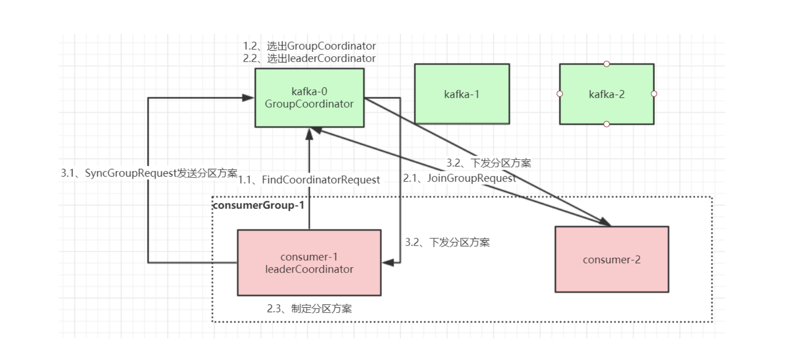

### 常见问题及优化
::: tip 1.消息丢失情况：
消息发送端：

（1）acks=0： 表示producer不需要等待任何broker确认收到消息的回复，就可以继续发送下一条消息。性能最高，但是最容易丢消息。大数据统计报表场景，对性能要求很高，对数据丢失不敏感的情况可以用这种。

（2）acks=1： 至少要等待leader已经成功将数据写入本地log，但是不需要等待所有follower是否成功写入。就可以继续发送下一条消息。这种情况下，如果follower没有成功备份数据，而此时leader又挂掉，则消息会丢失。

（3）acks=-1或all： 这意味着leader需要等待所有备份(min.insync.replicas配置的备份个数)都成功写入日志，这种策略会保证只要有一个备份存活就不会丢失数据。这是最强的数据保证。一般除非是金融级别，或跟钱打交道的场景才会使用这种配置。当然如果min.insync.replicas配置的是1则也可能丢消息，跟acks=1情况类似。

消息消费端：

如果消费这边配置的是自动提交，万一消费到数据还没处理完，就自动提交offset了，但是此时你consumer直接宕机了，未处理完的数据丢失了，下次也消费不到了
:::

::: tip 2.消息乱序:
如果发送端配置了重试机制，kafka不会等之前那条消息完全发送成功才去发送下一条消息，这样可能会出现，发送了1，2，3条消息，第一条超时了，后面两条发送成功，再重试发送第1条消息，这时消息在broker端的顺序就是2，3，1了

所以，是否一定要配置重试要根据业务情况而定。也可以用同步发送的模式去发消息，当然acks不能设置为0，这样也能保证消息发送的有序。

kafka保证全链路消息顺序消费，需要从发送端开始，将所有有序消息发送到同一个分区，然后用一个消费者去消费，但是这种性能比较低，可以在消费者端接收到消息后将需要保证顺序消费的几条消费发到内存队列(可以搞多个)，一个内存队列开启一个线程顺序处理消息。
::: 

### 消费者偏移量__consumer_offsets_相关解析
https://www.cxyzjd.com/article/u010634066/109306637


* [返回主页](../home.md)