* [返回主页](../home.md)
# kafka
## 核心概念
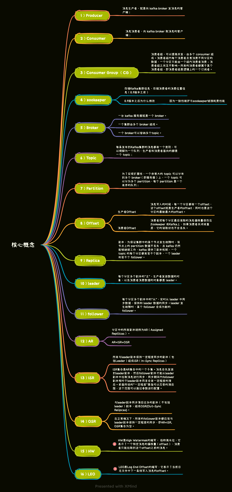

## 核心设计
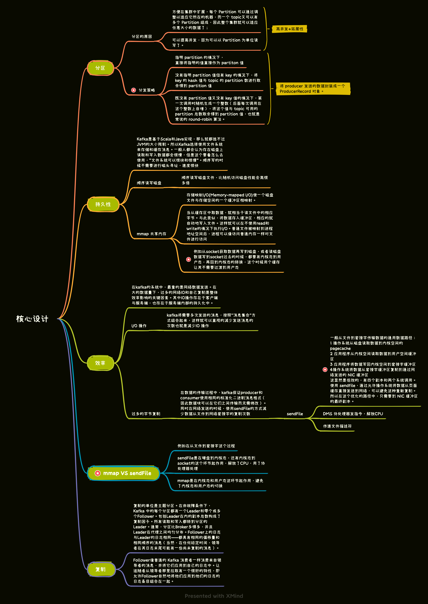

## 索引
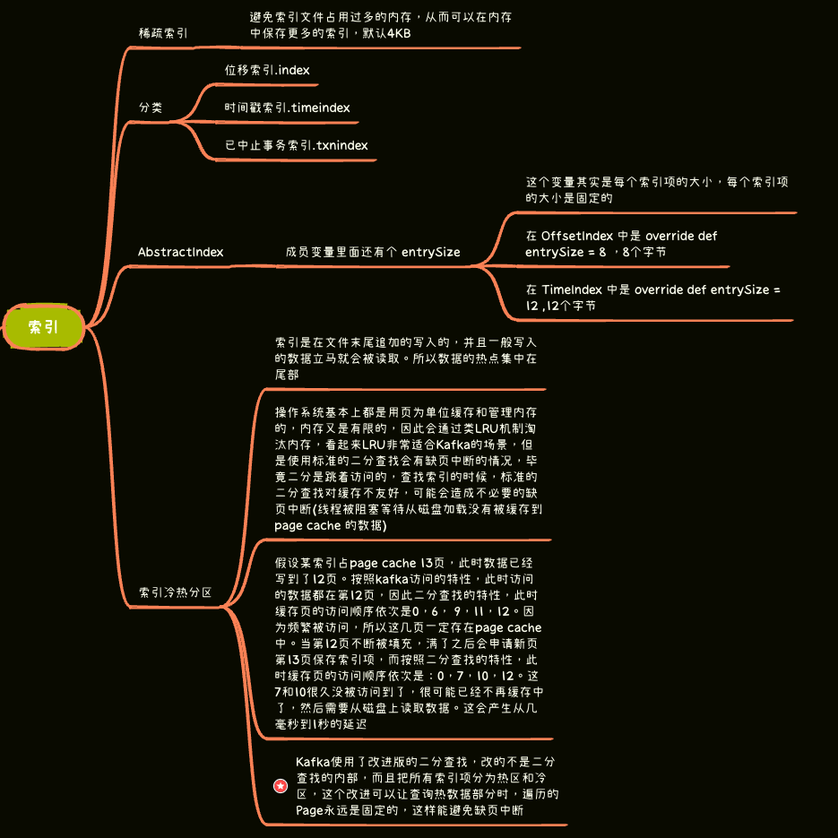

## 存储结构
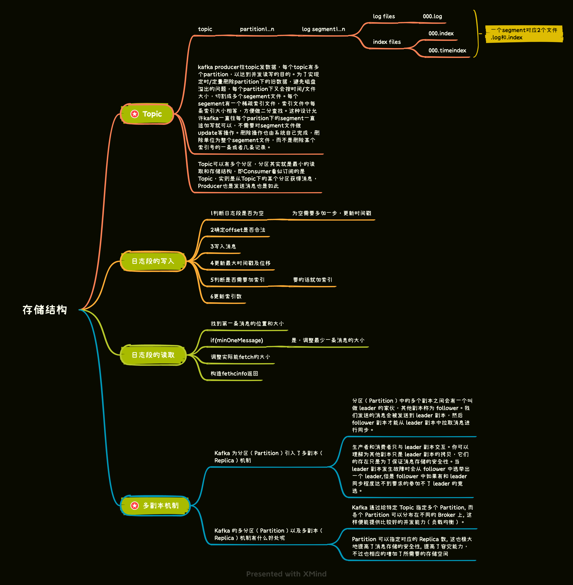

## 控制器
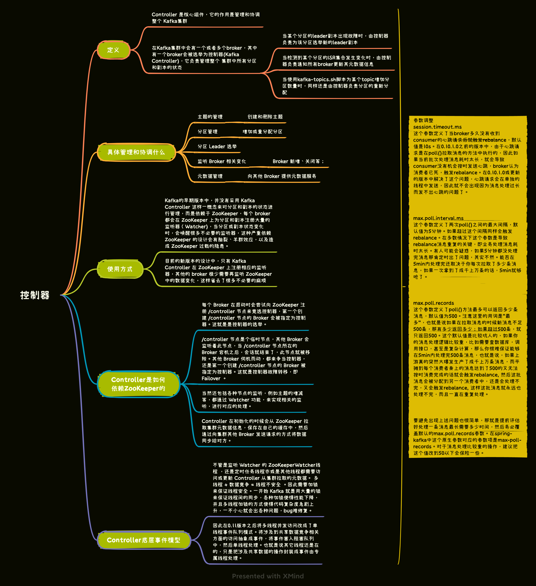

## Partition副本选举Leader机制
controller感知到分区leader所在的broker挂了(controller监听了很多zk节点可以感知到broker存活)， 
controller会从每 个parititon的 replicas 副本列表中取出第一个broker作为leader，当然这个broker需要也同时在ISR列表里。

## rebalance
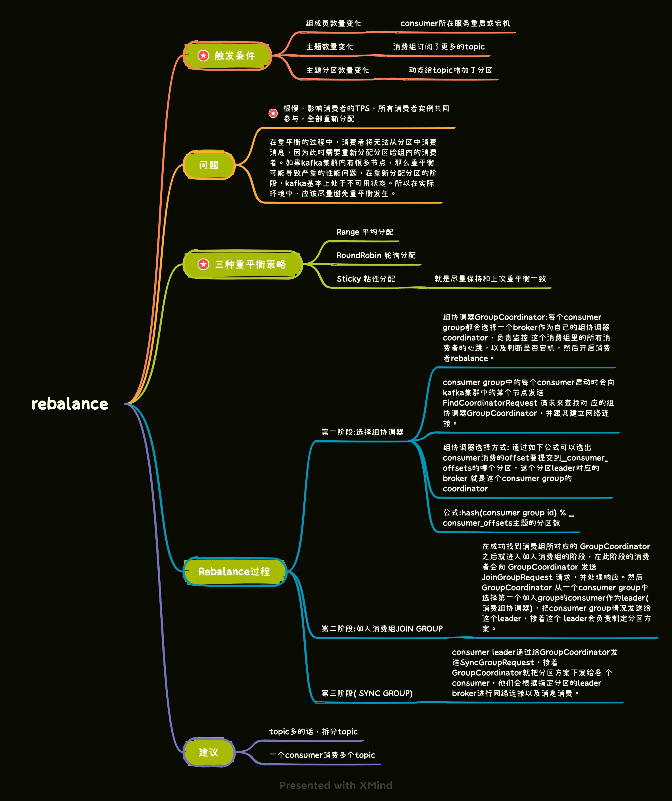

## KafkaBroker网络通信模型
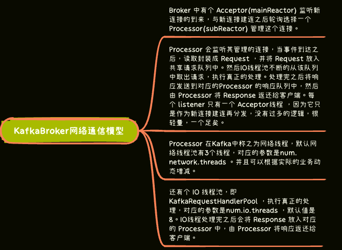

## 请求处理优先级
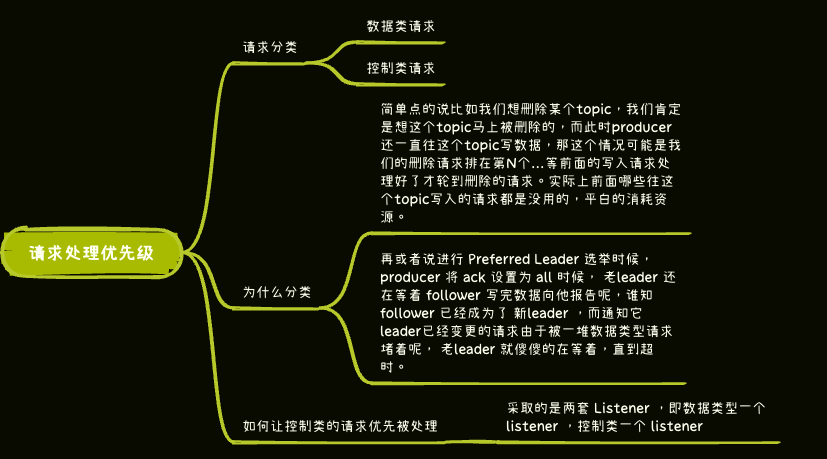

## zk和kafka
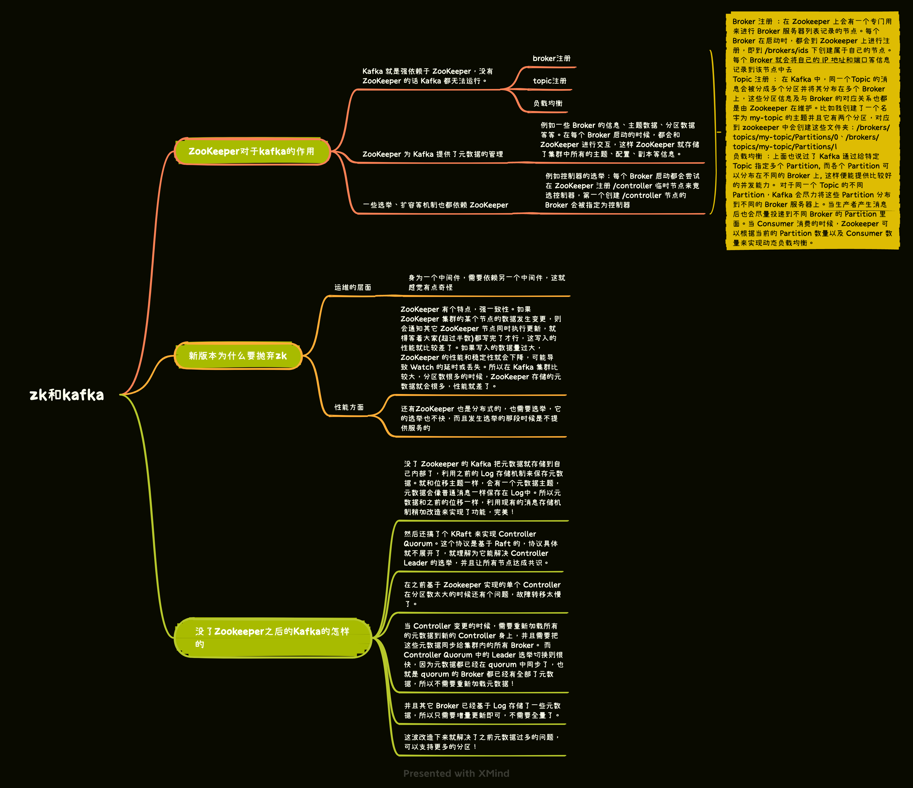

## 场景问题
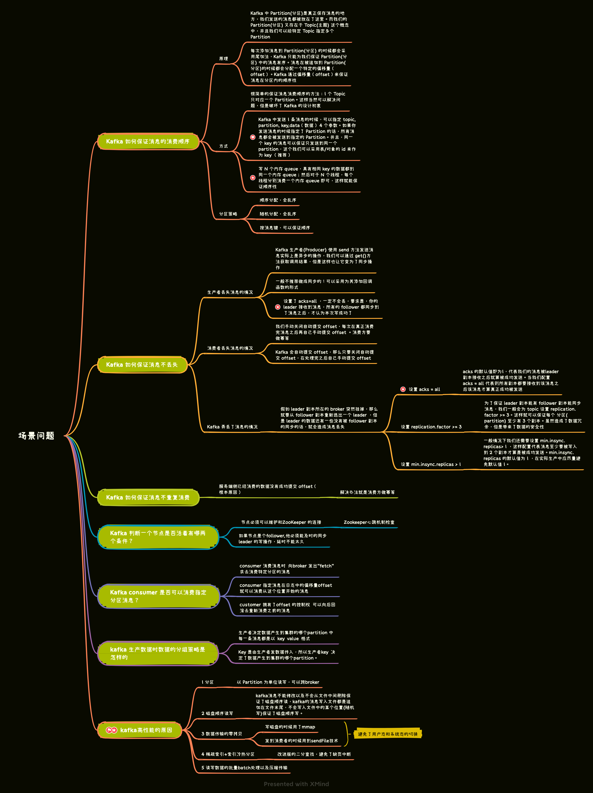

## 集群
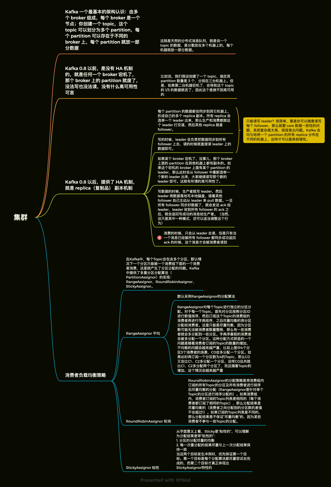

* [返回主页](../home.md)