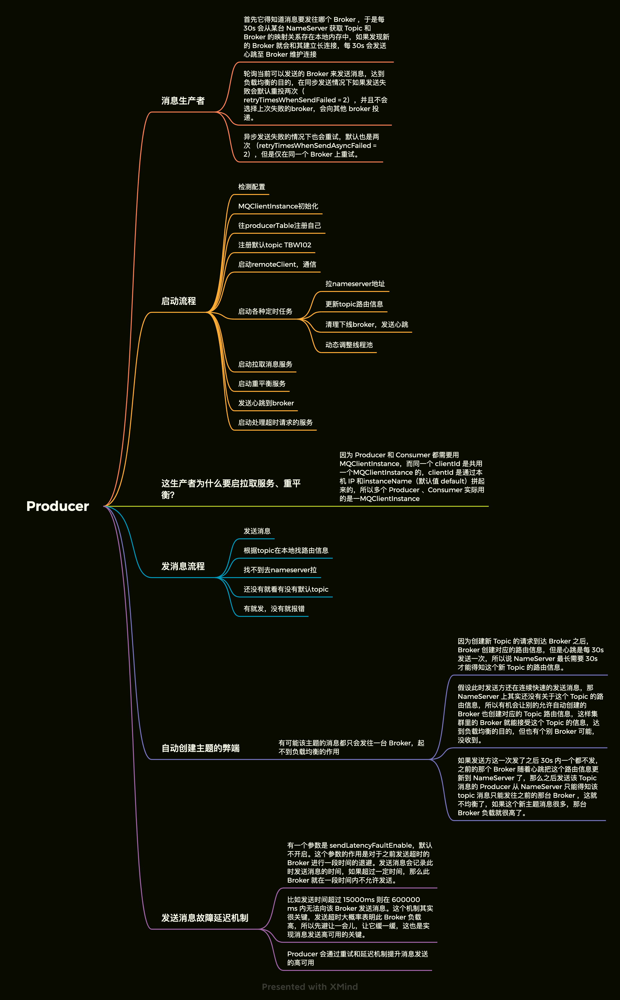
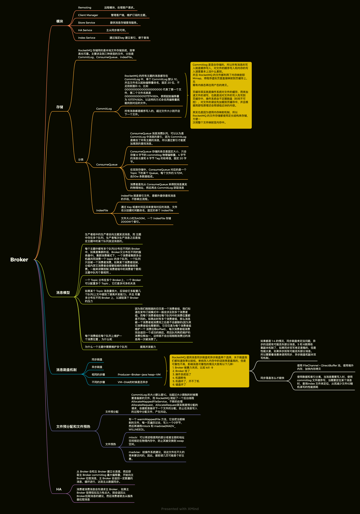
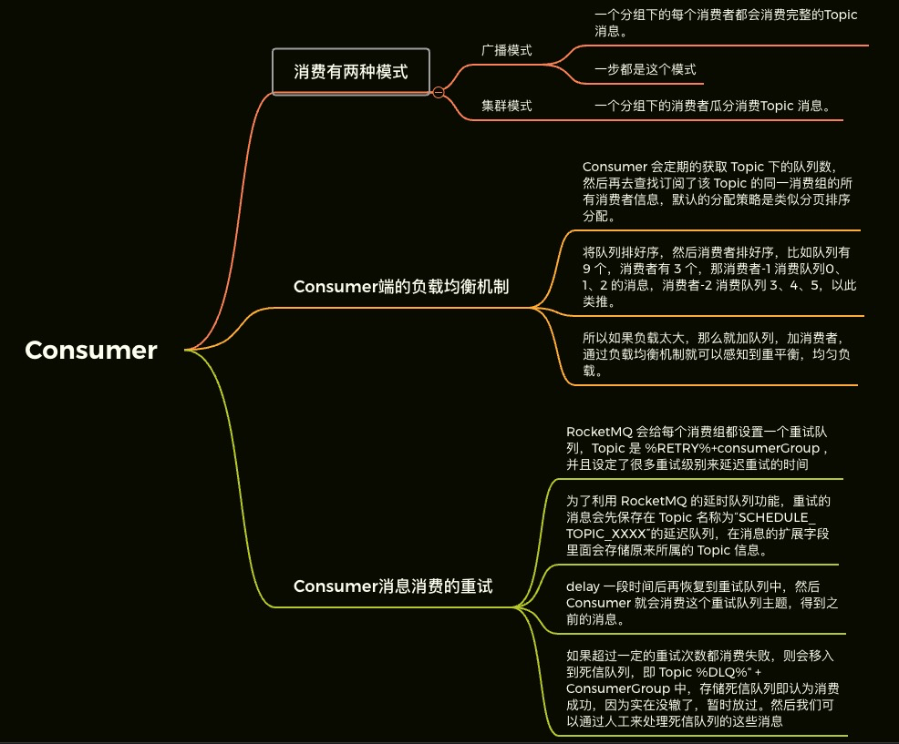
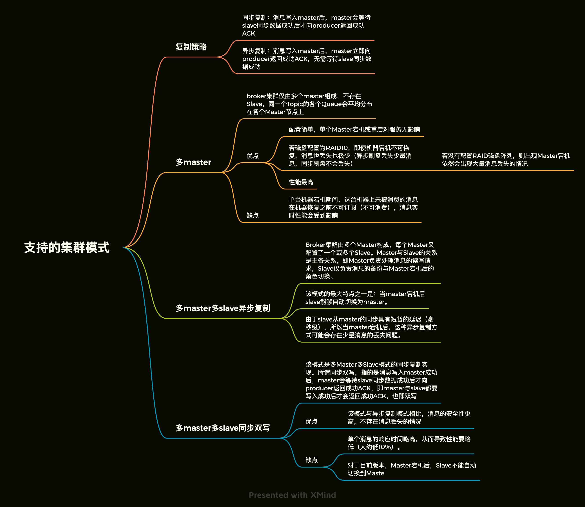
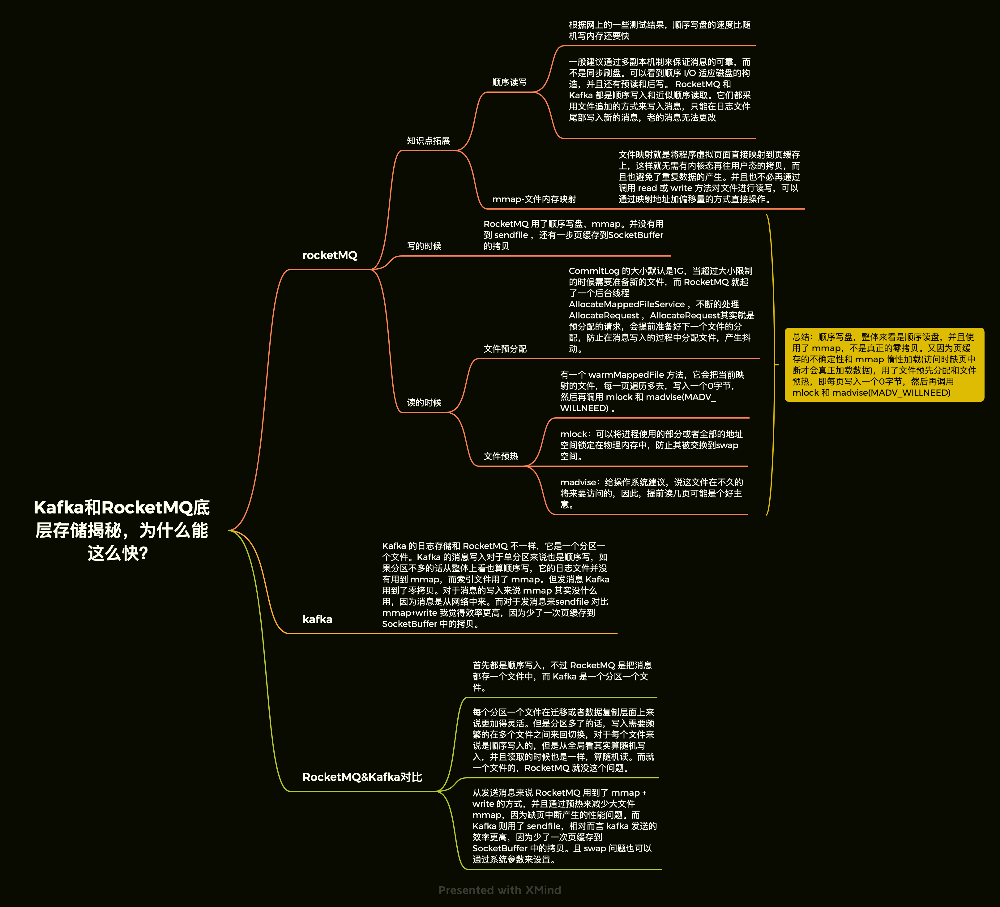

* [返回主页](../home.md)
# RocketMQ
## 架构设计
+ Producer
+ Consumer
+ Broker
+ NameServer
```text
ps.
都是cluster模式
生产者，消费者会去nameserver查询broker
broker会持续发心跳包给nameserver
```

## NameServer
```text
简单的 Topic 路由注册中心，支持 Broker 的动态注册和发现，保存 Topic 和 Borker 之间的关系
各 NameServer 之间不会互相通信， NameServer 都有完整的路由信息，即无状态
启动 NameServer 集群，各 NameServer 之间无任何数据交互，Broker 启动之后会向所有NameServer 定期（每 30s）发送心跳包，包括：IP、Port、TopicInfo，NameServer 会定期扫描 Broker 存活列表，如果超过 120s 没有心跳则移除此 Broker 相关信息，代表下线。这样每个 NameServer 就知道集群所有 Broker 的相关信息
broker向发心跳顺便带上所有的Topic信息
```

## Producer


## Broker


## Consumer


## 支持的集群模式


## Kafka和RocketMQ


## RocketMQ实践注意点
::: tip
1、订阅消息是以 ConsumerGroup 为单位存储的，所以ConsumerGroup 中的每个 Consumer需要有相同的订阅。因为订阅消息是随着心跳上传的，如果一个 ConsumerGroup 中 Consumer 订阅信息不一样，那么就会出现互相覆盖的情况。比如消费者 A 订阅 Topic a，消费者 B 订阅 Topic b，此时消费者 A 去 Broker 拿消息，然后 B的心跳包发出了，Broker 更新了，然后接到 A 的请求，一脸懵逼，没这订阅关系啊。
2、RocketMQ 主从读写分离，从只能读，不能写，并且只有当前客户端读的 offset 和 当前 Broker 已接受的最大 offset 超过限制的物理内存大小时候才会去从读，所以正常情况下从分担不了流量
3、单单加机器提升不了消费速度，队列的数量也需要跟上。
4、之前提到的，不要允许自动创建主题
:::


* [返回主页](../home.md)