* [返回主页](../home.md)
# Dubbo
## RPC
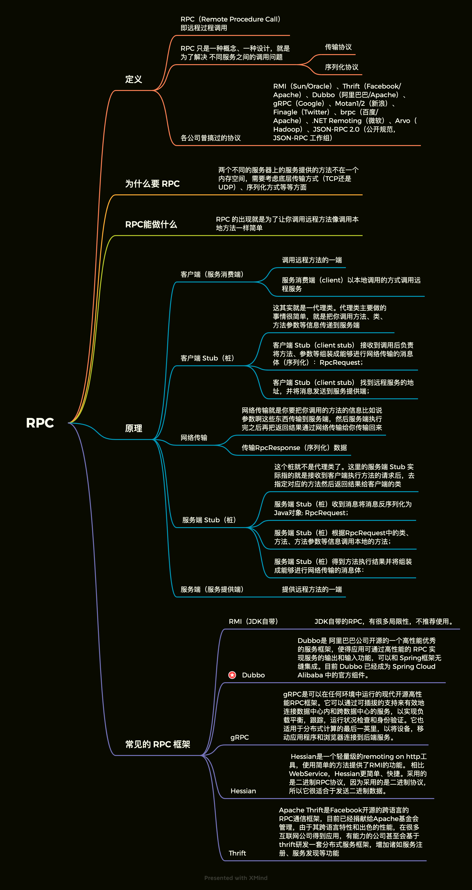

## Dubbo基础
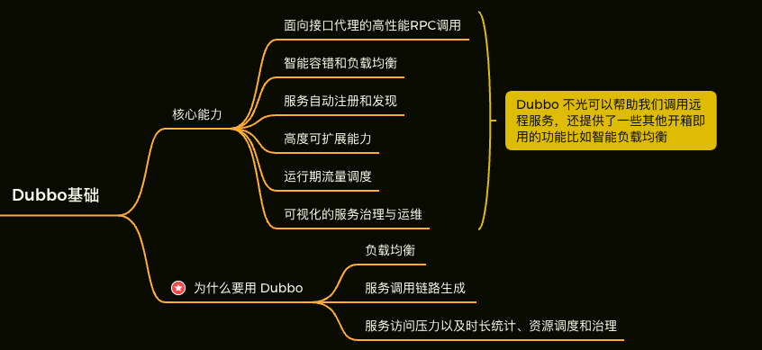

## Dubbo架构
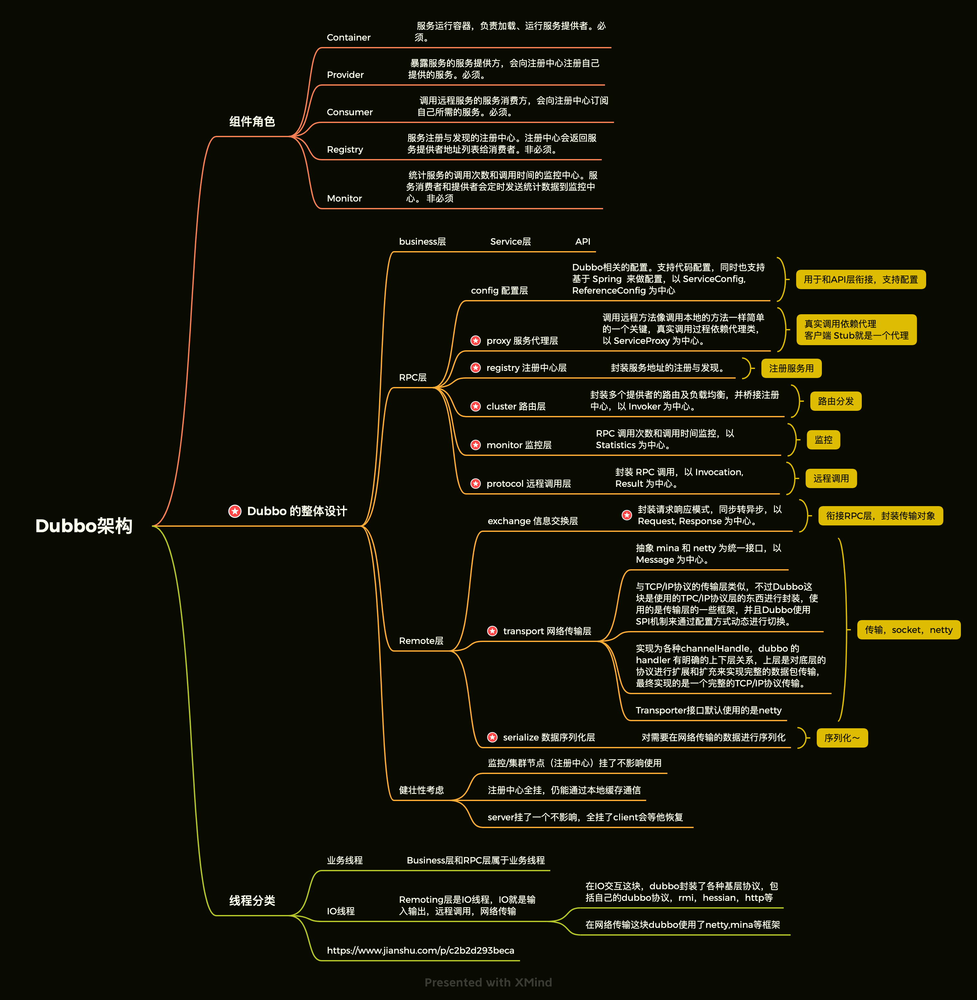

## dubbo调用过程
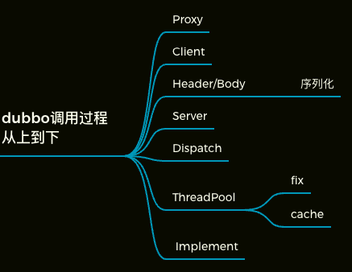

## Invoker
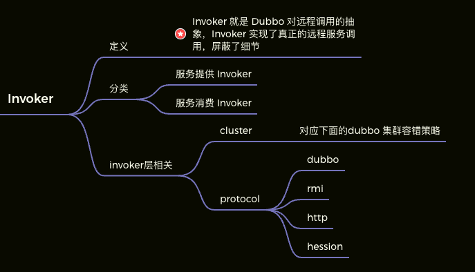

## dubbo集群容错策略
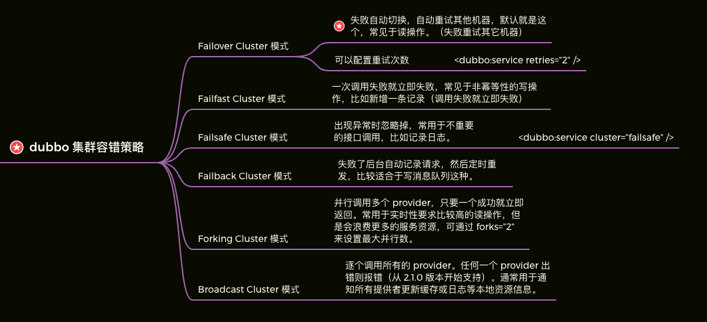

## 服务暴露过程
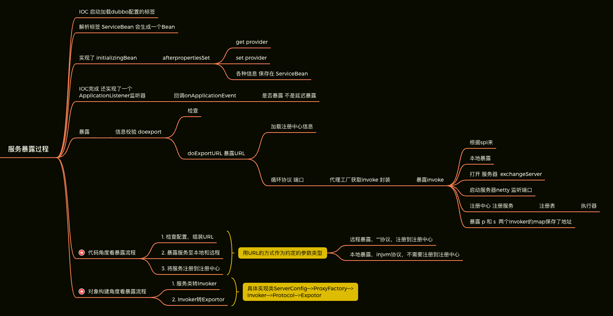

## 服务引用
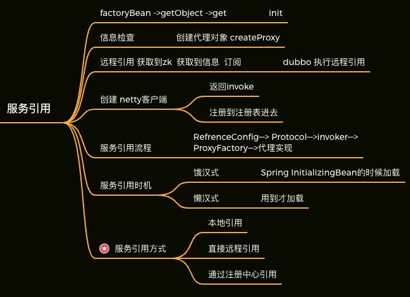

## SPI 机制
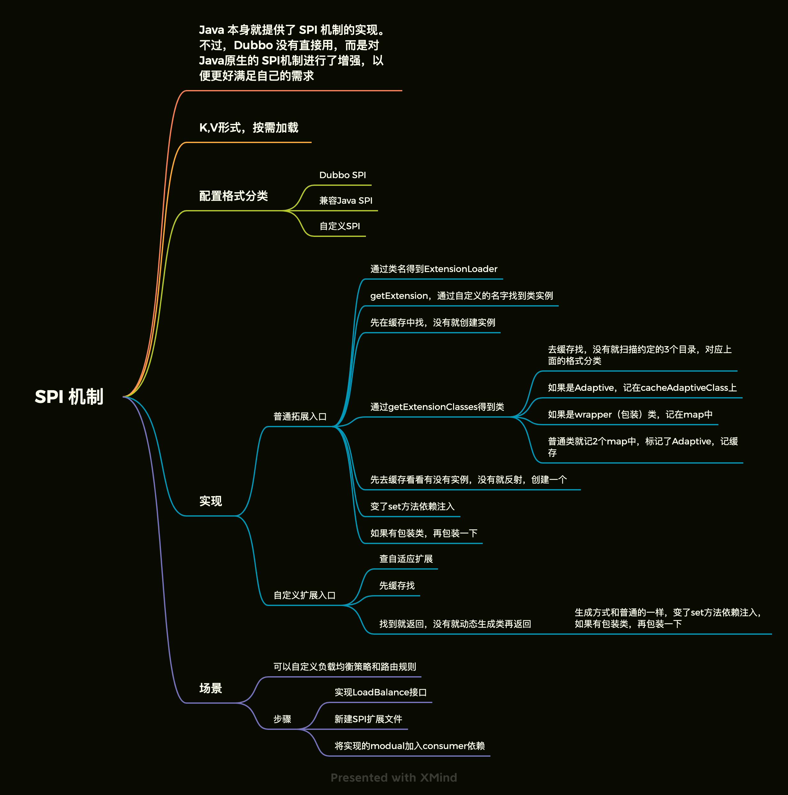

## Dubbo 的负载均衡策略
```markdown
random 默认
RandomLoadBalance 权重随机
LeastActiveLoadBalance 最小活跃数
ConsistentHashLoadBalance 一致性Hash
RoundRobinLoadBalance 加权轮询
使用SPI方式可以自定义拓展
```

## dubbo 动态代理策略
+ 默认使用 javassist 动态字节码生成，创建代理类。但是可以通过 spi 扩展机制配置自己的动态代理策略。

## 协议
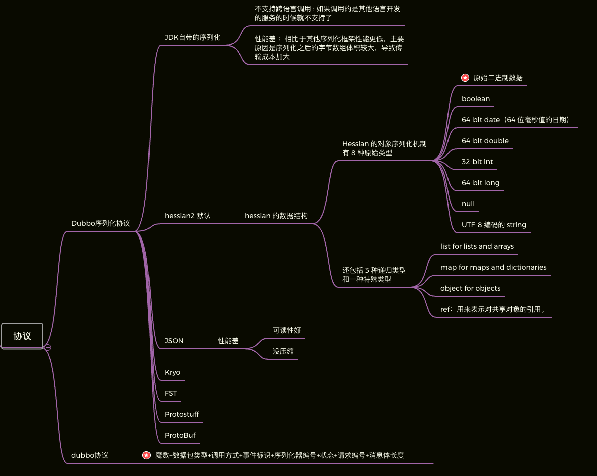

## 如何基于 dubbo 进行服务治理、服务降级、失败重试以及超时重试？
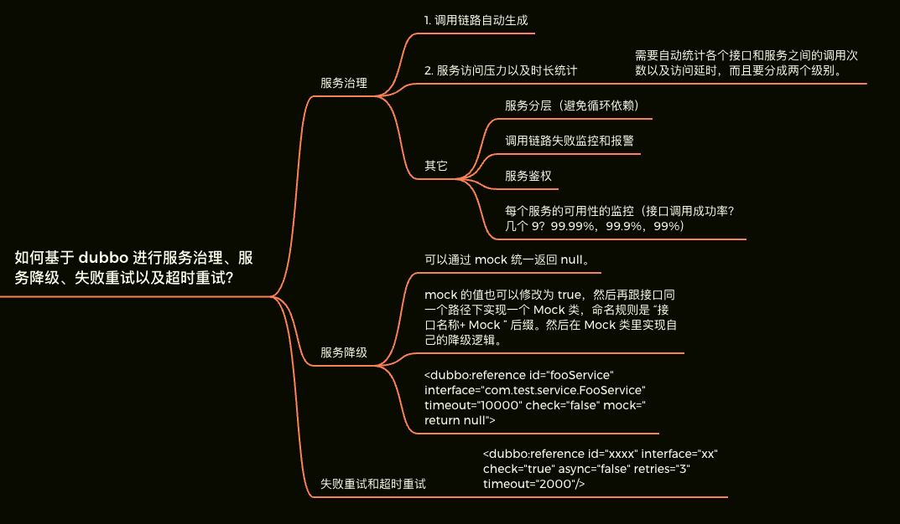

## 设计一个RPC框架需要考虑什么
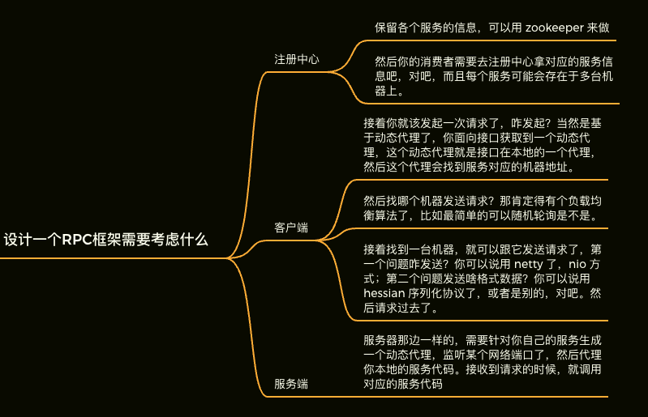


* [返回主页](../home.md)