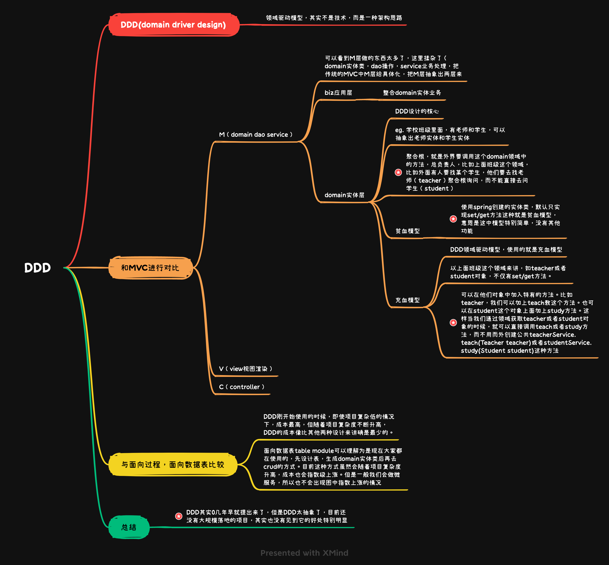

* [返回主页](../home.md)

# DDD  

  
## 领域驱动设计之三域划分
### 三域概述
```text
人是怎么区分自己和他人的关系的，你我他。

领域驱动设计是如何界定工作边界的，核心域（我），通用域（你），支撑域（他）。

核心域：指我/自身组织掌握的核心业务，即提供的能力或者竞争力

通用域：指与核心域配套使用的可以复用的能力，一般指内部能力

支撑域：指与核心域配套使用的可用能力，一般指外部能力



如果“我”属于中间件组织，则：

我的核心域：中间件开发业务，对外提供SDK或者中间件服务

我的通用域：某些内部沉淀的底层SDK或者框架

我的支撑域：某些外部特殊化的SDK或者框架



如果“我”属于后端业务组织，则：

我的核心域：行业业务系统，向外部提供业务接口或者可复用能力SDK

我的通用域：公司中台，如用户域、网关域等

我的支撑域：外部系统，如阿里云的短信服务、对象存储服务等



如果“我”属于公司中台用户域，则：

我的核心域：用户系统开发，对外提供用户鉴权、授权等能力

我的通用域：依赖的其他可复用内部系统或者框架，如 LDAP系统、公司通讯录等

我的支撑域：外部系统，如三方登陆，微信二维码登陆、支付宝刷脸登陆等
```
### 透过防腐层和外域打交道
> Any problem in computer science can be solved by anther layer of indirection ——Butler W. Lampson
> 计算机里如果有不能解决的问题，就给他加一层。
```text
如果称核心域为内域，则通用域、支撑域都是外域。为了避免核心域受外域影响，一般就需要增加一个中间层屏蔽掉外部模型对核心域模型的影响。

查询有如下转换方式：

将外域模型转换为核心域的值对象
将外域模型构建为核心域的实体对象


事件监听有如下转换方式：

监听的外域事件转换为核心域的事件对象
监听的外域事件转换为核心域的值对象
监听的逻辑使用抽象接口方式


发布事件有如下转换方式：

将核心域发布的事件转换为外部消息中间件约定消息格式
消息发布逻辑采用抽象方式，根据消息中间件的不同使用不同的实现/适配器
```
[comment]: <> (![]&#40;../../picture/3/6DDD六边形架构.png&#41;)
<div align="left">
    
</div>

* [返回主页](../home.md)