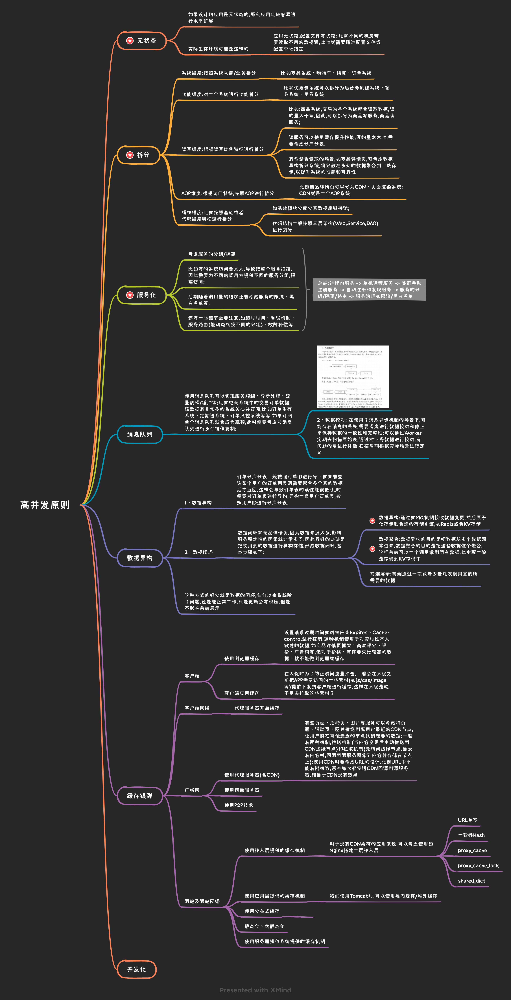
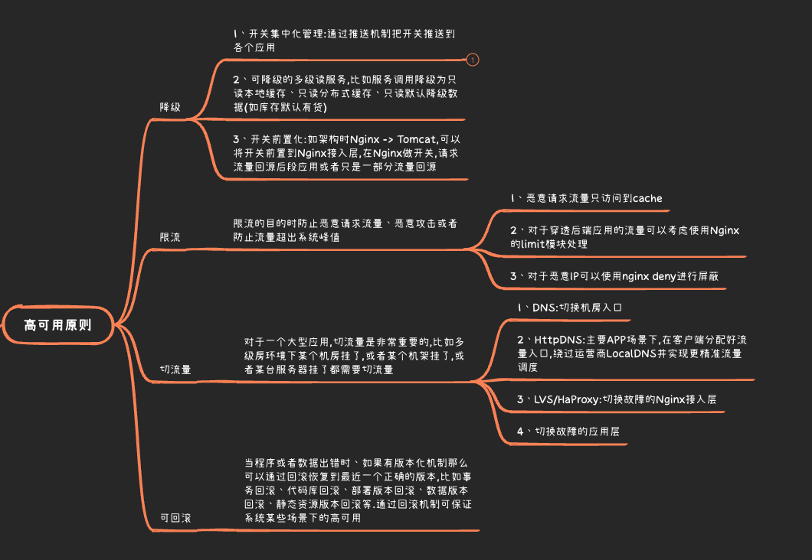
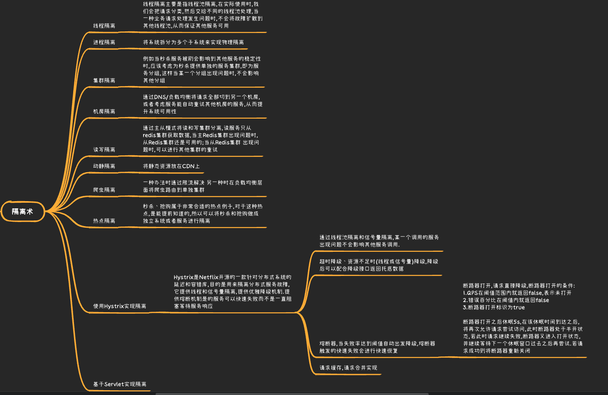
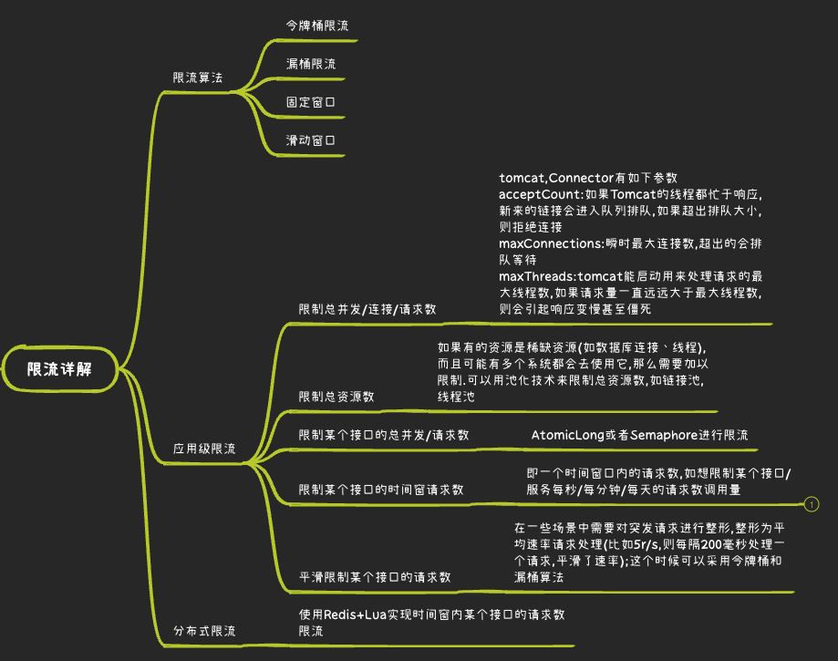
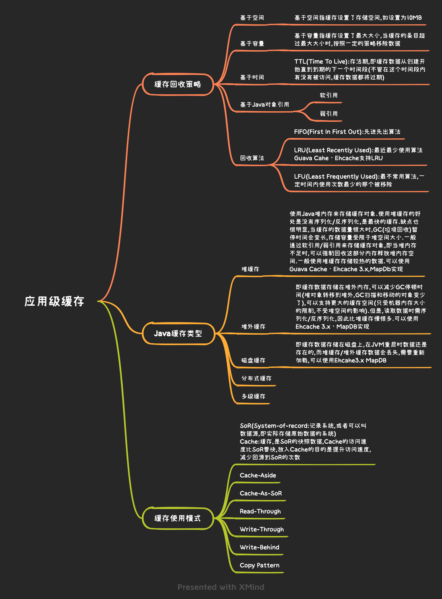
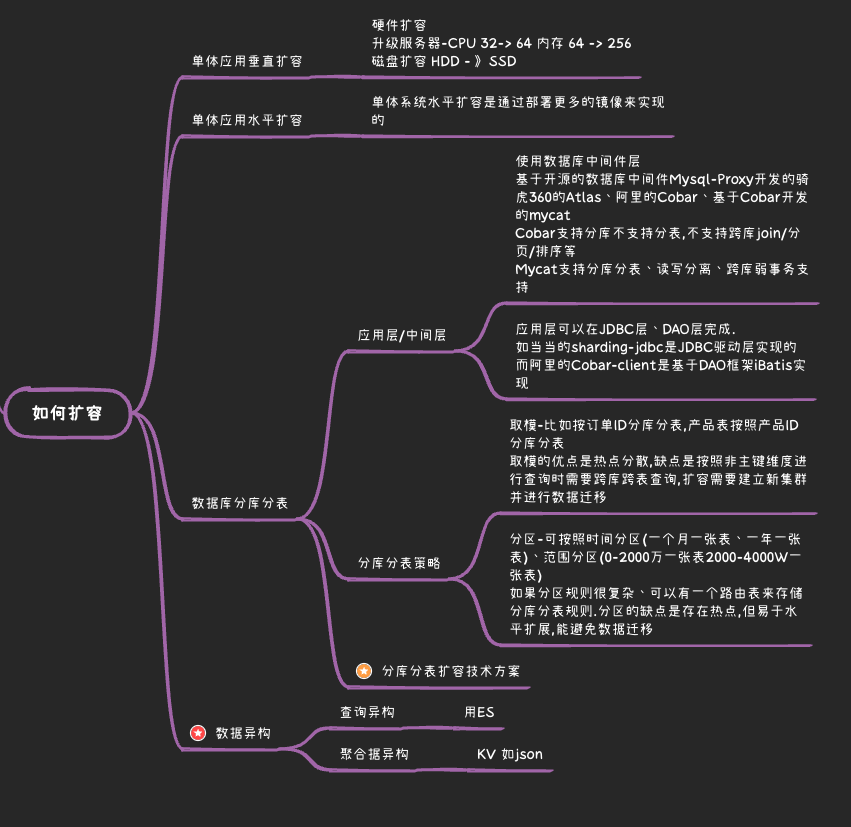

* [返回主页](../home.md)

# 分布式架构  
## 高并发原则

## 高可用原则

## 隔离术

## 限流

## 降级
::: tip 降级特技
超时降级
 统计失败次数降级
 故障降级
 限流降级
 人工开关降级
 读服务降级
 写服务降级
 多级降级
 Hystrix降级
 Hystrix熔断
:::

## 应用级缓存

## 如何扩容

* [返回主页](../home.md)