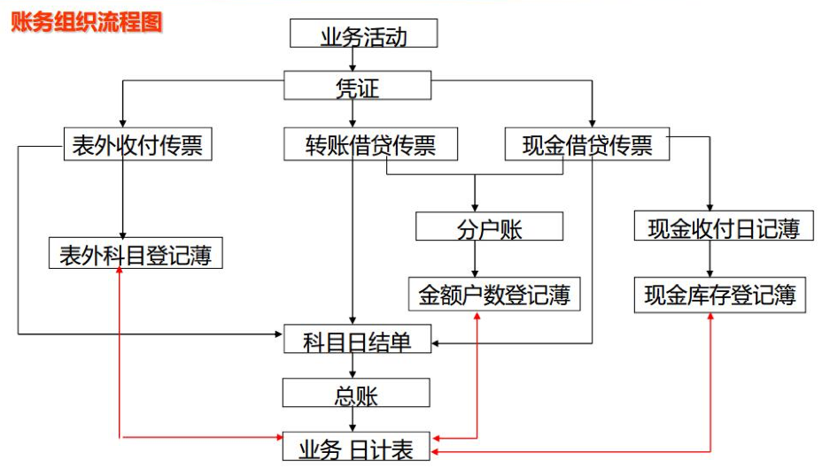
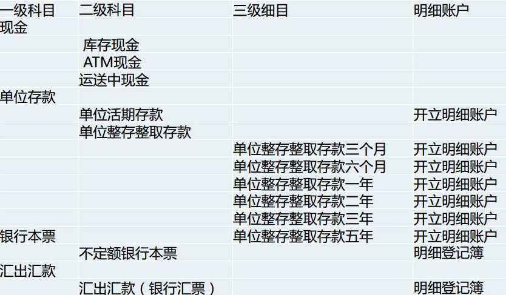

* [返回主页](../home.md)
# 账务组织和账户信息
## 账务组织
+ 账务组织包括明细核算和综合核算，两者都必须按照双线核算的原则，根据同一凭证分别进行核算，它们是相互联系相互制约，明细核算与综合核算的数字必须核对相符。
    + 明细核算是按账户核算，反映各单位或各项资金增减发化及其结果的详细情况的核算系统；
    + 综合核算则是按会计科目汇总核算，反映各类资金的增减变化及其结果的总括情况的核算系统。

### 明细核算
+ 1）分户账：是各科目的明细记彔，必须按户立账，连续记载
+ 2）登记簿： 金额户数登记薄、开销户登记薄、挂失登记薄、现金登记薄、重要空白凭证登记薄、有价单证登记薄、托收登记薄、代保管有价值品登记薄。

### 综合核算
+ （1）科目日结单: 是监督明细账务发生额，轧平当天账务的重要工具
+ （2）总 账: 当日根据科目日结单借/贷方发生额合计分别填记,结出余额
+ （3）日计表: 根据总账各科目当日发生额和余额填记，借/贷方发生额和借/贷方余额的合计数必须各自平衡。

### 各种账目详细介绍
```text
1、分户账：一般设有甲、乙、丙、丁四种账簿。
甲种账簿设有借、贷方发生额和余额三栏，适用于余额表计息或不计息账户及内部科目账户。
乙种账簿设有借、贷方发生额和余额、积数四栏，适用于在账页上计息的账户。
丙种账簿设有借、贷方収生额和借、贷方余额四栏，适用于借、贷双方反映余额的账户。
丁种账簿设有借、贷方収生额和余额以及销账日期四栏，适用于逐笔记账、逐笔销账的一次性业务的账户。

2、科目日结单：科目日结单是每一会计科目当天借、贷发生额和传票张数的汇总记彔，是登记总账的依据。
每日营业终了，将全部传票按科目分开，同一科目的传票分别现金收入、现金付出、转账借方、转账贷方各自加计金额和传票张数，填入该科目日结单相关栏内。

3、 总账：总账按科目设立，是各科目的汇总记彔。
每日营业终了，根据各科目日结单的借、贷方发生额分别填列，并结出余额；10天一小计，每月终了，加计本月的借贷方发生额和本年累计发生额。

4、日计表：商业银行会计的日计表起着试算平衡表的作用，它反映当日业务和财务活动情况，是轧平当日财务的工具。
每日营业终了，根据总账各科目借、贷方发生额和余额分别填列，日计表内全部科目的借、贷方发生额和借、贷方余额的合计数应各自平衡。
```

::: tip ps.
 黑线是业务流程，红线是核对流程
:::

## 账户信息
### 账户信息介绍
账户信息是银行内部的资金管理、财务分析、分级考核以及风险控制的要求将业务处理系统中的账户信息进行分类整理，用于会计核算的基本数据集，是用于会计报表的基础数据源，账户信息可以从以
下维度理解：
+ 按科目分为：资产、负债、共同类、所有者权益、损益、或有、表外；
+ 按产品分为：存款、贷款、结算、资金、外汇、承诺等等；
+ 按账务组织分为：总帐账户、明细账户；
+ 按账务管理分为：外部账户、内部账户；
+ 按账户清算分为：往来账；

### 总帐账户和明细账户设置demo


## 中间业务分类
+ 金融类：涉及记账、转账、现金收支、汇兑、票据买卖、理财产品买卖、贷款放款还款等资金转移的业务（有资金变动的服务）
+ 非金融类：涉及密码验证、协议维护（签约、修改、解约）、交易信息校验、连通性测试、业务信息更新等业务操作的服务
+ 查询类：涉及余额查询、交易明细查询等各种业务查询的所有服务。
+ 冲正类：涉及各种金融类业务冲正、撤销等所有服务（只对金融类服务的冲正撤销）
+ 文件类：涉及批量文件通知、文件传送等所有服务。
* [返回主页](../home.md)