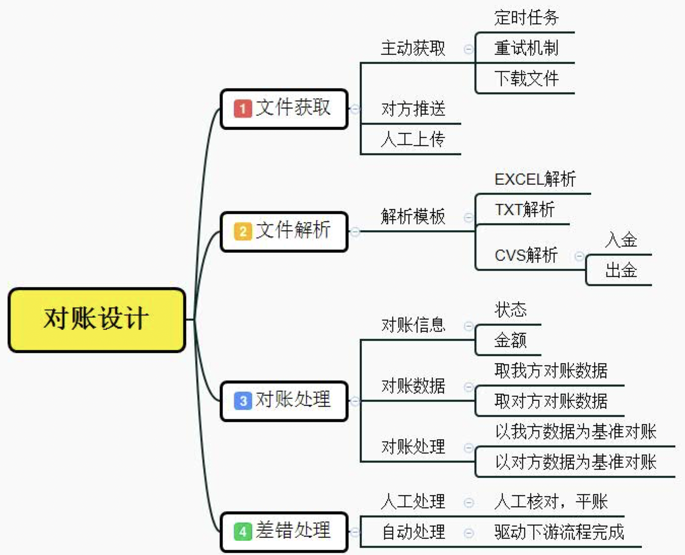
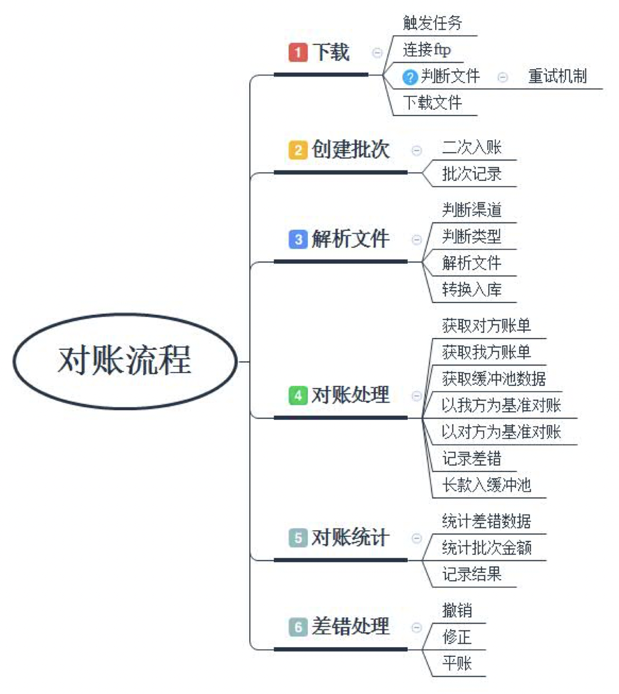

* [返回主页](../home.md)
# 对账系统
## 背景
核对交易的一致性和正确性，导出差错，用于核心根据差错进行冲账或者补帐

## 相关概念
### 轧帐和平帐
+ 每一笔交易，都要做到各参与者的记录能够吻合，没有偏差。对账系统的工作，是发现有差异的记录，即轧帐； 
+ 然后通过人工或者自动的方式，解决这些差异，即平帐。
+ 总结：有差异的记录叫轧账，解决差异叫平账
### 长款和短款
+ 长款就是多收钱了，短款就是少收钱了
### 清算和结算
+ 清算就是计算各方应收应付的时间和金额
+ 结算就是根据清算结果在指定时间对各方进行资金转移

## 系统逻辑架构
```text
a调度模块
b任务模块
c配置模块
    机构配置
    文件配置
    模型配置
    清单配置
d文件模块
    格式映射
    数据拆分
    格式转换
    逻辑组装
e对账模型
    全量对账
    对账要素
    滚动对账
    序号对账
f对账清单
    标准输出
    个性化输出
```
## 滚动对账介绍
```text
非序号对账：
    1.把清单表前天的存疑数据废弃（标记为删除态）
    2.对账
        按机构对
        加上归集表中的本机构存疑数据
    3.更新归集表的存疑数据的状态+滚动天数
    4.更新归集表状态
序号对账：
    1.获取截止线
        type1和type2的当前数据和存疑数据的交叉部分的最大对账序号就是截止线
    2.和非序号对账完全一样的步骤
不同点：
    非序号对账：
        滚动天数0，有一边没有=>9差错	
        滚动天数不为0，有一边没有=>1存疑
    序号对账：
        滚动天数0，有一边没有=>9差错	
        滚动天数不为0，有一边没有
        序号在截止线内就是差错
        不在就是存疑
```

### 系统设计和对账流程



* [返回主页](../home.md)