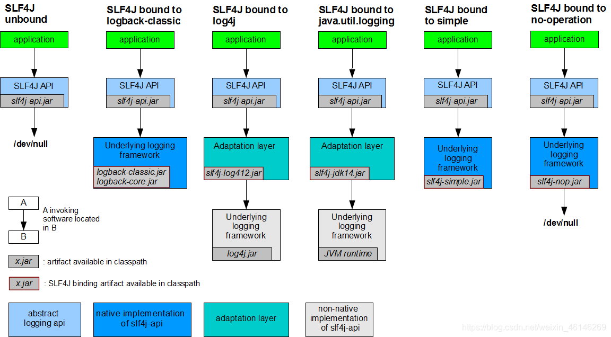
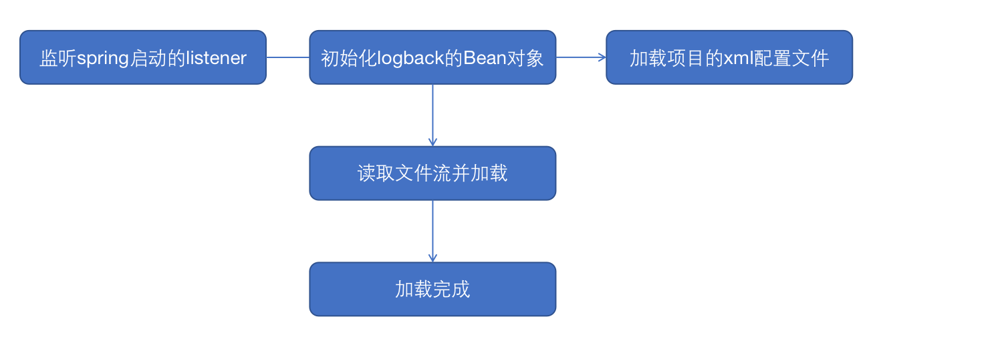

* [返回主页](../home.md)
# 日志框架与Spring
当前java流行的日志框架主要是有log4j、log4j2，logback，对于不同的日志框架有自身的优点以及缺点。下面先简单介绍下。
## 主流日志框架
### Log4J
Apache Log4j 是一个非常古老的日志框架，并且是多年来最受欢迎的日志框架。 Log4j有7种不同的log级别，按照等级从低到高依次为：TRACE、DEBUG、INFO、WARN、ERROR、FATAL、OFF。Log4j支持两种格式的配置文件：properties和xml。包含三个主要的组件：Logger、appender、Layout。

### Logback
Logback，一个“可靠、通用、快速而又灵活的Java日志框架”。logback是log4j的一个改良版本。此外logback-classic完整实现SLF4J API使你可以很方便地更换成其它日志系统如log4j或JDK Logging。
```text
选择logback的理由：
logback比log4j要快大约10倍，而且消耗更少的内存。
logback-classic模块直接实现了SLF4J的接口，所以我们迁移到logback几乎是零开销的。
logback不仅支持xml格式的配置文件，还支持groovy格式的配置文件。相比之下，Groovy风格的配置文件更加直观，简洁。
logback-classic能够检测到配置文件的更新，并且自动重新加载配置文件。
logback能够优雅的从I/O异常中恢复，从而我们不用重新启动应用程序来恢复logger。
logback能够根据配置文件中设置的上限值，自动删除旧的日志文件。
logback能够自动压缩日志文件。
logback能够在配置文件中加入条件判断（if-then-else)。可以避免不同的开发环境（dev、test、uat…）的配置文件的重复。
logback带来更多的filter。
logback的stack trace中会包含详细的包信息。
logback-access和Jetty、Tomcat集成提供了功能强大的HTTP-access日志。
```

### Log4J2
Spring Boot1.4以及之后的版本已经不支持log4j，log4j也很久没有更新。Log4j 2在各个方面都与Logback非常相似，那么为什么我们还需要Log4j 2呢？
```text
1.插件式结构。Log4j 2支持插件式结构。我们可以根据自己的需要自行扩展Log4j 2. 我们可以实现自己的appender、logger、filter。
2. 配置文件优化。在配置文件中可以引用属性，还可以直接替代或传递到组件。而且支持json格式的配置文件。不像其他的日志框架，它在重新配置的时候不会丢失之前的日志文件。
3. Java 5的并发性。Log4j 2利用Java 5中的并发特性支持，尽可能地执行最低层次的加锁。解决了在log4j 1.x中存留的死锁的问题。
4. 异步logger。Log4j 2是基于LMAX Disruptor库的。在多线程的场景下，和已有的日志框架相比，异步的logger拥有10倍左右的效率提升。
```

## Springboot集成多个日志框架
### SLF4J
SLF4J，即简单日志门面（Simple Logging Facade for Java），不是具体的日志解决方案，而是通过Facade Pattern提供一些Java logging API，它只服务于各种各样的日志系统。按照官方的说法，SLF4J是一个用于日志系统的简单Facade，允许最终用户在部署其应用时使用其所希望的日志系统。
<br>
SLF4J封装了日志系统的所有行为，这样对于使用这来说配置和使用都是统一的。主流日志框架只需要实现SLF4J的接口就可以使用，下面是SLF4J设计的如何整合各个日志框架：<br>


### spring如何加载日志配置文件
springboot默认使用的是logback日志框架，通过SLF4J整合。下面看下spring如何加载logback：<br>
再springboot的jar包中有声明监听者，其中就有LoggingApplicationListener<br>
```java
# Application Listeners
org.springframework.context.ApplicationListener=\
org.springframework.boot.ClearCachesApplicationListener,\
org.springframework.boot.builder.ParentContextCloserApplicationListener,\
org.springframework.boot.cloud.CloudFoundryVcapEnvironmentPostProcessor,\
org.springframework.boot.context.FileEncodingApplicationListener,\
org.springframework.boot.context.config.AnsiOutputApplicationListener,\
org.springframework.boot.context.config.ConfigFileApplicationListener,\
org.springframework.boot.context.config.DelegatingApplicationListener,\
org.springframework.boot.context.logging.ClasspathLoggingApplicationListener,\
org.springframework.boot.context.logging.LoggingApplicationListener,\
org.springframework.boot.liquibase.LiquibaseServiceLocatorApplicationListener
```
从这个配置可以看到Spring是通过监听listener加载logback。

### 加载流程


### @SLf4J如何加载
lombok的@SLf4注解能打印日志的原因是，lombok再代码进行编译的时候，动态变更字节码添加了一行代码
```java
private static final Logger log = LoggerFactory.getLogger(class);
```
这样就相当于在每个声明注解的类里面都有一个Logger


* [返回主页](../home.md)