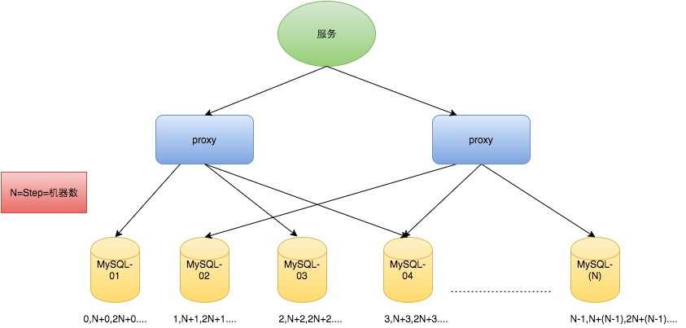
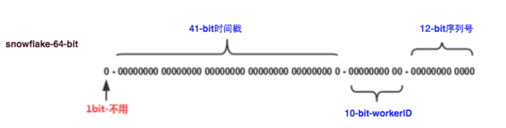
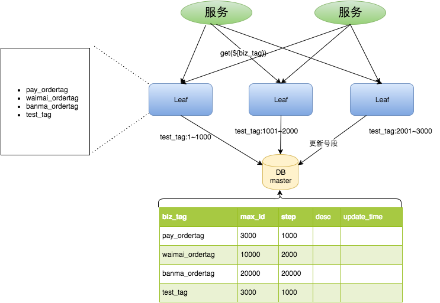
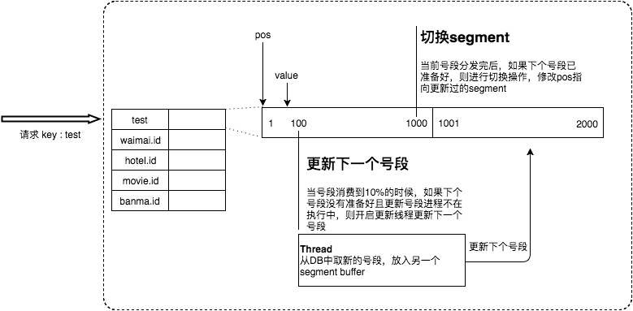
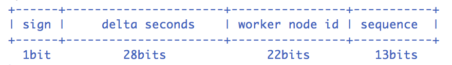

* [返回主页](../home.md)
# 分布式Id生成方案
UUID
数据库自增Id
号段模式
redis
雪花算法
美团leaf
百度Uidgenerater

## 基于UUID
::: tip 优点
生成足够简单，本地生成无网络消耗，具有唯一性
:::

::: warning 缺点
无序的字符串，不具备趋势自增特性<br>
没有具体的业务含义<br>
长度过长16 字节128位，36位长度的字符串，存储以及查询对MySQL的性能消耗较大，MySQL官方明确建议主键要尽量越短越好，作为数据库主键 UUID 的无序性会导致数据位置频繁变动，严重影响性能。
:::

## 基于数据库自增ID
::: tip 优点
实现简单，ID单调自增，数值类型查询速度快
:::

::: warning 缺点
DB单点存在宕机风险，无法扛住高并发场景
:::

## 基于数据库集群模式

<br>
```text
做双主模式集群，也就是两个Mysql实例都能单独的生产自增ID。
那这样还会有个问题，两个MySQL实例的自增ID都从1开始，会生成重复的ID怎么办？
解决方案：设置起始值和自增步长。
增加第三台MySQL实例需要人工修改一、二两台MySQL实例的起始值和步长，把第三台机器的ID起始生成位置设定在比现有最大自增ID的位置远一些，
但必须在一、二两台MySQL实例ID还没有增长到第三台MySQL实例的起始ID值的时候，否则自增ID就要出现重复了，必要时可能还需要停机修改。
```
::: tip 优点
解决DB单点问题
:::

::: warning 缺点
不利于后续扩容，而且实际上单个数据库自身压力还是大，依旧无法满足高并发场景。
:::

## 基于数据库的号段模式
号段模式是当下分布式ID生成器的主流实现方式之一，号段模式可以理解为从数据库批量的获取自增ID，每次从数据库取出一个号段范围，例如 (1,1000] 代表1000个ID，具体的业务服务将本号段，生成1~1000的自增ID并加载到内存。
由于多业务端可能同时操作，所以采用版本号version乐观锁方式更新，这种分布式ID生成方式不强依赖于数据库，不会频繁的访问数据库，对数据库的压力小很多。

## 基于Redis模式
Redis也同样可以实现，原理就是利用redis的 incr命令实现ID的原子性自增。
```shell
127.0.0.1:6379> set seq_id 1     // 初始化自增ID为1
OK
127.0.0.1:6379> incr seq_id      // 增加1，并返回递增后的数值
(integer) 2
```
::: warning 注意点
redis有两种持久化方式RDB和AOF

RDB会定时打一个快照进行持久化，假如连续自增但redis没及时持久化，而这会Redis挂掉了，重启Redis后会出现ID重复的情况。<br>
AOF会对每条写命令进行持久化，即使Redis挂掉了也不会出现ID重复的情况，但由于incr命令的特殊性，会导致Redis重启恢复的数据时间过长。
:::

## 基于雪花算法（Snowflake）模式

```text
雪花算法（Snowflake）是twitter公司内部分布式项目采用的ID生成算法，
开源后广受国内大厂的好评，在该算法影响下各大公司相继开发出各具特色的分布式生成器。

Snowflake生成的是Long类型的ID，一个Long类型占8个字节，每个字节占8比特，也就是说一个Long类型占64个比特。

Snowflake ID组成结构：正数位（占1比特）+ 时间戳（占41比特）+ 机器ID（占5比特）+ 数据中心（占5比特）+ 自增值（占12比特），总共64比特组成的一个Long类型。
  第一个bit位（1bit）：Java中long的最高位是符号位代表正负，正数是0，负数是1，一般生成ID都为正数，所以默认为0。
  时间戳部分（41bit）：毫秒级的时间，不建议存当前时间戳，而是用（当前时间戳 - 固定开始时间戳）的差值，可以使产生的ID从更小的值开始；41位的时间戳可以使用69年，(1L << 41) / (1000L * 60 * 60 * 24 * 365) = 69年
  工作机器id（10bit）：也被叫做workId，这个可以灵活配置，机房或者机器号组合都可以。
  序列号部分（12bit），自增值支持同一毫秒内同一个节点可以生成4096个ID
根据这个算法的逻辑，只需要将这个算法用Java语言实现出来，封装为一个工具方法，那么各个业务应用可以直接使用该工具方法来获取分布式ID，只需保证每个业务应用有自己的工作机器id即可，而不需要单独去搭建一个获取分布式ID的应用。
```

## 美团（Leaf）
Leaf由美团开发，github地址：<br>
https://github.com/Meituan-Dianping/Leaf
<br>
Leaf同时支持号段模式和snowflake算法模式，可以切换使用。
### 号段模式
服务启动后，先去数据库根据max_id和step获取到每个实例对应的id号段。当业务号段用完之后，重新查询数据库获取Id号段。

#### 双buffer机制

<br>
Leaf服务内部有两个号段缓存区segment。当前号段已下发10%时，如果下一个号段未更新，则另启一个更新线程去更新下一个号段。当前号段全部下发完后，如果下个号段准备好了则切换到下个号段为当前segment接着下发，循环往复。

### snowflake模式
Leaf的snowflake模式依赖于ZooKeeper，不同于原始snowflake算法也主要是在workId的生成上，Leaf中workId是基于ZooKeeper的顺序Id来生成的，每个应用在使用Leaf-snowflake时，启动时都会都在Zookeeper中生成一个顺序Id，相当于一台机器对应一个顺序节点，也就是一个workId。

## 百度（uid-generator）
uid-generator是由百度技术部开发，项目GitHub地:<br>
https://github.com/baidu/uid-generator
<br>
uid-generator是基于Snowflake算法实现的，与原始的snowflake算法不同在于，uid-generator支持自定义时间戳、工作机器ID和 序列号 等各部分的位数，而且uid-generator中采用用户自定义workId的生成策略。<br>
uid-generator需要与数据库配合使用，需要新增一个WORKER_NODE表。当应用启动时会向数据库表中去插入一条数据，插入成功后返回的自增ID就是该机器的workId数据由host，port组成。<br>

对于uid-generator ID组成结构：<br>

<br>
workId，占用了22个bit位，时间占用了28个bit位，序列化占用了13个bit位，需要注意的是，和原始的snowflake不太一样，时间的单位是秒，而不是毫秒，workId也不一样，而且同一应用每次重启就会消费一个workId。


* [返回主页](../home.md)