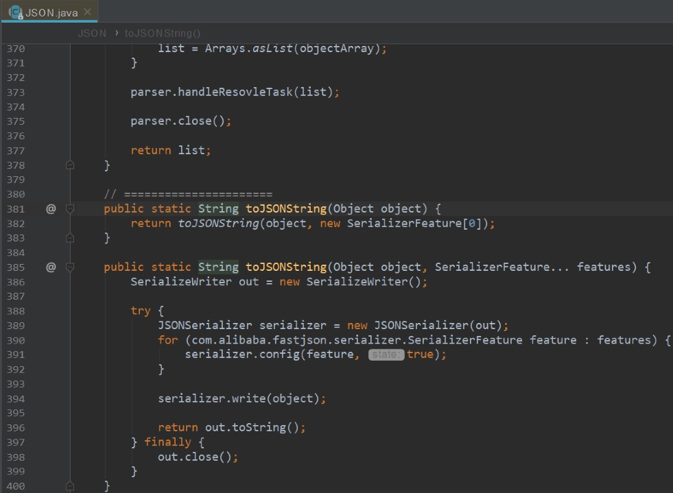

* [返回主页](../home.md)
## 序列化踩过的坑
### FastJson简介
fastjson是由alibaba开源的一套json处理器。

### 采坑实例
Map中有10条记录，然后使用JSON.toJSONString 包装后进行网络传递，但是通过日志发现接收方只收到了5条数据。

### JSON.toJSONString 源码分析

<br>看下SerializerFeature属性:

|名称|含义| 
|:-----|:-----|
|QuoteFieldNames|输出key时是否使用双引号,默认为true|
|UseSingleQuotes| 使用单引号而不是双引号,默认为false|
|WriteMapNullValue| 是否输出值为null的字段,默认为false|
|WriteEnumUsingToString| Enum输出name()或者original,默认为false|
|SortField| 按字段名称排序后输出。默认为false|
|WriteTabAsSpecial| 把\t做转义输出，默认为false|
|PrettyForma| 结果是否格式化,默认为false|
|WriteClassName| 序列化时写入类型信息，默认为false。反序列化是需用到|

### 解决方法
指定序列化方式：<br>
```java
JSON.toJSONString(map, SerializerFeature.WriteMapNullValue)
```
实际上是拿到10条了，只是日志打印5条；

* [返回主页](../home.md)