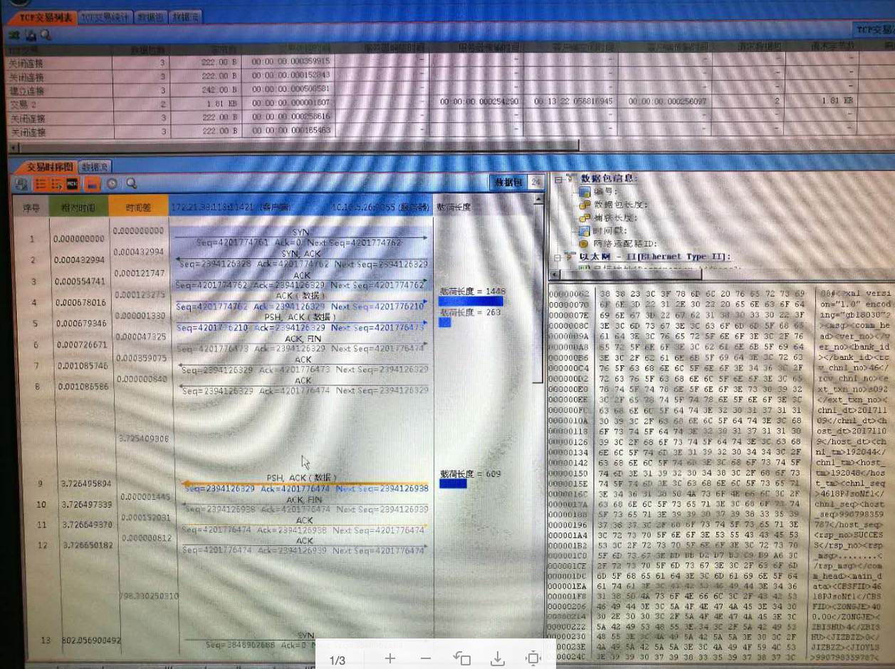
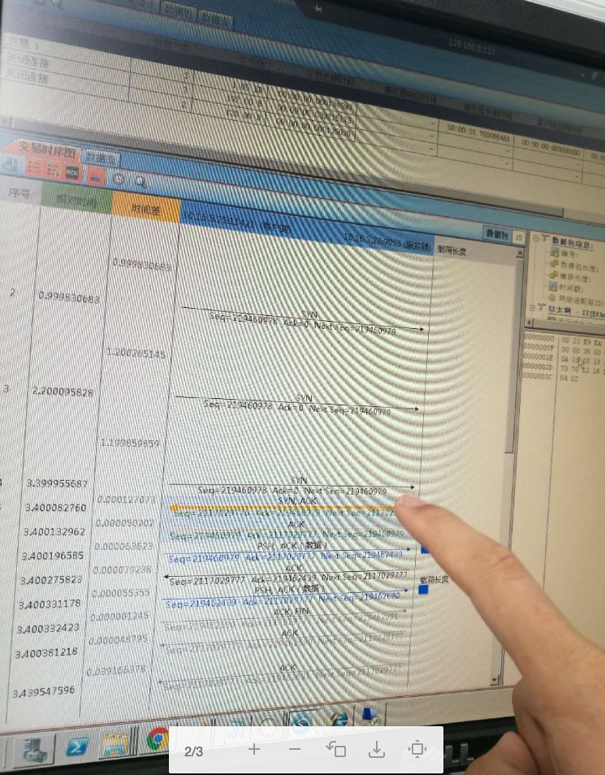

* [返回主页](../home.md)
## 排查系统5%交易超时问题
### 现象
消费系统-ESB-服务系统 的交易，每隔20笔大概有一笔的响应时间需要三四秒！

### 排查问题
查看ESB内部处理时间，发现交易进来应用到出去的时间都在200ms内<br>
需要抓包查看链路各端处理时间

### 抓包排查各个节点耗时
#### 消费系统到ESB的F5这段的处理时间没有问题

#### 可能是F5或者是应用的问题，继续抓包


::: danger 发现问题
TCP三次握手的时候，第4次才成功，这耗时3秒多
:::

### 问题分析
#### RFC1323中有如下一段描述：
```text
An additional mechanism could be added to the TCP, a per-hostcache of the last timestamp received from any connection.
This value could then be used in the PAWS mechanism to rejectold duplicate segments from earlier incarnations of theconnection, 
if the timestamp clock can be guaranteed to haveticked at least once since the old connection was open. 
Thiswould require that the TIME-WAIT delay plus the RTT togethermust be at least one tick of the sender’s timestamp clock.
Such an extension is not part of the proposal of this RFC.
```
大概意思是说TCP有一种行为，可以缓存每个连接最新的时间戳，后续请求中如果时间戳小于缓存的时间戳，即视为无效，相应的数据包会被丢弃。
Linux是否启用这种行为取决于tcp_timestamps和tcp_tw_recycle，因为tcp_timestamps缺省就是开启的，所以当tcp_tw_recycle被开启后，实际上这种行为就被激活了。
#### PAWS介绍
全名Protect Againest Wrapped Sequence numbers，目的是解决在高带宽下，TCP序列号在一次会话中可能被重复使用而带来的问题。
#### 问题分析
```text
现在很多公司都用LVS做负载均衡，通常是前面一台LVS，后面多台后端服务器，这其实就是NAT，
当请求到达LVS后，它修改地址数据后便转发给后端服务器，但不会修改时间戳数据，
对于后端服务器来说，请求的源地址就是LVS的地址，加上端口会复用，
所以从后端服务器的角度看，原本不同客户端的请求经过LVS的转发，就可能会被认为是同一个连接，
加之不同客户端的时间可能不一致，所以就会出现时间戳错乱的现象，
于是后面的数据包就被丢弃了，具体的表现通常是是客户端明明发送的SYN，但服务端就是不响应ACK
```
::: tip 
如果服务器身处NAT环境，安全起见，通常要禁止tcp_tw_recycle，至于TIME_WAIT连接过多的问题，可以通过激活tcp_tw_reuse来缓解。
:::
>net.ipv4.tcp_tw_reuse = 1 表示开启重用。允许将TIME-WAIT sockets重新用于新的TCP连接，默认为0，表示关闭；
> 
>net.ipv4.tcp_tw_recycle = 1 表示开启TCP连接中TIME-WAIT sockets的快速回收，默认为0，表示关闭。

#### 更详细说明请参考
* [PAWS介绍及细节](https://www.m690.com/archives/1053/)
* [TCP连接的TIME-WAIT详情](https://blog.csdn.net/enweitech/article/details/79261439)

### 解决方案
::: tip 解决方案
将/etc/sysctl.conf的net.ipv4.tcp_tw_recycle = 1 修改为 net.ipv4.tcp_tw_recycle = 0，<br>
执行命令/sbin/sysctl -p生效
:::
* [返回主页](../home.md)