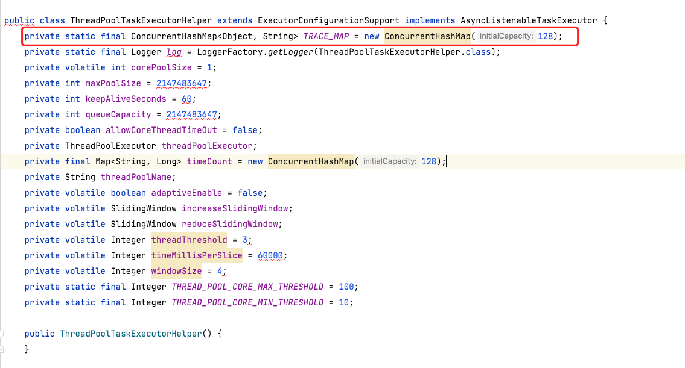

* [返回主页](../home.md)
# 线上OOM定位异常对象全过程
## 背景
线上环境线程数1小时增长500个，且收到了gc频繁的告警。<br>
```text
1、2021-11-24 shendeng应用引入executor-starter组件，在此期间shendeng线上业务正常运行。
2、2022-04-04 01:38:00 开始收到线上pod:shendeng-44d8-5d6459f879-vffvf的gc报警信息，
     2022-04-05 01:00:00 gc报警信息在云鸮监控平台停止更新，线上请求异常栈信息已经大量抛出 java.lang.OutOfMemoryError: Java heap space。该pod已经无法正常处理线上业务。线上业务流量开始路由到pod:shendeng-44d8-5d6459f879-j9jk2。
3、2022-04-05 1:52:00 开始收到线上pod:shendeng-44d8-5d6459f879-j9jk2的gc报警信息，
    2022-04-05 19:30:00 gc报警信息在云鸮监控平台停止更新，线上请求异常栈信息已经大量抛出 java.lang.OutOfMemoryError: Java heap space。该pod已经无法正常处理线上业务。
4、2022-04-06 09:14:00 消杀客户反馈线上业务受到影响，后续陆续其他业务像大屏业务、大峡谷业务都开始反馈受到影响。初步日志问题定位是无可用dubbo服务，之前有遇到过类似问题，怀疑是shendeng服务注册到maxwell网关存在问题。因此打算首先重启shendeng和maxwell应用。
5、2022-04-06 09:58:00 重启shendeng和maxwell应用，线上业务陆续恢复正常。
6、2022-04-06 13:41:00 开始频繁收到gc报警信息，结合日志中频繁出现java.lang.OutOfMemoryError: Java heap space，基本断定是内存泄漏导致的系统OOM。
```


## 分析过程
### 问题表现监控
+ 查看dubbo监控，dubbo提供者、消费者都没获取到有什么异常调用（高频调用、时长过长等）的接口；
+ kafka、redis监控也没有什么异常的曲线；
+ 把重点关注在jvm监控上面


::: danger 从上图看来，主要信息
线程数从10点开始激增<br>
在13:30后gc高频发生，且耗时激增
:::

### 线程堆栈分析
当我们需要定位异常线程时，一般可以从分析线程堆栈入手。分析堆栈的途径有很多，下面简略讲一下当时用jvm自带的指令分析<br>
::: tip
1.找出pid————通过jps找java进程 或者 top找占用最高cpu的进程 等等<br>
2.jstack pid————打印堆栈dump，输出堆栈信息到文件
:::
```shell
jstack -l 7052 >> thread.txt
```
然后就可以根据堆栈文件搜索异常线程关键字,异常线程定位详细可参考：<br>
* [查看jstack Dump 日志](https://wanglichao.com/2016/12/22/jstack-dump.html)

### 线程分析结论
1.经过多次堆栈（一次线程堆栈分析可靠性不足，因为可能打印堆栈的当时刚好有线程等待锁释放等之类的让人误以为是异常阻塞的线程等等）打印进行异常线程搜索后，并没有发现有什么异常线程。<br>
2.结合线上线程数的4月份曲线分析（如下），这个线程数激增在应用重启后都会有，且当时其他jvm曲线也没什么异常状况，所以这线程激增大概率是正常的线程创建，而非异常创建。<br>


### jvm内存分析
在其他问题都暂时排除后，可以就gc高频进行jvm内存分析下原因<br>

::: tip 从上图可获取到的关键信息：
看左图：在12:00后，gc频率开始猛增<br>
看有图：gc耗时在13:00后明显激增，一分钟的gc耗时高达20~40s（gc时长占了user time的1/3到2/3）<br>
初步分析gc是有明显异常，且gc时长主要在于老年代（看右图cms回收器曲线【parnew用于新生代】），这个时候就可以去dump应用的堆栈信息分析异常内存了。
:::

打印dump文件，可以通过jmap或arthas进行dump堆栈输出成文件，然后下载到本地，分析dump文件方式很多，线上工具、本地工具（mat等），以下是用mat进行分析。<br>
* [mat使用详情请参考](https://www.cnblogs.com/zh94/p/14051852.html)

用mat分析dump<br>


::: warning 重点关注：
Leak Suspects：通过MAT自动分析当前内存泄露的主要原因<br>
Dominator Tree 以占用总内存的百分比的方式来列举出所有的实例对象，注意这个地方是直接列举出的对应的对象而不是类，这个视图是用来发现大内存对象的
:::

开始分析<br>
1.点开 Leak Suspects ，mat帮我们分析到有个大对象占用了几乎800m的空间，且可以看到对象类为class com.tuya.executor.core.ThreadPoolTaskExecutorHelper，其中占用大空间的变量名为TRACE_MAP<br>


2.点开 Dominator Tree ，可以看到这个类ThreadPoolTaskExecutorHelper确实占用了当前对的67.90%的空间<br>


点开右箭头查看对象详情（跟踪占用空间比例大的变量），如下图，可以看出：<br>
ThreadPoolTaskExecutorHelper类中有个类型为ConcurrentHashMap的变量占用很大空间，且可以看到里面的每个节点都不大，但是节点数非常多，达到663833个。<br>
至此可以发现异常的对象及对象的大致情况了。<br>


+ 结合代码分析，大致原因为ThreadPoolTaskExecutorHelper的TRACE_MAP静态变量在一直put对象进去，但并没有及时手动释放，导致里面的对象一直堆积且不会被回收（静态变量为gc root的可达对象），进而引起gc频繁，直至oom。
+ 基本可以确定是业务线程池走了拒绝策略导致TRACE_MAP释放内存失败。通过观察监控平台4月3号到4月7号的线程池监控数据，philipsExecutor队列size频繁触及设定队列容量大小，工作线程一直保持在maxPoolSize大小，应该是philipsExecutor触发了executor-starter的隐藏bug。
<br>


### ThreadPoolTaskExecutorHelper原理


<br>由于philipsExecutor线程池设置的核心数比较小，队列也比较小，设置的拒绝策略是CallerRunsPolicy，导致任务处理不过来的时候是由调用线程来处理，这个时候就不再走afterExecute逻辑，导致TRACE_MAP释放内存逻辑没走。

## 修复方案
::: tip
1.动态调整线上环境philipsExecutor核心线程数和最大线程数大小，保证正常业务不走拒绝策略<br>
2.将ThreadPoolTaskExecutorHelper的TRACE_MAP设置成自动过期和限定数量大小的数据结构。
:::

### 后续action
```text
1、对于线程池监控需要进一步完善，对于工作线程大小长时间接近或者等于最大线程数的业务线程池，需要告警提醒业务方，确认业务线程池的参数设置是否需要进行相应调整。
2、对线程池任务执行时长进行监控，对于超出正常处理时长的业务线程池，需要告警提醒业务方，进行问题定位和排查。
3、对于线上应用gc报警，需要引起高度重视，shendeng应用从1月份开始，每个月都有一两天会发生频繁gc告警，没有很好地引起重视，由于时间比较久远，不太好定位具体原因。初步猜测原因很有可能跟这次OOM的原因是一样的。
4、对于有状态全局性的数据结构，需要特别注意线程安全以及内存泄漏问题，最好是使用限定数量大小的数据结构。
5、对于线上业务做好监控和自动化测试，能够提前预警，业务发生异常时能够第一时间通知到相关人员。
```

* [返回主页](../home.md)