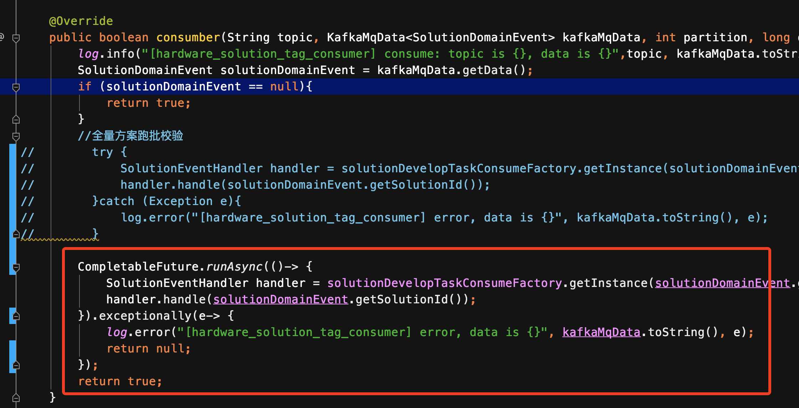

* [返回主页](../home.md)
# kafka问题排查
## 1.kafka消息大量堆积后flinkStreamSql消费时，有部分消息丢失问题
### 现象
欧洲区遇到的消息大量堆积后，启动flink任务，有部分消息丢失的问题。
### 原因
::: warning 原因
因为bizlog这个topic有1200个分区(分区数有点多)，kafka consumer拉取消息一次最大是500条。

这500条消息，可能都是从partition1拉取，partition1的拉取完了才会拉取partition2。

这样有可能会造成拉取partition1200时，时间上已经落后了很久。
当获取到的500条消息部分从编号靠前的分区获取(可能事件时间是最新的)，部分从编号靠后分区获取(可能事件时间是很久之前的)，
因为flink任务中有对窗口内的消息配置最大延迟时间30s，这500条消息在处理时超过30s的这部分消息就会丢弃。
:::
### 解决方案
```text
方案1.flink消费线程数据和分区数一致，这样一个线程管一个分区，不会造成后面的分区因为排在后面，后久才消费到的情况
a)减少bizlog的分区数，flink消费线程数据和分区数一致。(不可行，kafka不会减小分区数)
b)新建一个bizlog这个业务的分区，迁移到这个分区，分区数设置的小一点（需要这个业务相关的服务都要做调整)

方案2.在停服后，大量堆积，重启的情况下，先修改flink任务配置中的最大延迟时间，等堆积的消息降下来后，在调整成正常的事件延迟时间。
```

## 2.线上kafka阻塞问题
### 现象
+ 1.早上7点18分线上报警了，看具体报警内容，发现是健康中心的topic有消息堆积。
+ 2.该topic的作用是，dp上报到hulk，分到健康中心的group做对应的消费。查看topic监控，发现该时间段内并没有非常明显的消息增量
+ 3.查看hulk的线上的三台服务器，稍微有一些波动，但是整体资源是正常的
### 排查 & 操作
+ 1.在kibana查看了健康中心里的最近一批的消费日志，发现有很大一部分是非健康产品的消息，以为又是配置错误导致产品上报大量无效消息（以前发生过的一个坑），但是配置的权限已经回收了，按道理说不会有新的产品能配进来，遂否定该猜想。
+ 2.观察了一段时间，消息堆积数量好像时高时低，我定位不到具体产生的原因，遇事不决先重启。
+ 3.重启后，堆积数量还是时高时低，但是总体堆积数量还是上涨的。这时候查看该topic的分片堆积情况，发现只有一个分片在堆积。同时应用消费等待时间慢慢增长。


+ 4.这时候查看kibana的kafka消息消费耗时记录，发现了是一个大部分消息消费很快，只有一个称的产品的消息消费耗时特别长。用arthas查看栈链路耗时，确定了是这个秤的历史问题导致。
+ 5.这个秤之前也排查过问题，有一段老逻辑，需要查询历史所有未分配数据，并且循环做dp倍率转换，该地方会循环调用RPC。虽然rpc调用很快，平均一个100ms内能完成，但是循环元素多，有几千个，最终耗时能达到几十秒以上。这里之前做过处理，因为是同一个设备，所以可以用缓存代替rpc，但是由于另一个问题，所以把缓存开关关上了。确定了原因后，我把缓存开关打开，很快啊，啪一声消息就消费完了。

::: warning 奇怪的现象
4个分区，3个服务器。为什么3个服务器都很闲，3个分区也不堆积，只有一个分区一直堆积？（jupiter并没有指定key，即随机分发消息）

答：这和offset提交，rebalance机制有关。我们知道，kafka消费为了吞吐最大化，都是批量拉取消息的，只有当前批消息消费完了，在下次poll的时候再把offset提交上去。由于单条消息消费已经达到80s了，当一批消息里这个产品有数条时，耗时达到数分钟时，那这次消费必定超时，还没提交offset就触发了rebalance，在rebalance后，之前的group产生了新一届group成员，而这次新延迟的offset提交携带的是旧generation信息，所以会拒绝这次offset提交，kafka会从上次offset最后消费的位置重新消费。即使rebalance后，该分片交给另一个消费者消费，因为是同一批数据，循环poll，消费，超时，rebalance这个过程。这也即使加了分区和消费者，该分片还是阻塞着。
:::

::: tip 解决办法：
1.保证消息消费耗时不要太慢（3s内）

2.调整消息rebalance判断时间和单次拉取消息数量，这个涉及到kafka消费性能，慎重改。

3.把offset往后挪，越过当前批阻塞消息，这个会涉及消息丢失，在实际没办法的情况下考虑使用。
:::

## 3.kafka集群无法消费消息
### 现象
现象为 kafka 集群无法消费消息，导致消息堆积，加机器、批量重启、单台重启均无效，最后停止某台机器之后系统恢复。

### 排查
::: tip kafka配置
kafka 版本：0.11.0.2。该版本 heartbeat 线程是单独线程，和 poll 线程分开了（0.9 版本 heartbeat 在 poll 逻辑里）。

相关参数配置：<br>
max.poll.interval.ms：300000ms（两次 poll 消息最大间隔时间，超过该值即认为 consumer 崩溃）<br>
max.poll.records: 500（一次 poll 消息的最大数量）<br>
heartbeat.interval.ms: 3000ms（发送 heartbeat 的间隔时间）<br>
session.timeout.ms: 60000ms（heartbeat 最大间隔时间，超过该值即认为 consumer 崩溃）
:::


+ cpu 、上报量、消息消费速度开始狂跌，时间大约是从 11：18、19 开始。
+ 日志搜索 "sending LeaveGroup request to coordinator" ，也是从 11：18 开始出现下面的日志
  <br><br>
对应的机器是 us-onedata-035（后面简称 ”035“ ），说明这台机器出了问题，需要脱离 consumer group ，然后集群进行 rebalance 。这也是为什么后来无论加机器还是批量重启都没有效果，最后停掉 035 这台机器反而集群恢复正常。

### Rebalance产生原因
通过还原现场知道，由于 035 故障，导致 consumer 集群 rebalance，集群无法进行消费。

```text
很明显，是满足了第一个条件，并且是 consumer 崩溃。
从监控面板得知，相应时间段内应用“健康检查”一切正常，说明进程没有挂掉，机器也没有宕机，那就是 coordinator 认为 consumer 挂掉了。
以下两种情况会导致 coordinator 认为 consumer 挂掉：
consumer 没有及时同步 heartbeat；
consumer 两次 poll 之间时间间隔超过 max.poll.interval.ms 的值。

情况1：
kafka 存在 heartbeat 机制：如果在 session.timeout.ms 值之内，consumer 没有发送 heartbeat 给 coordinator ，就会被认为崩溃，进行 rebalance。
根据当前系统的配置，每 3s 发送一次 heartbeat，如果连续 20 次未发送成功，则进行 rebalance 。
但是目前来看，应用”健康检查“正常且网络输入输出并没有完全跌零，所以连续 20 次发送心跳失败的可能性不大。

情况2：
根据当前系统的配置来看，每次最大拉取数据量 500，间隔时间为 300s，需要在 600ms 之内消费完一条数据，如果出现网络问题，这种情况出现的概率会相对大些。
因此，初步认定，机器 035 进行 rebalance 是因为无法在 300s 内处理完 500 条数据，导致两次 poll 时间间隔超过阈值。
```

### Rebalance成功结束如何定义
目前我还没有找到如何去定义 rebalance 成功结束，所以无法准确的确认 rebalance 持续的时间。但是比较巧合的是，每次系统恢复， 在对应的时间点，能找到 rebalance 相关的日志。

目前猜测是 rebalance 后，整个 consumer 集群配置重置，中间件的同学在代码中打印了这行日志，并且重启了kafka 容器。部分代码截图如下
```java
if (null == switchConsumerMode) {

    logger.info("未配置切换模式，继续auto rebalance模式消费。config={}", consumerConfigs);

    start();

}

@Deprecated

public void start() {

    logger.info("开始执行 restart kafka container");

    if (CollectionUtils.isEmpty(listenerContainerList)) {

        return;

    }

    waitInit();

    for (MqKafkaMessageListenerContainer listenerContainer : listenerContainerList) {

        if (listenerContainer.isRunning()) {

            logger.info("kafka已经启动在运行，不能重复start");

            continue;

        }

        listenerContainer.doStart();

    }

}
```
后面和中间件的同学确认下，看看代码的具体含义，是否能作为 rebalance 成功的标志。
<br>
结论：目前只能看消费消息是否恢复，如果恢复，自然已经 rebalance 成功，”未配置切换模式，继续auto rebalance模式消费” 这行日志可以当做辅助参考。

### Rebalance的影响面
```text
rebalance 造成的影响主要两部分：数据重复消费、降低消费速度甚至不消费。

重复消费对于 onedata 来讲影响不是很大，消费速度降低甚至不消费影响更大。rebalance 耗时时间比较长，少则几秒，多则几分钟。

在 2020.08.15 14:52:43.214 ~ 14:52:47.627 发生一次 rebalance，持续时长近 5s。

在 2020.08.15 11:18 ~ 13:00 之间，几乎一直在 rebalance，通过 kibana 搜索 “Attempt to heartbeat failed since group is rebalancing” 日志可以看到，几乎一直在报错。
```


理论上来说，035 崩溃之后，进行一次 rebalance，group 剔除掉 035，剩余的机器是可以重新开始消费的，为什么后面会一直 rebalance 呢？个人猜测有以下原因：
+ 重启/加机器：每一次重启或者加机器几乎都会导致再一次的 rebalance；
+ 重启了 035：本来 035 因为故障被剔除 group，重启之后 rebalance 又进入 group，然后发现 035 还是有故障，再次被剔除，再次 rebalance；

### 处理方案
```text
处理方案分为两部分，其一是事前优化，尽量避免 rebalance 的产生，其二是事中处理，如果发生 rebalance，需要进行正确的处理。

事前优化：

1、调整配置

max.poll.interval.ms：适当调大一点（效果不一定明显，目前看出问题时网络输入/输出下降明显，即使时间间隔大些，也不一定能及时处理完消息）


max.poll.records：适当调小一点（有风险，会增大网络开销）


2、系统优化，降低系统水位，降低阻塞（理论上来说效果会相对明显些）；

3、优化 consumer 业务代码逻辑，提高消费速度，避免两次 poll 操作间隔时间过大引起的 rebalance（成本高，效果不一定明显）；

4、加 rebalance 监控，《Apache Kafka实战》中提到有个会调接口 ConsumerRebalanceListener，可以在实现逻辑里统计 rebalance 持续时长、poll 数据量、consume time 等数据，需要研究下；

5、加监控预警：一旦出现"sending LeaveGroup request to coordinator"、“Attempt to heartbeat failed since group is rebalancing” 日志，及时预警和跟进；

事中处理：

如果再次出现 kafka 不消费的情况，可按如下思路排查：

1、kibana 中搜索 "sending LeaveGroup request to coordinator"，同时观察机器的网络输入/输出，看是否有机器出问题，定位到机器；

2、评估是否需要重启机器，如果长时间网络输入/输出降低，重启该机器，如果重启后还是有问题，说明它没救了，停止该机器，然后观察集群是否恢复，如果恢复，可以先让集群消费完堆积的消息，然后再加新机器（可以根据时间点的流量来判断是否需要立即加机器）；

3、避免批量重启或上下架机器，因为每一台机器上下线都会导致重新 rebalance；
```


## 堆积
### 告警
告警为方案每天的定时任务-- 全量方案校验， 随着方案数增长，分区仍然还是线上默认的1个，故实际的消费者实例为一个，可以从监控看到实际消费完所有的方案大概需要10min。消费速率偏慢，故而导致的这个告警。<br>


### 扩展分区数
预期是希望可以将每个分区的消费时间控制在5min之内，故设置了分区数=3 ，观察第二天的消费监控情况:<br>

<br>所有消息消费完大概需要5min，虽然没有出现告警但是可以看到消费时间并不是降低到预期的1/3 附近。

### 一个礼拜之后又出现告警
将trace 打点的时间精度调整到30s之后，再看下监控图：<br>


::: danger 疑问
为什么会出现堆积量停止不变的情况？ 而且每个分区都有，难道是消费停滞了？
:::

### 消费并没有停滞
每个方案处理完会打这固定的日志，从日志统计可以看到其实每30s区间都是有消息在被消费的，那既然消费没有停滞，为什么会出现这种情况？
结合每次下降的堆积量数量（100）， 其实不难想到这是由于kafka的offset提交策略导致， 每次批量拉取100条消息，处理完之后再提交offset，
观察线上consumer配置确实：


### 解决方案
那既然一直在消费，那消费时间肯定会随着后续方案数量增多而增加，这个场景大概有几种解决方式：<br>
+ 继续扩大分区数， 线上arthas有5个pod实例，故可以将分区数继续扩展至4-5，（目前为3个）， 可以将分区横向扩展能力进一步提升
+ 因为当前场景下只需要触发进行方案校验，并不需要特别关心offset提交的准确性，故可以将消费处理校验逻辑的代码改为异步,如图（不推荐使用， 因为CompletableFuture默认使用的ForkJoinPool线程池，线程数仅为cpu核数，当然也可以自定义线程池，但是在全量跑批的场景下很容易导致线程池被打满）



* [返回主页](../home.md)