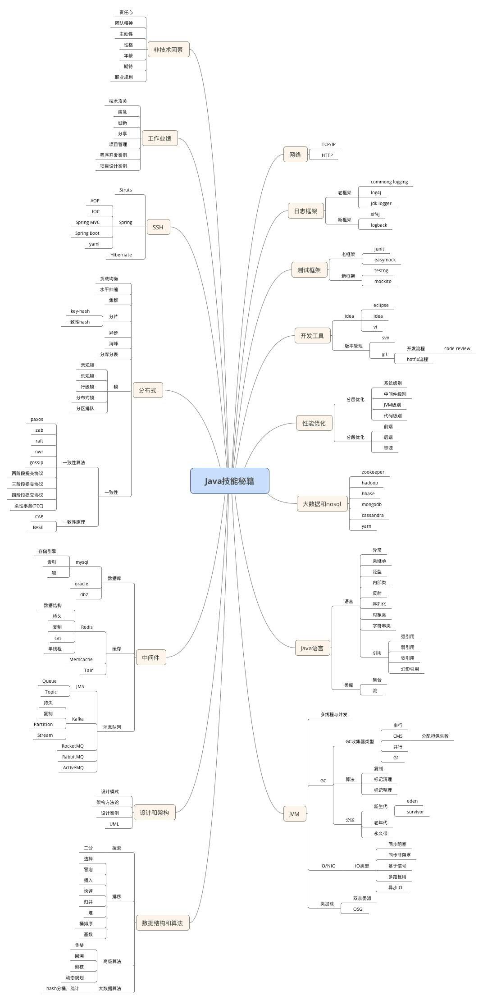
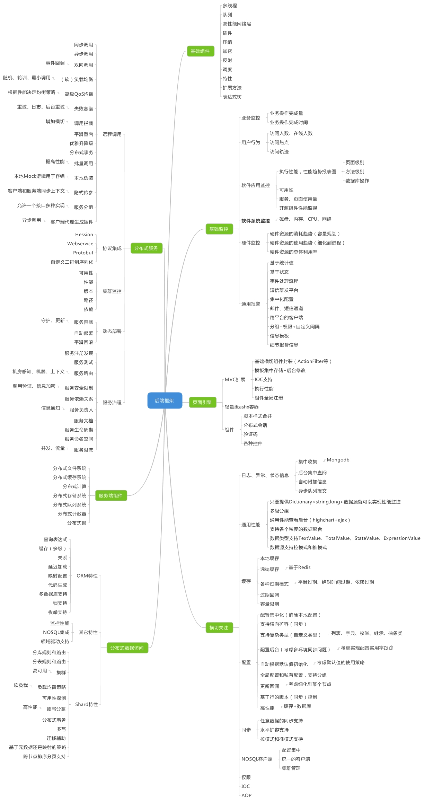
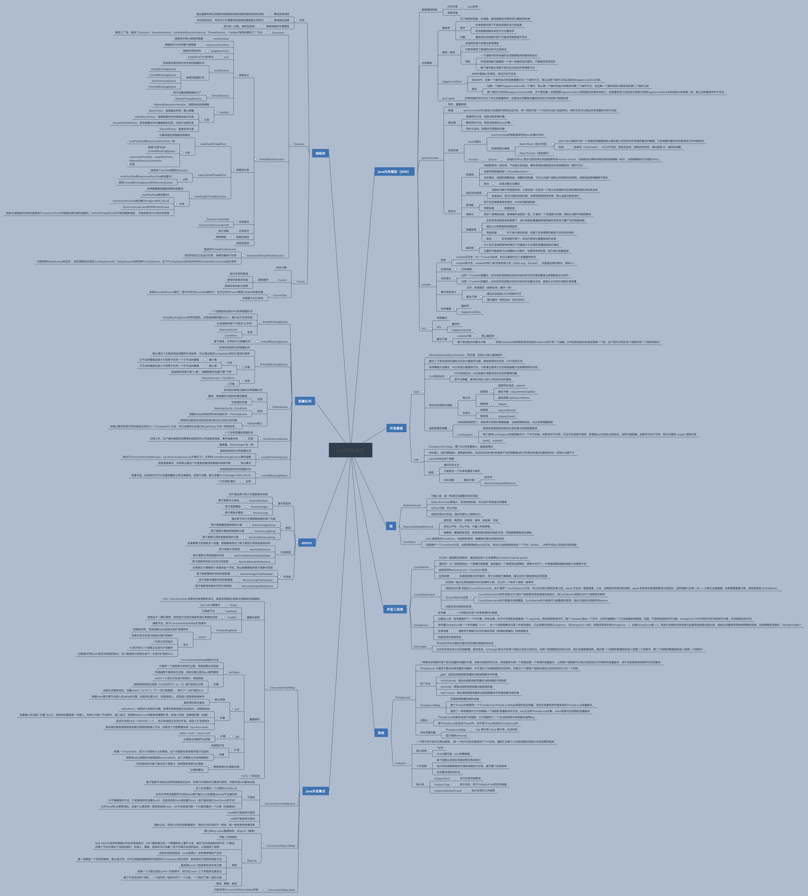
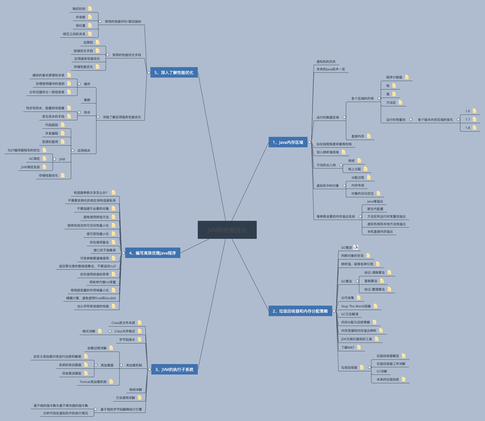
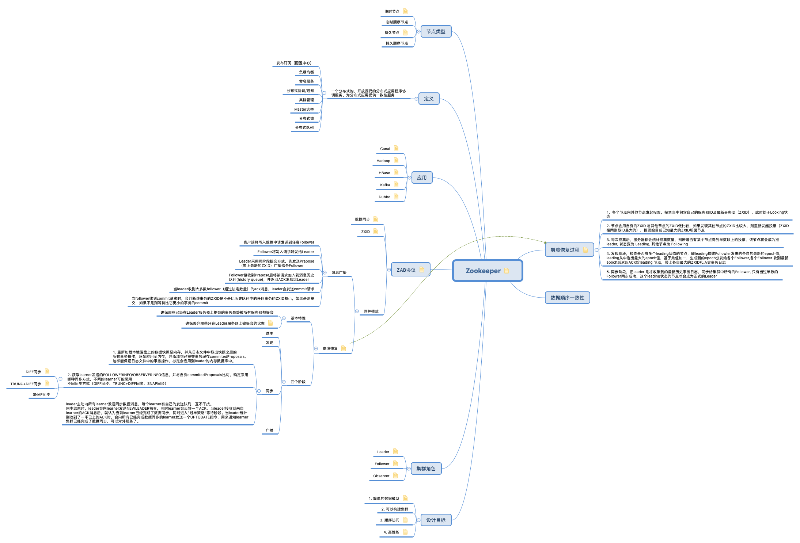
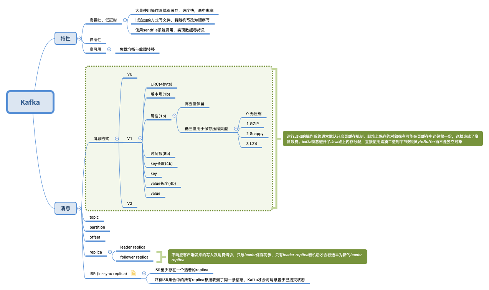
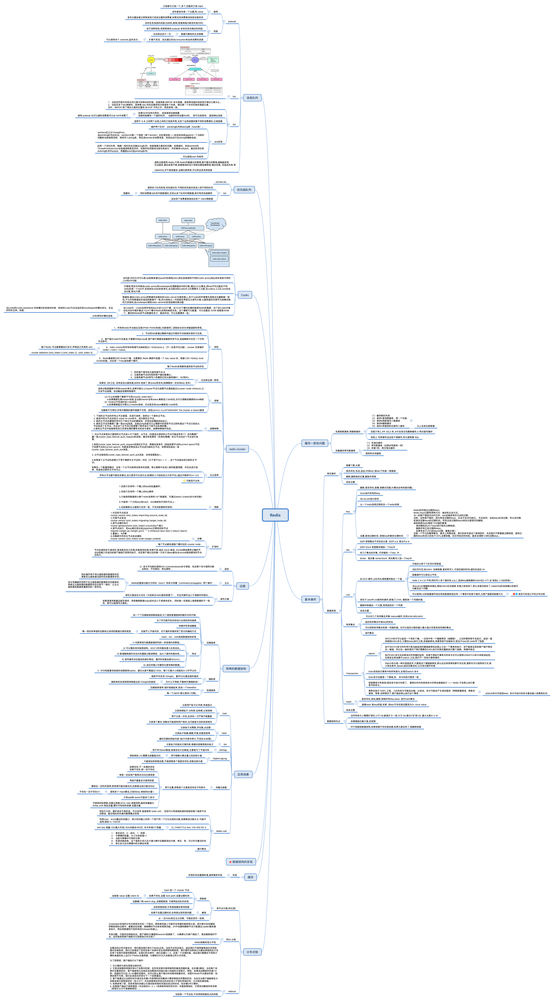
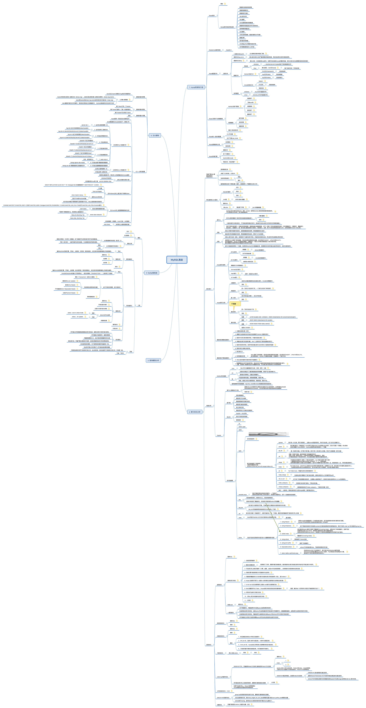
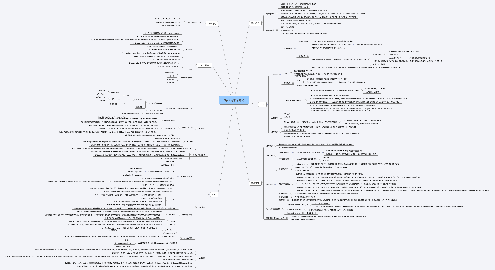
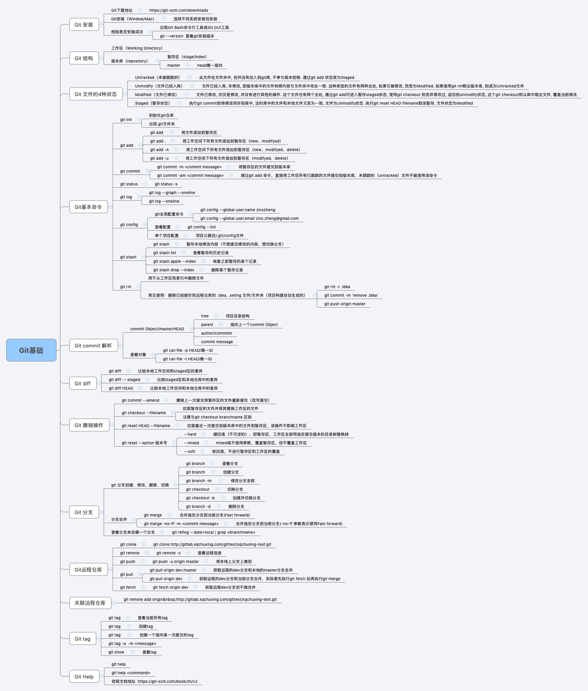

* [返回主页](../home.md)

# SkillMap
## Java.er Skill Map

## JUC Road Map

## JVM Road Map

## Middleware Road Map
### zk

### kafka

### redis

## MYSQL Road Ma

## Spring.io Road Map

## Git Road Map

* [返回主页](../home.md)