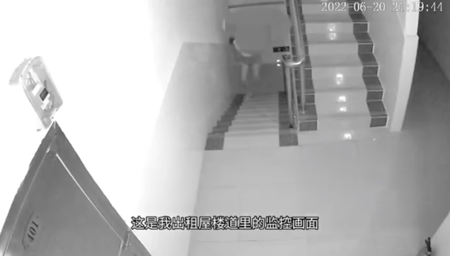
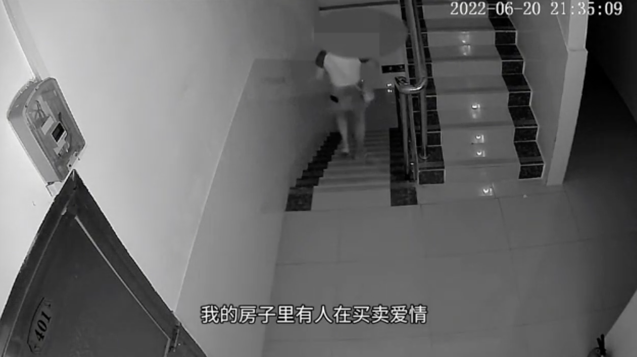
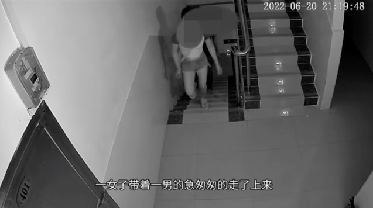
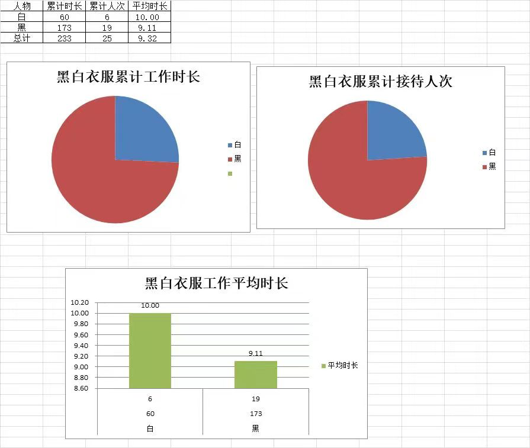
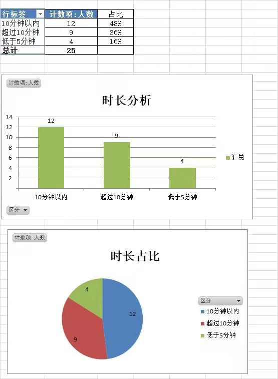
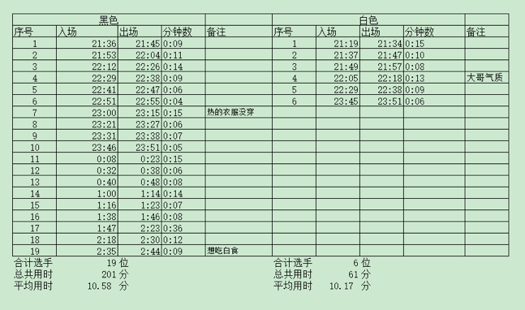
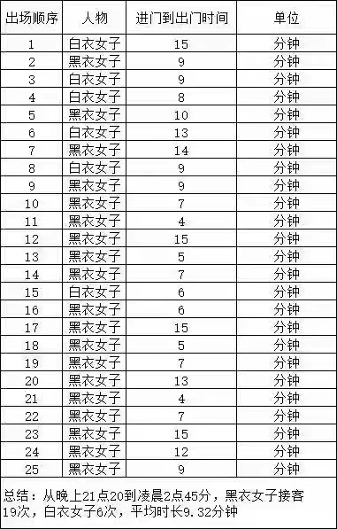

* [返回主页](../home.md)

# TSDB使用新场景思考
## 起源
### 新闻
最近看到一则新闻： 

 

 

 
剩下的自己脑补...

### 网友分析报告

 

 

 

### 网友总结
::: tip 网友恐怖如斯的总结：
视频虽然短短五分钟22秒，实际录制时间为五小时28分。在这5小时28分当中，共进出25人（不包括22点25分出现的男性租客），
25人进出具体时间就不细说，主要说下屋内停留时间，分别如下（按进出时间依次排序）：  

白衣妹：15分，9分，7分，13分，9分，6分，平均时间9.83分，除去脱衣服穿衣服时间1分钟，战斗时间只有8分钟多一点； 
黑衣妹：9分，10分，14分，9分，6分，4分，15分，5分，7分，5分，15分，5分，7分，13分，7分，8分，16分，12分，9分，平均时间9.26分，除去脱衣服穿衣服时间1分钟，战斗时间只有8分钟多一点。  

综上得出结论： 
1⃣：在凹凸战场，男性坚持的平均时间在10分钟内其实是个正常值，还是包含了热身前奏的！so各位男同胞们别太自卑。 
2⃣，从视频中看出，黑衣服女战士共对战19人，很明显白衣服就仅仅对战6人。按一次300元计算，19*300=5700元，短短五个小时就收入囊中将近六千。由此得出结论：勤奋方能致富。 
3⃣，据房主视频中介绍，楼层位于四楼，每层楼台阶11个*2，四层楼也就是22*4=88，黑衣服女战士走了19趟，19*88=1672，也就是说短短五小时内，人家爬了1672个台阶。由此得出结论三：生命在于运动，多运动，身材才会好。
:::

## 思考
### 对于小区物业或者业主怎么避免涉嫌犯罪，收容买卖爱情人员？
::: tip 
1. 像上面那么有才的业主给我们提供了思路，可以让我们的IPC设备在有人来访的时候自动上报数据并落库TSDB；
   
2. 根据前面分享的TSDB内容，我们知道，TSDB使用常见多为监控+统计，并具有降精度功能；
   
3. 使用TSDB建立对应的时间线模型就能很方便的统计出具体的数据，设置比寻常家庭高出几倍的阈值就能轻松做到这个功能，不需要特别的建模或者算法；

4. 超出阈值后触发告警，通过对接阿里云短信平台或者其他告警方式,就可以通知业主或者物业；

5. 通过降精度可以出日报/月报/年报，为业主提供感兴趣的功能；

6. 对接人脸识别之类的还能有更多玩法...
:::

* [返回主页](../home.md)